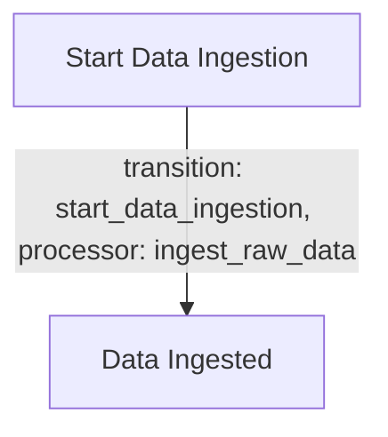
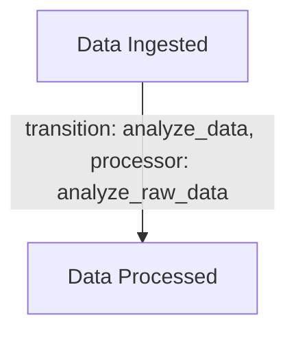
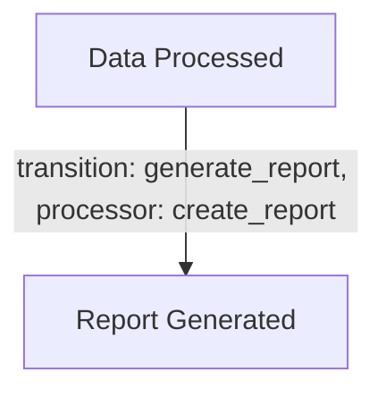
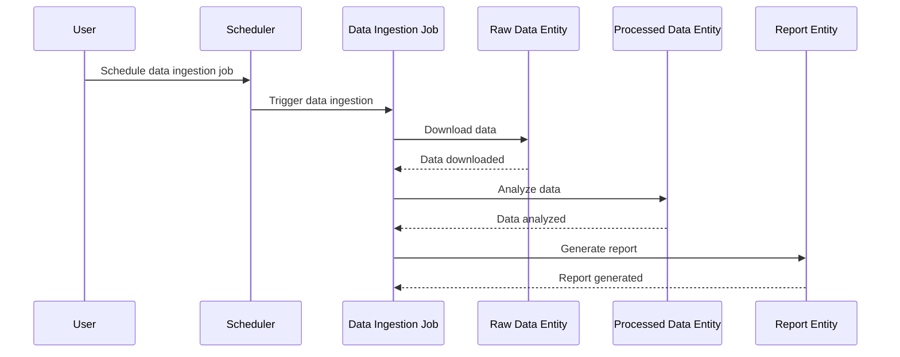
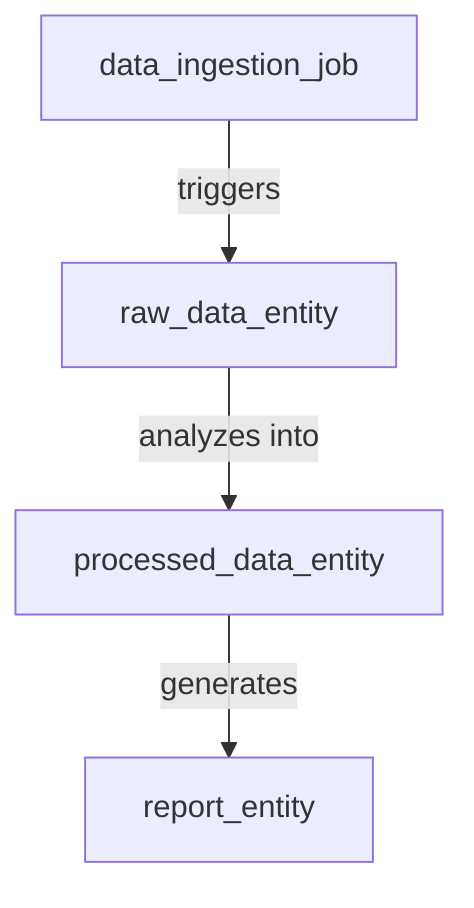
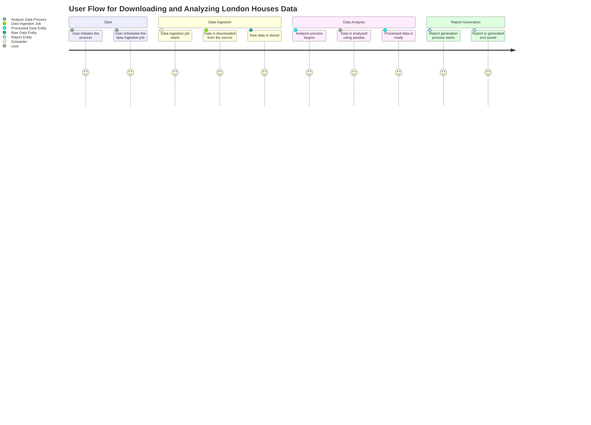

# Product Requirements Document (PRD) for Cyoda Design

## Introduction

This document provides a comprehensive overview of the Cyoda-based application designed to download London Houses Data, analyze it using pandas, and save a report. The Cyoda design facilitates the management of workflows through a structure of entities and their relationships. This PRD outlines how the design aligns with the specified requirements, explaining the roles of each entity, their workflows, and providing various diagrams for clarity.

## What is Cyoda?

Cyoda is a serverless, event-driven framework that enables the orchestration of workflows through entities representing jobs and data. Each entity has a defined state, and transitions between states are governed by events that occur within the system, promoting a responsive and scalable architecture.

## Cyoda Entity Database

This design includes the following core entities:

1. **Data Ingestion Job (`data_ingestion_job`)**:
   - **Type**: JOB
   - **Source**: SCHEDULED
   - **Description**: Responsible for downloading the London Houses Data from an external source.

2. **Raw Data Entity (`raw_data_entity`)**:
   - **Type**: EXTERNAL_SOURCES_PULL_BASED_RAW_DATA
   - **Source**: ENTITY_EVENT
   - **Description**: Stores the raw data obtained from the data ingestion job.

3. **Processed Data Entity (`processed_data_entity`)**:
   - **Type**: SECONDARY_DATA
   - **Source**: ENTITY_EVENT
   - **Description**: Contains the analyzed data derived from the raw data.

4. **Report Entity (`report_entity`)**:
   - **Type**: SECONDARY_DATA
   - **Source**: ENTITY_EVENT
   - **Description**: Holds the generated report from the processed data.

## Workflows Overview

### Data Ingestion Job Workflow

```mermaid
flowchart TD
    A[Start Data Ingestion] -->|transition: start_data_ingestion, processor: ingest_raw_data| B[Data Ingested]
```

### Processed Data Entity Workflow

```mermaid
flowchart TD
    A[Data Ingested] -->|transition: analyze_data, processor: analyze_raw_data| B[Data Processed]
```

### Report Entity Workflow

```mermaid
flowchart TD
    A[Data Processed] -->|transition: generate_report, processor: create_report| B[Report Generated]
```

## Event-Driven Approach

The Cyoda design leverages an event-driven architecture, which allows for automatic responses to changes or triggers. The significant events in this requirement include:

1. **Data Ingestion**: The `data_ingestion_job` is triggered on a scheduled basis to download the data.
2. **Data Analysis**: Once the data is ingested, the system automatically analyzes it with pandas.
3. **Report Generation**: After analysis, the report generation process is initiated.

This approach enhances scalability and efficiency by automating the workflow without manual intervention.

## Sequence Diagram

```mermaid
sequenceDiagram
    participant User
    participant Scheduler
    participant Data Ingestion Job
    participant Raw Data Entity
    participant Processed Data Entity
    participant Report Entity

    User->>Scheduler: Schedule data ingestion job
    Scheduler->>Data Ingestion Job: Trigger data ingestion
    Data Ingestion Job->>Raw Data Entity: Download data
    Raw Data Entity-->>Data Ingestion Job: Data downloaded
    Data Ingestion Job->>Processed Data Entity: Analyze data
    Processed Data Entity-->>Data Ingestion Job: Data analyzed
    Data Ingestion Job->>Report Entity: Generate report
    Report Entity-->>Data Ingestion Job: Report generated
```

## Entity Diagram

```mermaid
graph TD;
    A[data_ingestion_job] -->|triggers| B[raw_data_entity];
    B -->|analyzes into| C[processed_data_entity];
    C -->|generates| D[report_entity];
```

```mermaid
journey
    title User Flow for Downloading and Analyzing London Houses Data
    section Start
      User initiates the process: 5: User
      User schedules the data ingestion job: 5: User
    section Data Ingestion
      Data ingestion job starts: 5: Scheduler
      Data is downloaded from the source: 5: Data Ingestion Job
      Raw data is stored: 5: Raw Data Entity
    section Data Analysis
      Analysis process begins: 5: Processed Data Entity
      Data is analyzed using pandas: 5: Analyze Data Process
      Processed data is ready: 5: Processed Data Entity
    section Report Generation
      Report generation process starts: 5: Report Entity
      Report is generated and saved: 5: Report Entity
```

## Conclusion

The Cyoda design effectively meets the requirements for creating a robust application that automates the data downloading, analysis, and reporting processes. The outlined entities, workflows, and events ensure a smooth and efficient operation. This PRD serves as a foundation for implementation and development, providing guidance for the technical team and clarity for users unfamiliar with the Cyoda framework.
