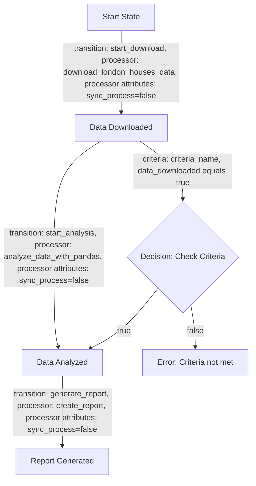

Here’s a complete Product Requirements Document (PRD) for your London Houses Data analysis application, incorporating all the elements we've discussed:

---

# Product Requirements Document (PRD) for London Houses Data Analysis Application

## Introduction

This document outlines the design and requirements for a Cyoda-based application intended for downloading, analyzing, and reporting on the London Houses Data. The application utilizes an event-driven architecture to manage workflows and state transitions efficiently.

## What is Cyoda?

Cyoda is a serverless, event-driven framework that manages workflows through entities. Each entity represents a specific process or data, and transitions between states are governed by events, enabling a responsive architecture.

## Cyoda Entity Database

### Entities

1. **Data Download Entity (`london_houses_data`)**
   - **Type**: EXTERNAL_SOURCES_PULL_BASED_RAW_DATA
   - **Source**: API_REQUEST
   - **Description**: Holds the raw data downloaded from the source for London Houses.

   ```json
   {
     "entity_name": "london_houses_data",
     "entity_type": "EXTERNAL_SOURCES_PULL_BASED_RAW_DATA",
     "entity_source": "API_REQUEST",
     "data": {
       "source_url": "https://example.com/london_houses_data",
       "downloaded_at": "2023-10-01T10:00:00Z",
       "data_schema": {
         "id": "integer",
         "address": "string",
         "price": "float",
         "bedrooms": "integer",
         "bathrooms": "integer"
       }
     }
   }
   ```

2. **Data Analysis Entity (`london_houses_analysis`)**
   - **Type**: SECONDARY_DATA
   - **Source**: ENTITY_EVENT
   - **Description**: Stores the analyzed data using Pandas.

   ```json
   {
     "entity_name": "london_houses_analysis",
     "entity_type": "SECONDARY_DATA",
     "entity_source": "ENTITY_EVENT",
     "data": {
       "average_price": 500000,
       "total_properties": 100,
       "analysis_date": "2023-10-01T10:30:00Z",
       "summary": "Analysis of London houses data showed a significant increase in prices."
     }
   }
   ```

3. **Report Entity (`london_houses_report`)**
   - **Type**: SECONDARY_DATA
   - **Source**: ENTITY_EVENT
   - **Description**: Contains the final report generated from the analyzed data.

   ```json
   {
     "entity_name": "london_houses_report",
     "entity_type": "SECONDARY_DATA",
     "entity_source": "ENTITY_EVENT",
     "data": {
       "report_id": "london_houses_report_2023_10_01",
       "generated_at": "2023-10-01T10:35:00Z",
       "report_content": "Detailed analysis of London houses with insights on pricing and trends.",
       "distribution_info": {
         "recipients": ["user@example.com"],
         "sent_at": "2023-10-01T10:40:00Z"
       }
     }
   }
   ```

4. **Orchestration Entity (`data_processing_job`)**
   - **Type**: JOB
   - **Source**: API_REQUEST
   - **Description**: Orchestrates the workflow of downloading, analyzing, and reporting.

   ```json
   {
     "entity_name": "data_processing_job",
     "entity_type": "JOB",
     "entity_source": "API_REQUEST",
     "entity_workflow": {
       "name": "data_processing_workflow",
       "class_name": "com.cyoda.tdb.model.treenode.TreeNodeEntity",
       "transitions": [
         {
           "name": "start_download",
           "description": "Trigger data download for London houses.",
           "end_state": "data_downloaded",
           "process": {
             "name": "download_london_houses_data",
             "description": "Fetch data from the specified API."
           }
         },
         {
           "name": "start_analysis",
           "description": "Analyze the downloaded data.",
           "end_state": "data_analyzed",
           "process": {
             "name": "analyze_data_with_pandas",
             "description": "Perform analysis using Pandas."
           }
         },
         {
           "name": "generate_report",
           "description": "Create the analysis report.",
           "end_state": "report_generated",
           "process": {
             "name": "create_report",
             "description": "Generate a report based on analysis."
           }
         }
       ]
     }
   }
   ```

## Workflow Overview

### Workflow for Orchestration Entity (`data_processing_job`)

This workflow manages the data processing lifecycle, comprising the following transitions:
1. **Start Data Download**
2. **Start Data Analysis**
3. **Generate Report**

### Workflow Flowchart


```mermaid
flowchart TD
   A[Start State] -->|transition: start_download, processor: download_london_houses_data, processor attributes: sync_process=false| B[Data Downloaded]
   B -->|transition: start_analysis, processor: analyze_data_with_pandas, processor attributes: sync_process=false| C[Data Analyzed]
   C -->|transition: generate_report, processor: create_report, processor attributes: sync_process=false| D[Report Generated]

   %% Decision point for criteria
   B -->|criteria: criteria_name, data_downloaded equals true| D1{Decision: Check Criteria}
   D1 -->|true| C
   D1 -->|false| E[Error: Criteria not met]

   class A,B,C,D,D1 automated;
```

## Conclusion

The proposed Cyoda design effectively aligns with the requirements for creating a robust data processing application for the London Houses Data. The outlined entities, workflows, and transitions ensure an automated process that manages the entire lifecycle from data download to report generation.

This PRD serves as a foundation for implementation and development, guiding the technical team through the specifics of the Cyoda architecture while providing clarity for users who may be new to the framework.

--- 

If you have any more questions or need further adjustments, feel free to ask! 😊