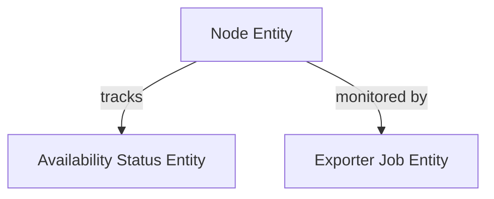
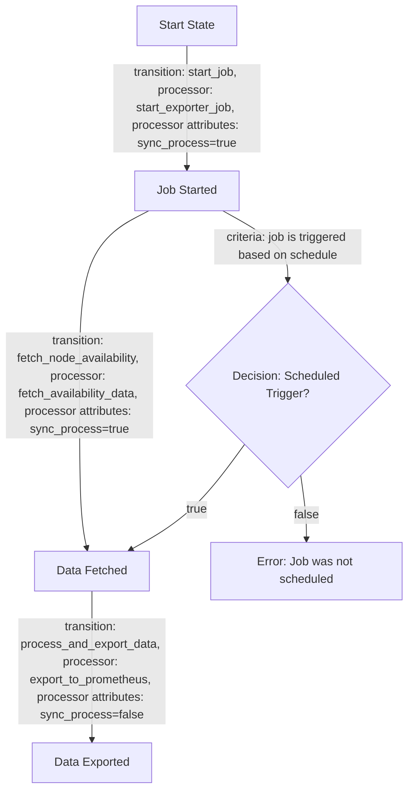

Here's the complete Product Requirements Document (PRD) for your Prometheus exporter that monitors the availability of nodes in a Cassandra cluster.

---

# Product Requirements Document (PRD) for Prometheus Exporter

## Introduction

This document outlines the requirements for developing a Prometheus exporter that monitors and exports the availability of nodes in a Cassandra cluster. The exporter will provide real-time data on node status, enabling efficient monitoring and alerting through Prometheus.

## Overview of Cyoda Design

### What is Cyoda?

Cyoda is a serverless, event-driven framework that utilizes entities to manage workflows and automate processes. In this design, each entity represents a component of the system, allowing for responsive and scalable architecture.

### Key Concepts

- **Entities**: Fundamental components representing processes or data (e.g., nodes, availability status).
- **Workflows**: Define state transitions and actions for each entity.
- **Event-Driven Architecture**: Automatically responds to changes and events, promoting scalability and efficiency.

## Entities Outline

1. **Node Entity**: Represents each node in the Cassandra cluster, including its name, ID, and availability status.
2. **Availability Status Entity**: Captures the availability status of nodes, indicating whether they are up or down.
3. **Exporter Job Entity**: Orchestrates the process of querying node availability and exporting the data to Prometheus.

### Entities Diagram

```mermaid
graph TD;
    A[Node Entity] -->|tracks| B[Availability Status Entity];
    A -->|monitored by| C[Exporter Job Entity];
```

### JSON Examples for Each Entity

1. **Node Entity**
```json
{
  "entity_name": "node_entity",
  "entity_type": "EXTERNAL_SOURCES_PULL_BASED_RAW_DATA",
  "entity_source": "ENTITY_EVENT",
  "node_id": "node_1",
  "node_name": "Cassandra Node 1",
  "status": "UP",
  "last_checked": "2023-10-05T14:00:00Z"
}
```

2. **Availability Status Entity**
```json
{
  "entity_name": "availability_status_entity",
  "entity_type": "EXTERNAL_SOURCES_PULL_BASED_RAW_DATA",
  "entity_source": "ENTITY_EVENT",
  "node_id": "node_1",
  "availability": {
    "is_available": true,
    "timestamp": "2023-10-05T14:00:00Z"
  }
}
```

3. **Exporter Job Entity**
```json
{
  "entity_name": "exporter_job_entity",
  "entity_type": "JOB",
  "entity_source": "SCHEDULED",
  "job_id": "export_job_1",
  "description": "Scheduled job to export node availability to Prometheus",
  "schedule": "every 5 minutes"
}
```

## Proposed Workflows

### Exporter Job Workflow
This workflow will handle the orchestration of data retrieval and export.

### Flowchart for Exporter Job Workflow

```mermaid
flowchart TD
   A[Start State] -->|transition: start_job, processor: start_exporter_job, processor attributes: sync_process=true| B[Job Started]
   B -->|transition: fetch_node_availability, processor: fetch_availability_data, processor attributes: sync_process=true| C[Data Fetched]
   C -->|transition: process_and_export_data, processor: export_to_prometheus, processor attributes: sync_process=false| D[Data Exported]

   B -->|criteria: job is triggered based on schedule| D1{Decision: Scheduled Trigger?}
   D1 -->|true| C
   D1 -->|false| E[Error: Job was not scheduled]

   class A,B,C,D,D1 automated;
```

### Explanation of the Workflow
- **Start State**: The workflow starts when the job is triggered.
- **Transitions**: Actions are defined with specific processors to call based on the current state.
- **Decision Point**: Checks if the job was triggered on schedule.

## Event-Driven Architecture

In Cyoda's event-driven design:
- Events are emitted when entities are created, updated, or deleted.
- The Exporter Job listens for these events to trigger workflows automatically, ensuring timely data retrieval and export.

## Conclusion

The proposed Prometheus exporter for monitoring the availability of nodes in a Cassandra cluster effectively utilizes Cyoda's event-driven architecture and entity-based design. By implementing the outlined entities and workflows, the application will provide real-time monitoring capabilities, enhancing operational visibility.

This PRD serves as a foundation for the development team to implement and realize the project effectively. Let me know if you need any further details or edits!