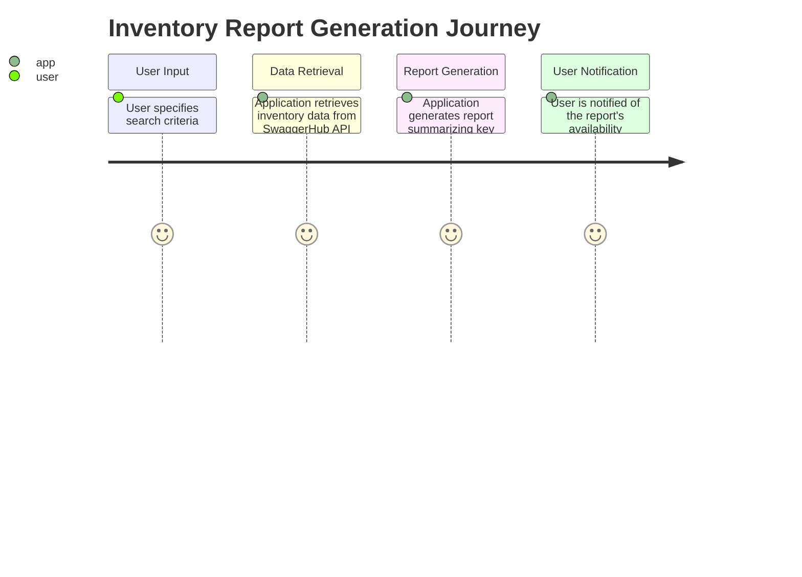
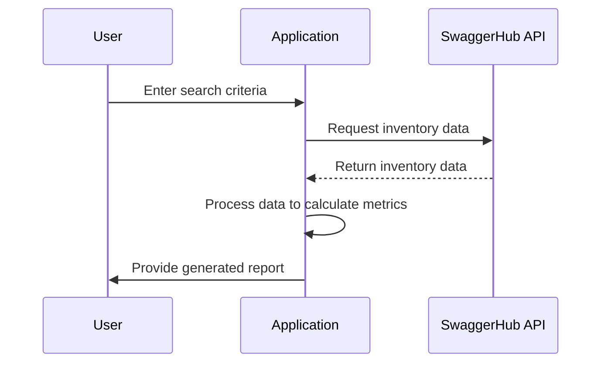
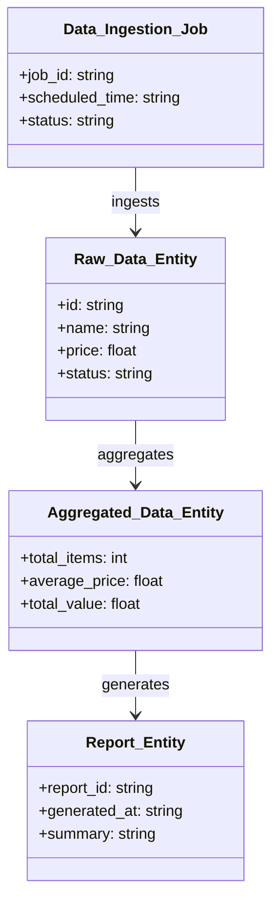
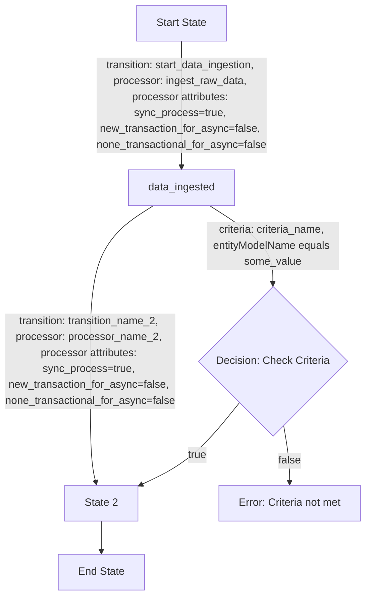

# Product Requirements Document (PRD) for Inventory Report Generation Application

## Introduction

This document outlines the requirements for the Inventory Report Generation Application, which leverages the SwaggerHub API to retrieve and process inventory data. The application aims to automate the report generation process, summarizing key metrics related to the inventory items.

## Objectives

- To develop an application that can generate reports on inventory data using the SwaggerHub API.
- To ensure that the application summarizes key metrics such as the total number of items, average price, and total value.
- To present the reports in a user-friendly format with clear error handling.

## User Requirements

### User Stories

1. **User Story 1: Data Retrieval**
   - **As a** developer
   - **I want to** retrieve all inventory items from the SwaggerHub API
   - **So that** I can use this data to generate reports summarizing key metrics.

2. **User Story 2: Report Generation**
   - **As a** business analyst
   - **I want to** generate reports that summarize key metrics such as the total number of items, average price, and total value
   - **So that** I can provide insights to stakeholders for better decision-making.

3. **User Story 3: User-Friendly Presentation**
   - **As a** user
   - **I want to** view the generated reports in a user-friendly format, such as tables or charts
   - **So that** I can easily understand and analyze the inventory data.

4. **User Story 4: Error Handling**
   - **As a** user
   - **I want to** have error handling mechanisms in place
   - **So that** I am informed of any issues during data retrieval or report generation.

### Journey Diagram

```mermaid
journey
    title Inventory Report Generation Journey
    section User Input
      User specifies search criteria: 5: user
    section Data Retrieval
      Application retrieves inventory data from SwaggerHub API: 5: app
    section Report Generation
      Application generates report summarizing key metrics: 5: app
    section User Notification
      User is notified of the report's availability: 5: app
```

### Sequence Diagram

```mermaid
sequenceDiagram
    participant User
    participant Application
    participant SwaggerHub API
    User->>Application: Enter search criteria
    Application->>SwaggerHub API: Request inventory data
    SwaggerHub API-->>Application: Return inventory data
    Application->>Application: Process data to calculate metrics
    Application->>User: Provide generated report
```

## Entity Outline

### Key Entities

1. **Data Ingestion Job (`data_ingestion_job`)**
   - **Type**: JOB
   - **Source**: SCHEDULED

2. **Raw Data Entity (`raw_data_entity`)**
   - **Type**: EXTERNAL_SOURCES_PULL_BASED_RAW_DATA
   - **Source**: ENTITY_EVENT

3. **Aggregated Data Entity (`aggregated_data_entity`)**
   - **Type**: SECONDARY_DATA
   - **Source**: ENTITY_EVENT

4. **Report Entity (`report_entity`)**
   - **Type**: REPORT
   - **Source**: ENTITY_EVENT

### Entities Diagram

```mermaid
classDiagram
    class Data_Ingestion_Job {
        +job_id: string
        +scheduled_time: string
        +status: string
    }

    class Raw_Data_Entity {
        +id: string
        +name: string
        +price: float
        +status: string
    }

    class Aggregated_Data_Entity {
        +total_items: int
        +average_price: float
        +total_value: float
    }

    class Report_Entity {
        +report_id: string
        +generated_at: string
        +summary: string
    }

    Data_Ingestion_Job --> Raw_Data_Entity : ingests
    Raw_Data_Entity --> Aggregated_Data_Entity : aggregates
    Aggregated_Data_Entity --> Report_Entity : generates
```

## Proposed Workflows

### 1. Data Ingestion Job Workflow

**Workflow Overview**: This workflow orchestrates the data ingestion process from the SwaggerHub API. It triggers the necessary steps to retrieve raw inventory data and initiate any subsequent processing.

**How the Workflow is Launched**:
- The workflow is launched based on a predefined schedule, as indicated by the "SCHEDULED" entity source.
- When the scheduled time arrives, the job automatically triggers the workflow to start the data ingestion process.

**Flowchart for Data Ingestion Job Workflow**:

```mermaid
flowchart TD
   A[Start State] -->|transition: start_data_ingestion, processor: ingest_raw_data, processor attributes: sync_process=true, new_transaction_for_async=false, none_transactional_for_async=false| B[data_ingested]
   B -->|transition: transition_name_2, processor: processor_name_2, processor attributes: sync_process=true, new_transaction_for_async=false, none_transactional_for_async=false| C[State 2]
   C --> D[End State]

   %% Decision point for criteria
   B -->|criteria: criteria_name, entityModelName equals some_value| D1{Decision: Check Criteria}
   D1 -->|true| C
   D1 -->|false| E[Error: Criteria not met]

   class A,B,C,D,D1 automated;
```

## Conclusion

This PRD serves as a comprehensive document outlining the requirements and workflows for the Inventory Report Generation Application. It includes user stories, entity outlines, and detailed workflows that align with the project's objectives. If you have any further questions or need additional information, please let me know! I'm here to help!