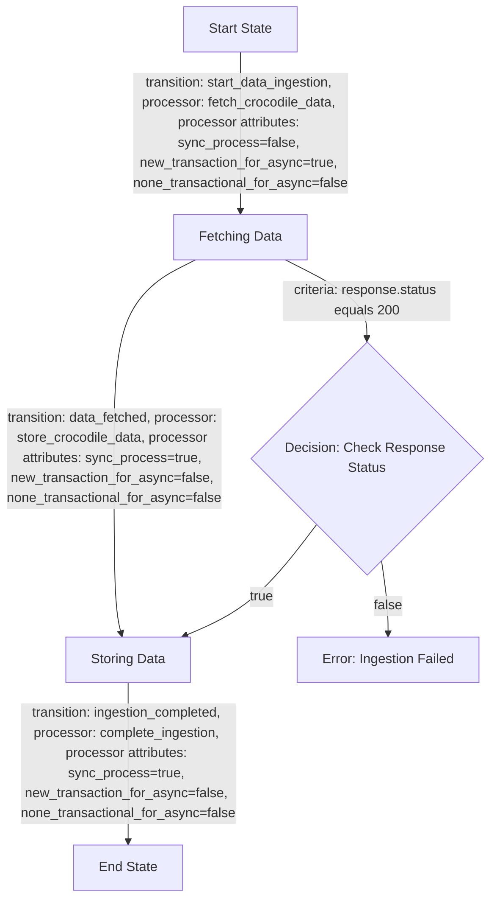

Sure! Here’s a complete Product Requirements Document (PRD) based on your crocodile data application requirements.

# Product Requirements Document (PRD) for Crocodile Data Application

## Introduction

This document outlines the design and functionality of a crocodile data application that will ingest data from an external API, store it, and allow users to filter the data by name, sex, and age. The document details the entities, workflows, and event-driven architecture that support the application.

## Requirements Overview

The application will:
- Ingest data about crocodiles from the API: https://test-api.k6.io/public/crocodiles/
- Store crocodile details including name, sex, and age.
- Allow users to filter the stored data based on specific criteria (name, sex, age).

## Proposed Entities

### 1. Crocodile Entity

```json
{
  "entity_name": "crocodile",
  "entity_type": "data_entity",
  "attributes": {
    "id": "string",
    "name": "string",
    "sex": "string",
    "age": "integer",
    "weight": "float",
    "length": "float",
    "date_added": "datetime"
  },
  "relationships": {
    "user_filters": "crocodile_filter"
  }
}
```

### 2. Crocodile Filter Entity

```json
{
  "entity_name": "crocodile_filter",
  "entity_type": "data_entity",
  "attributes": {
    "id": "string",
    "name": "string",
    "sex": "string",
    "age": {
      "min": "integer",
      "max": "integer"
    },
    "date_created": "datetime"
  },
  "relationships": {
    "crocodile": "crocodile"
  }
}
```

### 3. Data Ingestion Orchestration Entity

```json
{
  "entity_name": "crocodile_data_ingestion",
  "entity_type": "API_REQUEST",
  "attributes": {
    "id": "string",
    "api_url": "https://test-api.k6.io/public/crocodiles/",
    "last_run": "datetime",
    "status": "string",
    "parameters": {
      "filter_by_name": "string",
      "filter_by_sex": "string",
      "filter_by_age": {
        "min": "integer",
        "max": "integer"
      }
    }
  },
  "relationships": {
    "crocodiles": "crocodile"
  }
}
```

## Proposed Workflow for Crocodile Data Ingestion

### Workflow Description

This workflow will manage the process of fetching crocodile data from the API, storing it, and providing feedback on whether the ingestion was successful.

### Workflow Flowchart


```mermaid
flowchart TD
   A[Start State] -->|transition: start_data_ingestion, processor: fetch_crocodile_data, processor attributes: sync_process=false, new_transaction_for_async=true, none_transactional_for_async=false| B[Fetching Data]
   B -->|transition: data_fetched, processor: store_crocodile_data, processor attributes: sync_process=true, new_transaction_for_async=false, none_transactional_for_async=false| C[Storing Data]
   C -->|transition: ingestion_completed, processor: complete_ingestion, processor attributes: sync_process=true, new_transaction_for_async=false, none_transactional_for_async=false| D[End State]

   %% Decision point for criteria
   B -->|criteria: response.status equals 200| D1{Decision: Check Response Status}
   D1 -->|true| C
   D1 -->|false| E[Error: Ingestion Failed]

   class A,B,C,D,D1,E automated;
```

### Transition Descriptions

1. **Fetching Data**: Fetches data from the API.
2. **Check Response Status**: Evaluates the response status to determine success.
3. **Storing Data**: Saves the fetched data into the crocodile entity.
4. **Ingestion Completed**: Marks the ingestion process as complete.
5. **Error Handling**: If the response status isn’t successful, the workflow leads to an error state.

## Conclusion

This PRD outlines the structure and functionality of the crocodile data application. It details the entities required for storing crocodile data, the orchestration workflow for ingestion, and how the application will manage user interactions. The design promotes a clear and efficient event-driven architecture aimed at providing a seamless user experience.

Let me know if you need any modifications or further details! 😊