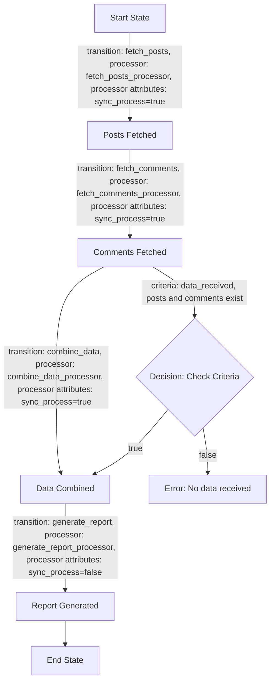

Sure! Here’s a complete Product Requirements Document (PRD) based on our discussions:

# Product Requirements Document (PRD) for Data Ingestion and Reporting Application

## Introduction

This document outlines the requirements for an application designed to ingest data from two APIs: one for posts and another for comments. The application will combine this data, analyze it, and generate a report on the number of comments for each post, sending it via email.

## Goals and Objectives

- To create a system that efficiently fetches and processes data from external APIs.
- To generate timely reports that inform users of engagement metrics.
- To implement a robust event-driven architecture using the Cyoda framework.

## User Stories

1. **As a user, I want to fetch posts and comments from APIs so that I can analyze user engagement.**
   - **Acceptance Criteria**:
     - Data is successfully fetched from both the posts and comments APIs.
     - Comments are correctly nested under the respective posts.

2. **As a user, I want to generate a report with the number of comments for each post immediately after data ingestion.**
   - **Acceptance Criteria**:
     - The report contains the post ID, title, and quantity of comments.
     - The report is sent to my email in a simple text format.

3. **As a user, I want to be notified if there’s an error in fetching data or generating the report.**
   - **Acceptance Criteria**:
     - Notifications are sent if any issues occur during data processing.

## Entity Outline

1. **Post Entity**
   - **Source**: `EXTERNAL_SOURCES_PULL_BASED_RAW_DATA`
   - **Type**: `RAW_DATA`

   Example JSON:
   ```json
   {
     "userId": 1,
     "postId": 1,
     "title": "sunt aut facere repellat provident occaecati excepturi optio reprehenderit",
     "body": "quia et suscipit...",
     "comments": []
   }
   ```

2. **Comment Entity**
   - **Source**: `EXTERNAL_SOURCES_PULL_BASED_RAW_DATA`
   - **Type**: `RAW_DATA`

   Example JSON:
   ```json
   {
     "postId": 1,
     "commentId": 1,
     "name": "id labore ex et quam laborum",
     "email": "Eliseo@gardner.biz",
     "body": "laudantium enim quasi est quidem..."
   }
   ```

3. **Combined Entity**
   - **Source**: `ENTITY_EVENT`
   - **Type**: `SECONDARY_DATA`

   Example JSON:
   ```json
   {
     "postId": 1,
     "title": "sunt aut facere repellat provident occaecati excepturi optio reprehenderit",
     "comments": [
       {
         "commentId": 1,
         "name": "id labore ex et quam laborum",
         "email": "Eliseo@gardner.biz",
         "body": "laudantium enim quasi est quidem..."
       }
     ]
   }
   ```

## Proposed Workflows

### Orchestration Entity Workflow

**Workflow Name**: `data_ingestion_workflow`

**Launch Information**: The workflow is triggered automatically when a new data fetch is initiated.

### Flowchart for the Workflow


```mermaid
flowchart TD
   A[Start State] -->|transition: fetch_posts, processor: fetch_posts_processor, processor attributes: sync_process=true| B[Posts Fetched]
   B -->|transition: fetch_comments, processor: fetch_comments_processor, processor attributes: sync_process=true| C[Comments Fetched]
   C -->|transition: combine_data, processor: combine_data_processor, processor attributes: sync_process=true| D[Data Combined]
   D -->|transition: generate_report, processor: generate_report_processor, processor attributes: sync_process=false| E[Report Generated]
   E --> F[End State]

   %% Decision point for criteria
   C -->|criteria: data_received, posts and comments exist| D1{Decision: Check Criteria}
   D1 -->|true| D
   D1 -->|false| E1[Error: No data received]

   class A,B,C,D,D1 automated;
```

## Event-Driven Architecture Explanation

In the Cyoda framework, entities emit events upon being saved or updated. For instance:
- When a new post is fetched and saved, an event triggers the subsequent processing steps (e.g., fetching comments, combining data).
- This event-driven model ensures that the application can respond dynamically to state changes, enhancing scalability and efficiency.

## Conclusion

This PRD outlines a robust framework for building your data ingestion and reporting application. By leveraging the Cyoda event-driven architecture, we can ensure timely processing and reporting, providing valuable insights into user engagement through effective data analysis.

Feel free to review this document and let me know if there's anything you'd like to adjust or expand upon! I'm here to help! 😊