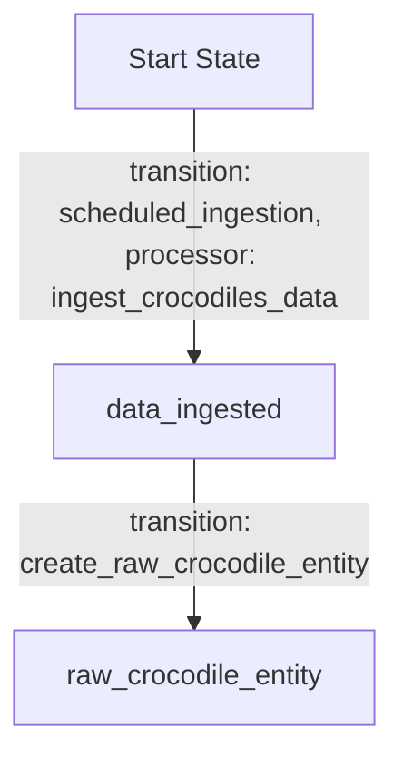
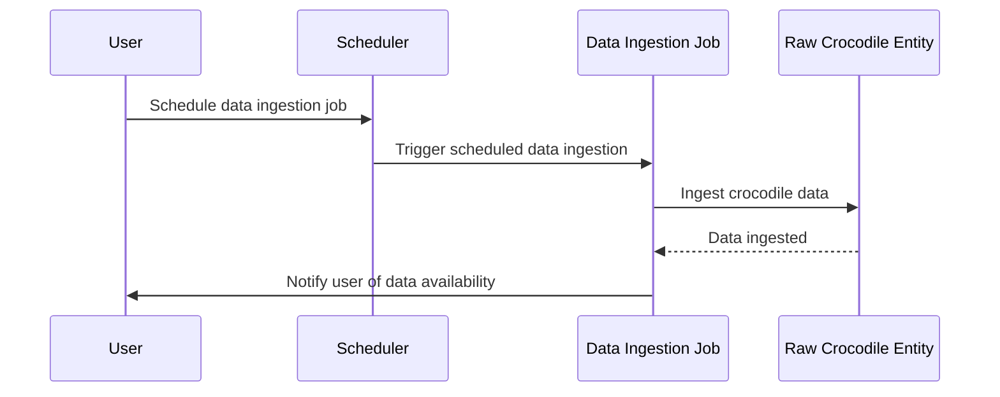
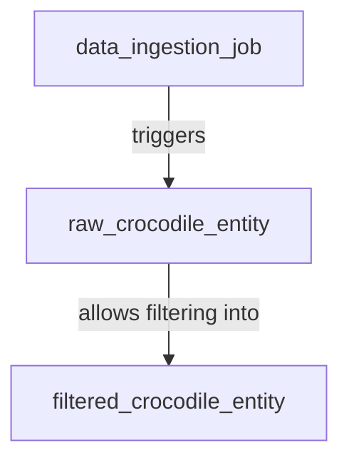

# Product Requirements Document (PRD) for Cyoda Design

## Introduction

This document provides an overview of the Cyoda-based application designed to ingest, filter, and manage crocodile data from an API, allowing users to access this data based on specific criteria. It explains how the Cyoda design aligns with the specified requirements while offering insights into the structure of entities, workflows, and the event-driven architecture that powers the application. The design is represented in a Cyoda JSON format which is translated into a human-readable document for clarity.

## What is Cyoda?

Cyoda is a serverless, event-driven framework designed to manage workflows through entities representing jobs and data. Each entity has a defined state, and transitions between states are governed by events that occur within the system, enabling a responsive and scalable architecture.

### Cyoda Entity Database

In the Cyoda ecosystem, entities are fundamental components that represent processes and data. The following entities are defined for our application:

1. **Data Ingestion Job (`data_ingestion_job`)**:
   - **Type**: JOB
   - **Source**: SCHEDULED
   - **Description**: This job ingests crocodile data from the specified API and triggers the creation of raw crocodile entities.

2. **Raw Crocodile Entity (`raw_crocodile_entity`)**:
   - **Type**: EXTERNAL_SOURCES_PULL_BASED_RAW_DATA
   - **Source**: ENTITY_EVENT
   - **Description**: This entity stores the raw data obtained from the API.

3. **Filtered Crocodile Entity (`filtered_crocodile_entity`)**:
   - **Type**: SECONDARY_DATA
   - **Source**: ENTITY_EVENT
   - **Description**: This entity allows filtering of the crocodile data based on criteria like name, sex, and age.

### Workflow Overview

The workflows in Cyoda define processes tied to each job entity. The `data_ingestion_job` includes a workflow that outlines the transition of data ingestion:

```mermaid
flowchart TD
    A[Start State] -->|transition: scheduled_ingestion, processor: ingest_crocodiles_data| B[data_ingested]
    B -->|transition: create_raw_crocodile_entity| C[raw_crocodile_entity]

    class A,B,C automated;
```

### Event-Driven Approach

An event-driven architecture allows the application to respond automatically to changes or triggers. In this specific requirement, the following events occur:

1. **Data Ingestion**: The data ingestion job is triggered on a scheduled basis, automatically initiating the process of fetching data from the specified API.
2. **Entity Creation**: Once data ingestion is complete, raw crocodile entities are created based on the ingested data.
3. **Data Filtering**: Users can filter the raw crocodile data through the filtered crocodile entity.

### Sequence Diagram

```mermaid
sequenceDiagram
    participant User
    participant Scheduler
    participant Data Ingestion Job
    participant Raw Crocodile Entity

    User->>Scheduler: Schedule data ingestion job
    Scheduler->>Data Ingestion Job: Trigger scheduled data ingestion
    Data Ingestion Job->>Raw Crocodile Entity: Ingest crocodile data
    Raw Crocodile Entity-->>Data Ingestion Job: Data ingested
    Data Ingestion Job->>User: Notify user of data availability
```

## Entity Relationships Diagram

```mermaid
graph TD;
    A[data_ingestion_job] -->|triggers| B[raw_crocodile_entity];
    B -->|allows filtering into| C[filtered_crocodile_entity];
```

## Conclusion

The Cyoda design effectively aligns with the requirements for creating a robust crocodile data processing application. By utilizing the event-driven model, the application efficiently manages state transitions of each entity involved, from data ingestion to filtered access. The outlined entities, workflows, and events comprehensively cover the needs of the application, ensuring a smooth and automated process.

This PRD serves as a foundation for implementation and development, guiding the technical team through the specifics of the Cyoda architecture while providing clarity for users who may be new to the Cyoda framework.