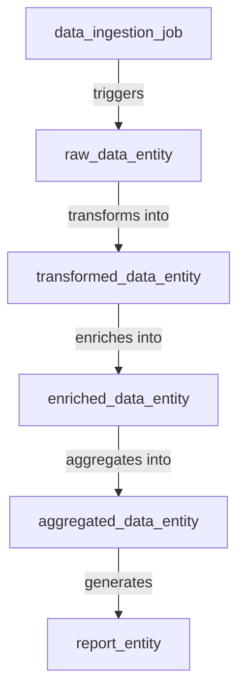
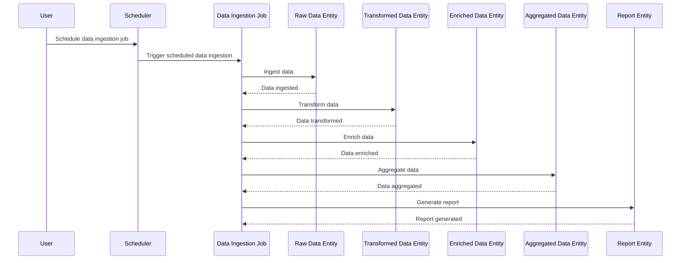

# Product Requirements Document (PRD) for Cyoda Design

## Introduction

This document outlines the Cyoda-based application designed for managing data ingestion, transformation, enrichment, aggregation, and report generation. The design is represented in JSON format, which defines the architecture of the application in terms of entities and workflows. This PRD explains how the Cyoda design aligns with the specified requirements and provides a comprehensive overview of the concepts involved.

## What is Cyoda?

Cyoda is a serverless, event-driven framework that manages workflows through entities representing jobs and data. The architecture is designed to be responsive and scalable, allowing for efficient processing of data through defined workflows and event-driven mechanisms.

### Key Concepts of Cyoda Design JSON

1. **Entities**: Fundamental components representing different data states or processes, such as `JOB`, `RAW_DATA`, and `SECONDARY_DATA`. Each entity is an object that contains specific data and has defined properties including `entity_name`, `entity_type`, `entity_source`, and an associated workflow.

2. **Workflows**: Processes associated with each job entity that define state transitions as events occur. Each workflow consists of transitions detailing how an entity moves from one state to another based on specific criteria.

3. **Event-Driven Architecture**: Automatically responds to changes in the state of entities, promoting scalability and efficiency. Events trigger workflows, which advance the state transitions of entities.

## Creating Entities

### How to Create an Entity

To create an entity in the Cyoda design, you will need to define the following key attributes:

1. **entity_name**: A unique identifier for the entity, typically in lowercase with underscores (e.g., `data_ingestion_job`).

2. **entity_type**: The type of entity, which can be one of the following:
   - `JOB`: Represents a process executing workflows.
   - `EXTERNAL_SOURCES_PULL_BASED_RAW_DATA`: Represents raw data sourced from external systems.
   - `SECONDARY_DATA`: Represents processed or derived data from the raw data.

3. **entity_source**: Indicates the origin of the entity:
   - `API_REQUEST`: The entity is created through an API call.
   - `SCHEDULED`: The entity is triggered on a scheduled basis.
   - `ENTITY_EVENT`: The entity is generated in response to another entity's event.

4. **depends_on_entity**: Specifies if this entity is dependent on another entity (e.g., `data_ingestion_job`).

5. **entity_workflow**: Defines the workflow for the entity, which includes:
   - **name**: The name of the workflow (e.g., `data_ingestion_workflow`).
   - **class_name**: The class that represents the workflow entity (typically `com.cyoda.tdb.model.treenode.TreeNodeEntity`).
   - **transitions**: An array of transitions that describe how the entity will change state.

## Cyoda Design Overview

The Cyoda design consists of various entities with defined workflows, each with transitions that describe how entities move through their lifecycle.

### Entities and Workflows

1. **Data Ingestion Job (`data_ingestion_job`)**
   - Type: JOB
   - Source: SCHEDULED
   - Workflow includes transitions for ingesting, transforming, enriching, aggregating, and generating reports.
   
   **Flowchart of `data_ingestion_job` Workflow**
   ```mermaid
   flowchart TD
      A[Start State] -->|transition: start_data_ingestion, processor: ingest_raw_data| B[data_ingested]
      B -->|transition: transform_data, processor: transform_data_process| C[data_transformed]
      C -->|transition: enrich_data, processor: enrich_data_process| D[data_enriched]
      D -->|transition: aggregate_data, processor: aggregate_data_process| E[data_aggregated]
      E -->|transition: add_report, processor: generate_report_process| F[report_generated]

      class A,B,C,D,E,F automated;
   ```

2. **Raw Data Entity (`raw_data_entity`)**
   - Type: EXTERNAL_SOURCES_PULL_BASED_RAW_DATA
   - Source: ENTITY_EVENT
   - Workflow has no transitions as it is triggered by the ingestion job.

3. **Transformed Data Entity (`transformed_data_entity`)**
   - Type: SECONDARY_DATA
   - Source: ENTITY_EVENT
   - Workflow has no transitions as it is triggered by the transformation of raw data.

4. **Enriched Data Entity (`enriched_data_entity`)**
   - Type: SECONDARY_DATA
   - Source: ENTITY_EVENT
   - Workflow has no transitions as it is created upon enrichment of transformed data.

5. **Aggregated Data Entity (`aggregated_data_entity`)**
   - Type: SECONDARY_DATA
   - Source: ENTITY_EVENT
   - Workflow has no transitions as it is the result of aggregation.

6. **Report Entity (`report_entity`)**
   - Type: SECONDARY_DATA
   - Source: ENTITY_EVENT
   - Workflow has no transitions as it is generated from aggregated data.

### Entity Relationship Diagram


```mermaid
graph TD;
    A[data_ingestion_job] -->|triggers| B[raw_data_entity];
    B -->|transforms into| C[transformed_data_entity];
    C -->|enriches into| D[enriched_data_entity];
    D -->|aggregates into| E[aggregated_data_entity];
    E -->|generates| F[report_entity];
```

### Sequence Diagram


```mermaid
sequenceDiagram
    participant User
    participant Scheduler
    participant Data Ingestion Job
    participant Raw Data Entity
    participant Transformed Data Entity
    participant Enriched Data Entity
    participant Aggregated Data Entity
    participant Report Entity

    User->>Scheduler: Schedule data ingestion job
    Scheduler->>Data Ingestion Job: Trigger scheduled data ingestion
    Data Ingestion Job->>Raw Data Entity: Ingest data
    Raw Data Entity-->>Data Ingestion Job: Data ingested
    Data Ingestion Job->>Transformed Data Entity: Transform data
    Transformed Data Entity-->>Data Ingestion Job: Data transformed
    Data Ingestion Job->>Enriched Data Entity: Enrich data
    Enriched Data Entity-->>Data Ingestion Job: Data enriched
    Data Ingestion Job->>Aggregated Data Entity: Aggregate data
    Aggregated Data Entity-->>Data Ingestion Job: Data aggregated
    Data Ingestion Job->>Report Entity: Generate report
    Report Entity-->>Data Ingestion Job: Report generated
```

## Conclusion

The Cyoda design effectively aligns with the requirements for creating a robust data processing application. By employing the event-driven model and defined workflows, the application can efficiently manage transitions of entities from data ingestion to report generation. This PRD serves as a foundational guide for implementation, clarifying the process of creating entities and their associated workflows. This should help new users better understand how to structure entities within the Cyoda framework.