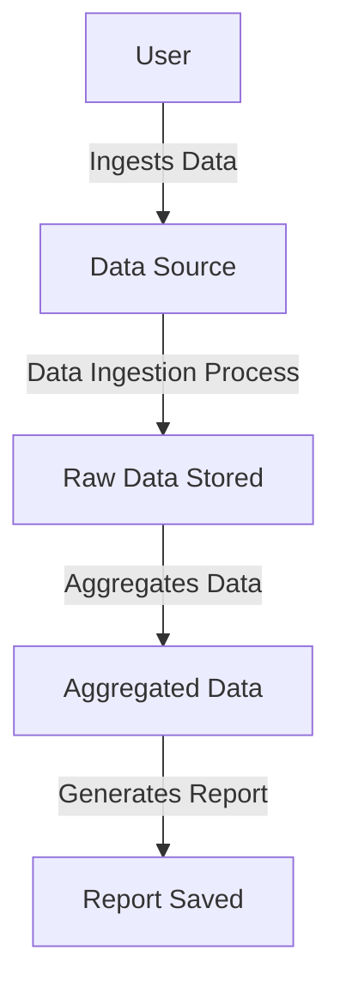
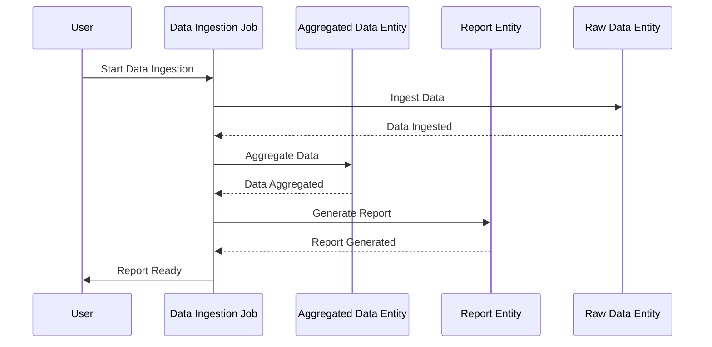
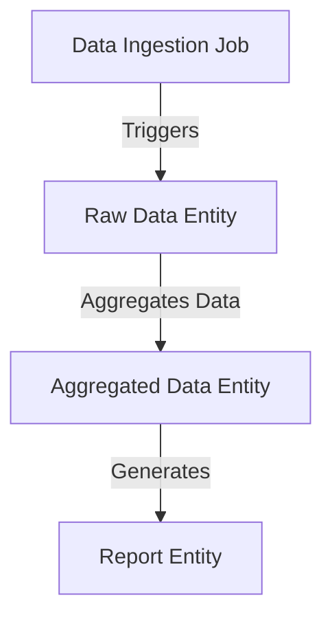
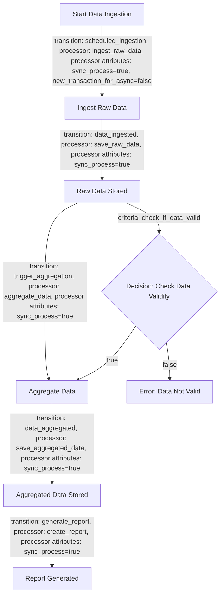

Sure! Below is a complete Product Requirements Document (PRD) tailored to your requirements, including all the elements we've discussed so far, formatted in Markdown for clarity.

---

# Product Requirements Document (PRD) for Data Processing Application

## Introduction

This document outlines the requirements for a data processing application designed to ingest, aggregate, and report data from specified sources. The application will leverage Cyoda's event-driven architecture and entity management system to automate workflows and ensure data integrity.

## User Requirements

### User Stories

1. **As a user**, I want to ingest data from a specified source so that I can begin processing the information I need for my reports.
2. **As a user**, I want to aggregate the ingested data based on specific criteria so that I can derive meaningful insights.
3. **As a user**, I want to save the aggregated data into a report format so that I can share the insights with my team.

### User Journey Diagram


```mermaid
graph TD;
    A[User] -->|Ingests Data| B[Data Source]
    B -->|Data Ingestion Process| C[Raw Data Stored]
    C -->|Aggregates Data| D[Aggregated Data]
    D -->|Generates Report| E[Report Saved]
```

### Sequence Diagram


```mermaid
sequenceDiagram
    participant User
    participant Data Ingestion Job
    participant Aggregated Data Entity
    participant Report Entity

    User->>Data Ingestion Job: Start Data Ingestion
    Data Ingestion Job->>Raw Data Entity: Ingest Data
    Raw Data Entity-->>Data Ingestion Job: Data Ingested
    Data Ingestion Job->>Aggregated Data Entity: Aggregate Data
    Aggregated Data Entity-->>Data Ingestion Job: Data Aggregated
    Data Ingestion Job->>Report Entity: Generate Report
    Report Entity-->>Data Ingestion Job: Report Generated
    Data Ingestion Job->>User: Report Ready
```

## Entities Definition

### Entities Outline

1. **Data Ingestion Job**
   - **Type**: JOB
   - **Source**: SCHEDULED
   - **Description**: Manages the process of ingesting data from specified sources at scheduled intervals.

2. **Raw Data Entity**
   - **Type**: EXTERNAL_SOURCES_PULL_BASED_RAW_DATA
   - **Source**: ENTITY_EVENT
   - **Description**: Stores unprocessed data that has been ingested by the data ingestion job.
   
3. **Aggregated Data Entity**
   - **Type**: SECONDARY_DATA
   - **Source**: ENTITY_EVENT
   - **Description**: Holds the aggregated data derived from the raw data for reporting purposes.
   
4. **Report Entity**
   - **Type**: SECONDARY_DATA
   - **Source**: ENTITY_EVENT
   - **Description**: Contains the generated report that is sent to the users, summarizing the aggregated data.

### Entities Diagram


```mermaid
graph TD;
    A[Data Ingestion Job] -->|Triggers| B[Raw Data Entity]
    B -->|Aggregates Data| C[Aggregated Data Entity]
    C -->|Generates| D[Report Entity]
```

## Proposed Workflows

### Data Ingestion Workflow

- **Orchestration Entity**: Data Ingestion Job
- **Workflow Purpose**: To manage the process of ingesting data from specified sources and triggering subsequent actions.
- **How It Launches**: This workflow is automatically launched based on a schedule defined for the Data Ingestion Job.

#### Flowchart for Data Ingestion Workflow


```mermaid
flowchart TD
   A[Start Data Ingestion] -->|transition: scheduled_ingestion, processor: ingest_raw_data, processor attributes: sync_process=true, new_transaction_for_async=false| B[Ingest Raw Data]
   B -->|transition: data_ingested, processor: save_raw_data, processor attributes: sync_process=true| C[Raw Data Stored]
   C -->|transition: trigger_aggregation, processor: aggregate_data, processor attributes: sync_process=true| D[Aggregate Data]
   D -->|transition: data_aggregated, processor: save_aggregated_data, processor attributes: sync_process=true| E[Aggregated Data Stored]
   E -->|transition: generate_report, processor: create_report, processor attributes: sync_process=true| F[Report Generated]

   %% Decision point for criteria
   C -->|criteria: check_if_data_valid| D1{Decision: Check Data Validity}
   D1 -->|true| D
   D1 -->|false| E1[Error: Data Not Valid]

   class A,B,C,D,E,F,D1,E1 automated;
```

## Example Data Models

1. **Data Ingestion Job**
   ```json
   {
       "job_id": "ingestion_job_001",
       "source": "API_ENDPOINT",
       "scheduled_time": "2023-10-01T10:00:00Z",
       "status": "Scheduled"
   }
   ```

2. **Raw Data Entity**
   ```json
   {
       "raw_data_id": "raw_data_001",
       "data": [
           {
               "id": 1,
               "title": "Data Point 1",
               "value": 100
           },
           {
               "id": 2,
               "title": "Data Point 2",
               "value": 200
           }
       ],
       "ingestion_timestamp": "2023-10-01T10:05:00Z"
   }
   ```

3. **Aggregated Data Entity**
   ```json
   {
       "aggregated_data_id": "aggregated_data_001",
       "total": 300,
       "aggregation_timestamp": "2023-10-01T10:06:00Z",
       "summary": "Total of all values ingested."
   }
   ```

4. **Report Entity**
   ```json
   {
       "report_id": "report_2023_10_01",
       "generated_at": "2023-10-01T10:10:00Z",
       "report_summary": "Monthly Data Overview.",
       "data": [
           {
               "title": "Data Point 1",
               "value": 100
           },
           {
               "title": "Data Point 2",
               "value": 200
           }
       ],
       "overall_status": "Completed"
   }
   ```

## Conclusion

This PRD serves as a foundational guide for developing the data processing application using Cyoda's event-driven architecture. By outlining the user requirements, entity definitions, workflows, and example data models, stakeholders can ensure that the application meets its intended goals while providing a clear path for development. 

If you have any further questions or need modifications, just let me know! 😊