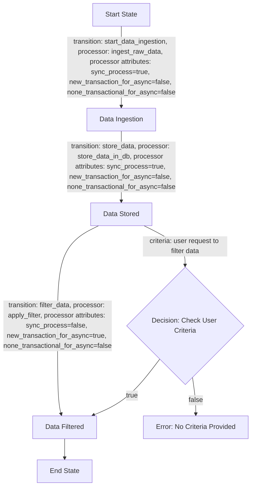

Sure! Here’s a complete Product Requirements Document (PRD) tailored to your crocodile data ingestion application using the Cyoda framework.

---

# Product Requirements Document (PRD) for Crocodile Data Ingestion Application

## Introduction

This document outlines the requirements and design for a Cyoda-based application that will manage the ingestion, storage, and filtering of crocodile data fetched from an external API. The goal is to create a responsive and user-friendly application that allows for efficient data processing and retrieval.

## What is Cyoda?

Cyoda is a serverless, event-driven framework that facilitates the management of workflows through entities representing jobs and data. It operates through defined states and transitions, enabling a responsive and scalable architecture.

## Cyoda Entity Database

### Entities
1. **Crocodile Data Entity**
   - **Entity Name**: `crocodile_data`
   - **Entity Type**: `EXTERNAL_SOURCES_PULL_BASED_RAW_DATA`
   - **Entity Source**: `API_REQUEST`
   - **Description**: Stores unprocessed data about crocodiles from the specified API.
   - **JSON Example**:
   ```json
   {
     "id": 1,
     "name": "Bert",
     "sex": "M",
     "date_of_birth": "2010-06-27",
     "age": 14
   }
   ```

2. **Filtered Crocodile Data Entity**
   - **Entity Name**: `filtered_crocodile_data`
   - **Entity Type**: `SECONDARY_DATA`
   - **Entity Source**: `ENTITY_EVENT`
   - **Description**: Holds the filtered data based on user criteria such as name, sex, and age.
   - **JSON Example**:
   ```json
   {
     "filtered_id": 1,
     "name": "Bert",
     "sex": "M",
     "age": 14
   }
   ```

## Workflow Overview

### Crocodile Data Ingestion Job Workflow
This workflow orchestrates the ingestion of data from the API, storage in the database, and filtering based on user input.

**Launching the Workflow**: 
- Triggered by a scheduled job or manually by the admin.

### Flowchart

```mermaid
flowchart TD
   A[Start State] -->|transition: start_data_ingestion, processor: ingest_raw_data, processor attributes: sync_process=true, new_transaction_for_async=false, none_transactional_for_async=false| B[Data Ingestion]
   B -->|transition: store_data, processor: store_data_in_db, processor attributes: sync_process=true, new_transaction_for_async=false, none_transactional_for_async=false| C[Data Stored]

   C -->|transition: filter_data, processor: apply_filter, processor attributes: sync_process=false, new_transaction_for_async=true, none_transactional_for_async=false| D[Data Filtered]
   D --> E[End State]

   %% Decision point for criteria
   C -->|criteria: user request to filter data| F{Decision: Check User Criteria}
   F -->|true| D
   F -->|false| G[Error: No Criteria Provided]

   class A,B,C,D,F automated;
```

### Explanation of Workflow
- The workflow begins with data ingestion from the API.
- After ingestion, the data is stored in the database.
- Users can then apply filters based on their criteria.
- A decision point checks if user criteria are provided before filtering the data.

## Event-Driven Approach
In Cyoda, each entity generates events when it is created, updated, or deleted. For example, when the `crocodile_data` entity is saved after ingestion, an event triggers any subsequent workflows, thus allowing for responsive data processing.

## Conclusion
The Cyoda design effectively aligns with the requirements for creating an application that ingests, stores, and filters crocodile data. The outlined entities, workflows, and event-driven architecture provide a solid foundation for building a responsive and efficient application.

---

If you have any further questions or need additional details for this PRD, feel free to ask! I'm here to help you through the application development process.