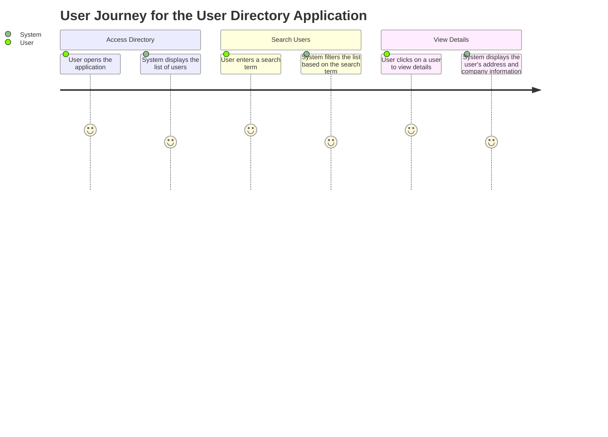
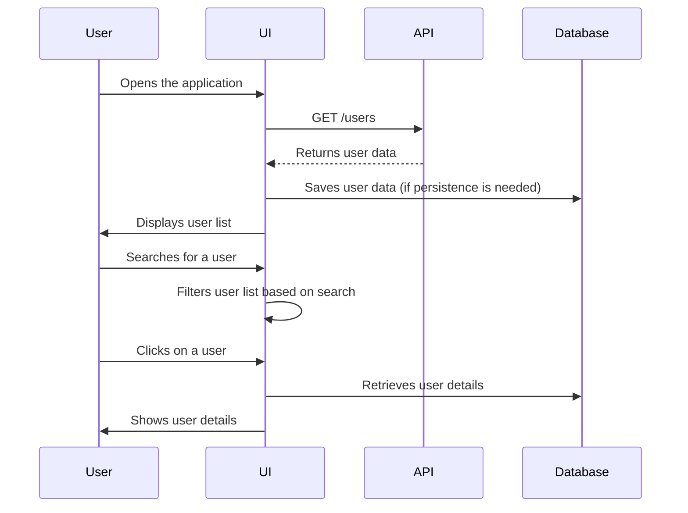
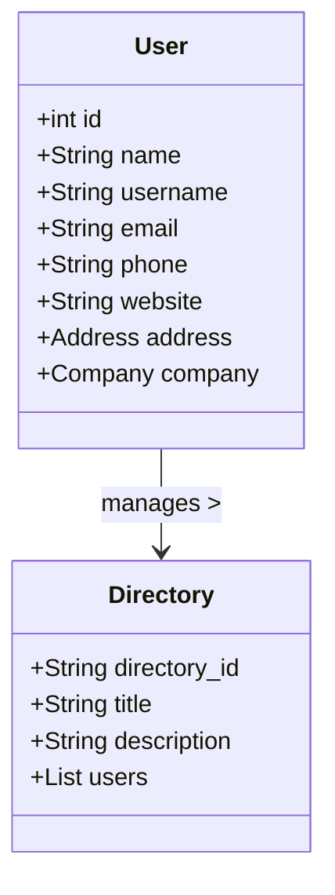
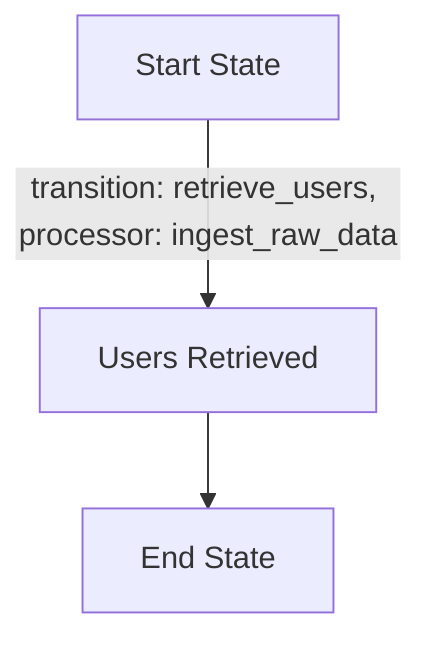
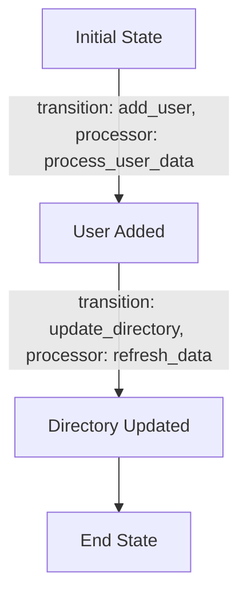

Here’s a detailed Product Requirement Document (PRD) for the user directory application, including user requirements, entity definitions, workflows, and supporting diagrams. This document aims to provide a comprehensive overview that will guide the development process.

---

# Product Requirement Document (PRD) for User Directory Application

## Introduction

This document outlines the requirements for the user directory application, which aims to provide users with a simple interface to view, search, and manage contact information for various users. The application will retrieve data from a third-party API and offer functionalities to enhance the user experience.

## User Requirement Overview

The user directory application will:

- List all users with their basic contact details, including name, email, phone number, and address.
- Allow users to search and filter the directory by name or email.
- Provide a detailed view for each user, showing additional information such as company details.

## User Stories

```markdown
### User Stories

- **As a user**, I want to view a list of all users with their basic contact details, so that I can easily find and access the information I need.
- **As a user**, I want to search for specific users by name or email, so that I can quickly locate the contacts I am interested in.
- **As a user**, I want to see additional details about each user, including their address and company information, so that I have a complete view of the contact.
```

## Journey Diagram


```mermaid
journey
    title User Journey for the User Directory Application
    section Access Directory
      User opens the application: 5: User
      System displays the list of users: 4: System
    section Search Users
      User enters a search term: 5: User
      System filters the list based on the search term: 4: System
    section View Details
      User clicks on a user to view details: 5: User
      System displays the user's address and company information: 4: System
```

## Sequence Diagram


```mermaid
sequenceDiagram
    participant User
    participant UI
    participant API
    participant Database

    User->>UI: Opens the application
    UI->>API: GET /users
    API-->>UI: Returns user data
    UI->>Database: Saves user data (if persistence is needed)
    UI->>User: Displays user list
    User->>UI: Searches for a user
    UI->>UI: Filters user list based on search
    User->>UI: Clicks on a user
    UI->>Database: Retrieves user details
    UI->>User: Shows user details
```

## Entities Outline

### 1. User Entity

- **Description**: Represents the basic information about users retrieved from the API.
- **Example JSON**:
  ```json
  {
    "id": 1,
    "name": "Leanne Graham",
    "username": "Bret",
    "email": "Sincere@april.biz",
    "address": {
      "street": "Kulas Light",
      "suite": "Apt. 556",
      "city": "Gwenborough",
      "zipcode": "92998-3874",
      "geo": {
        "lat": "-37.3159",
        "lng": "81.1496"
      }
    },
    "phone": "1-770-736-8031 x56442",
    "website": "hildegard.org",
    "company": {
      "name": "Romaguera-Crona",
      "catchPhrase": "Multi-layered client-server neural-net",
      "bs": "harness real-time e-markets"
    }
  }
  ```

- **Saving Method**: Retrieved directly via an API call to the user data endpoint.

### 2. Directory Entity

- **Description**: Represents the collection of users and any additional functionalities related to managing the user list.
- **Example JSON**:
  ```json
  {
    "directory_id": "dir_001",
    "title": "User Directory",
    "description": "A directory to manage and access user contacts.",
    "users": [
      {
        "id": 1,
        "name": "Leanne Graham",
        "email": "Sincere@april.biz"
      }
    ]
  }
  ```

- **Saving Method**: This could be saved as a secondary data entity (SECONDARY_DATA) after processing the user data.

## Entities Diagram


```mermaid
classDiagram
    class User {
      +int id
      +String name
      +String username
      +String email
      +String phone
      +String website
      +Address address
      +Company company
    }
    class Directory {
      +String directory_id
      +String title
      +String description
      +List<User> users
    }
    User --> Directory : manages >
```

## Workflows and Flowcharts

### 1. Workflow for User Retrieval

- **Associated with**: User Entity
- **Flowchart**:

```mermaid
flowchart TD
  A[Start State] -->|transition: retrieve_users, processor: ingest_raw_data| B[Users Retrieved]
  B --> C[End State]
```

### 2. Workflow for Directory Management

- **Associated with**: Directory Entity
- **Flowchart**:

```mermaid
flowchart TD
  A[Initial State] -->|transition: add_user, processor: process_user_data| B[User Added]
  B -->|transition: update_directory, processor: refresh_data| C[Directory Updated]
  C --> D[End State]
```

## Conclusion

This PRD provides a comprehensive overview of the user directory application, including the user journeys, entity definitions, workflows, and visual representations of the processes involved. By following this document, the development team will be well-equipped to build an application that meets the specified requirements and enhances the user experience.

If you have any further questions or need additional modifications, please let me know! I'm here to help and ensure that everything aligns with your vision for the project.