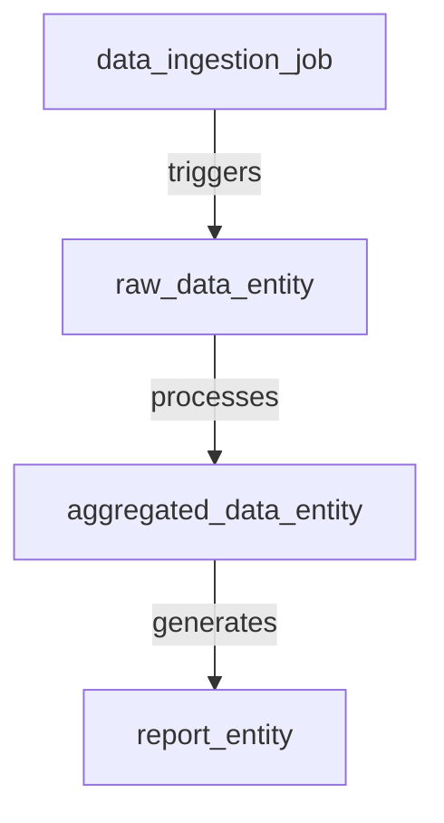
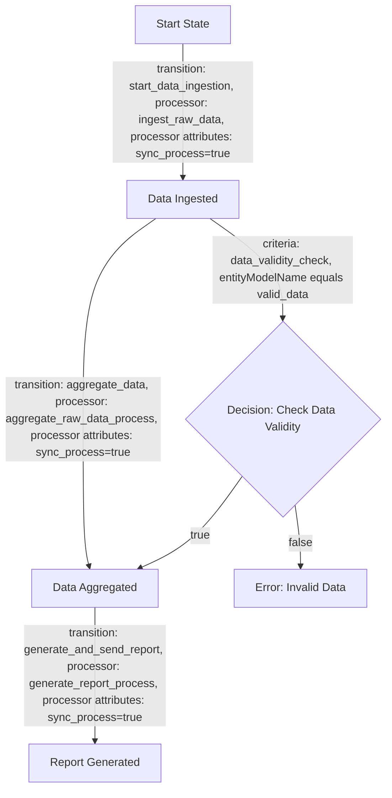

Sure! Below is a complete Product Requirements Document (PRD) for your application based on the requirements and discussions so far.

---

# Product Requirements Document (PRD) for Data Ingestion, Aggregation, and Reporting Application

## Introduction
This document outlines the design and requirements for an application that ingests data, aggregates it, and generates reports. The application is based on the Cyoda framework and utilizes an event-driven architecture to ensure scalability and efficiency.

## What is Cyoda?
Cyoda is a serverless, event-driven framework that enables management of workflows through entities that represent jobs and data. Each entity has defined states and transitions that are governed by events, allowing for a responsive architecture.

## Functional Requirements
The application must fulfill the following requirements:

1. **Data Ingestion**: The application must be able to ingest data from a specified source.
2. **Data Aggregation**: After ingestion, the application must aggregate the data.
3. **Report Generation**: The aggregated data must be saved in a report format.

## Entities
### Outline of Key Entities

1. **Data Ingestion Job (`data_ingestion_job`)**
   - **Type**: JOB
   - **Source**: SCHEDULED
   - **Description**: Manages the process of ingesting data from a specified source and orchestrates subsequent workflows.

2. **Raw Data Entity (`raw_data_entity`)**
   - **Type**: EXTERNAL_SOURCES_PULL_BASED_RAW_DATA
   - **Source**: ENTITY_EVENT
   - **Description**: Stores raw, unprocessed data obtained from various inputs.

3. **Aggregated Data Entity (`aggregated_data_entity`)**
   - **Type**: SECONDARY_DATA
   - **Source**: ENTITY_EVENT
   - **Description**: Contains processed and aggregated data derived from the raw data.

4. **Report Entity (`report_entity`)**
   - **Type**: SECONDARY_DATA
   - **Source**: ENTITY_EVENT
   - **Description**: Holds the generated report created from the aggregated data.

### Entities Diagram

```mermaid
graph TD;
    A[data_ingestion_job] -->|triggers| B[raw_data_entity];
    B -->|processes| C[aggregated_data_entity];
    C -->|generates| D[report_entity];
```

## Workflows
### Workflow for Data Ingestion Job
The workflow for the **Data Ingestion Job** consists of transitions to handle data ingestion, aggregation, and report generation. It is launched on a scheduled basis.


```mermaid
flowchart TD
   A[Start State] -->|transition: start_data_ingestion, processor: ingest_raw_data, processor attributes: sync_process=true| B[Data Ingested]
   B -->|transition: aggregate_data, processor: aggregate_raw_data_process, processor attributes: sync_process=true| C[Data Aggregated]
   C -->|transition: generate_and_send_report, processor: generate_report_process, processor attributes: sync_process=true| D[Report Generated]

   %% Decision point for criteria
   B -->|criteria: data_validity_check, entityModelName equals valid_data| D1{Decision: Check Data Validity}
   D1 -->|true| C
   D1 -->|false| E[Error: Invalid Data]

   class A,B,C,D,D1 automated;
```

### Workflow Launch Information
The workflow is launched by triggering the **Data Ingestion Job** at a scheduled time. Once triggered, the workflow steps through each transition automatically based on the conditions defined.

## Event-Driven Architecture
In Cyoda, events are emitted whenever entities are created, updated, or deleted. This event-driven architecture allows other workflows to respond to these changes dynamically. For example, when a `raw_data_entity` is created, an event can automatically trigger data aggregation.

## Example JSON Data Models
1. **Data Ingestion Job**
```json
{
  "id": "job_001",
  "status": "scheduled",
  "scheduled_time": "2023-10-02T10:00:00Z"
}
```

2. **Raw Data Entity**
```json
{
  "id": "raw_data_001",
  "source": "API",
  "data": [
    {
      "record_id": 1,
      "title": "Sample Data 1",
      "value": "100"
    },
    {
      "record_id": 2,
      "title": "Sample Data 2",
      "value": "200"
    }
  ],
  "ingestion_timestamp": "2023-10-02T10:01:00Z"
}
```

3. **Aggregated Data Entity**
```json
{
  "id": "aggregated_data_001",
  "total_count": 2,
  "average_value": 150,
  "aggregation_timestamp": "2023-10-02T10:02:00Z"
}
```

4. **Report Entity**
```json
{
  "report_id": "report_2023_10_02",
  "generated_at": "2023-10-02T10:05:00Z",
  "report_title": "Daily Data Report",
  "total_entries": 2,
  "average_value": 150,
  "comments": "This report summarizes the data ingested and aggregated."
}
```

## Conclusion
The outlined design effectively addresses the application's requirements for data ingestion, aggregation, and report generation. By leveraging the Cyoda framework and an event-driven architecture, the application will be scalable, efficient, and responsive to changes. This PRD serves as a foundational document for the development team to implement and build the application.

---

If you need any more adjustments or additional information, feel free to ask! 😊