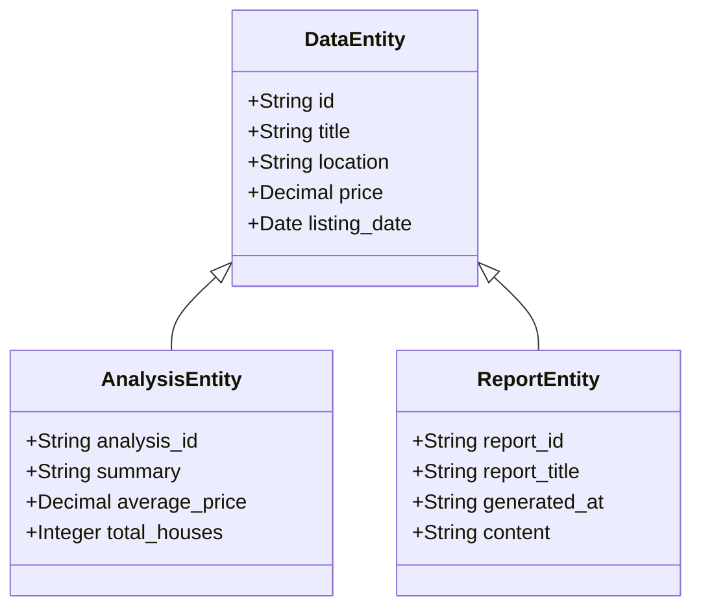
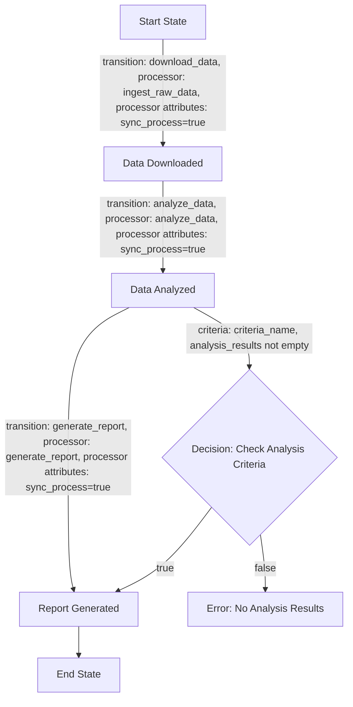

Sure! Here's a complete Product Requirements Document (PRD) tailored to your requirement of downloading, analyzing, and reporting on London Houses Data. 

---

# Product Requirements Document (PRD) for London Houses Data Analysis Application

## Introduction

This document provides an overview of the application designed to download data about London houses, analyze it using pandas, and generate a report based on the findings. The application leverages the Cyoda framework to manage workflows through an event-driven architecture.

## What is Cyoda?

Cyoda is a serverless, event-driven framework that facilitates the management of workflows via entities representing jobs and data. Each entity defines its state, and transitions between states are governed by events, enabling a responsive and scalable architecture.

## Cyoda Entity Database

The Cyoda entity database consists of the following core entities:

1. **Data Entity (`london_houses_data`)**
   - **Type**: `RAW_DATA`
   - **Source**: `EXTERNAL_SOURCES_PULL_BASED_RAW_DATA`
   - **Description**: Stores raw data downloaded about London houses.

2. **Analysis Entity (`london_houses_analysis`)**
   - **Type**: `SECONDARY_DATA`
   - **Source**: `ENTITY_EVENT`
   - **Description**: Contains the results of the analysis performed on the raw data.

3. **Report Entity (`london_houses_report`)**
   - **Type**: `SECONDARY_DATA`
   - **Source**: `ENTITY_EVENT`
   - **Description**: Holds the generated report based on the analysis results.

### Entity Diagram

```mermaid
classDiagram
    class DataEntity {
        +String id
        +String title
        +String location
        +Decimal price
        +Date listing_date
    }

    class AnalysisEntity {
        +String analysis_id
        +String summary
        +Decimal average_price
        +Integer total_houses
    }

    class ReportEntity {
        +String report_id
        +String report_title
        +String generated_at
        +String content
    }

    DataEntity <|-- AnalysisEntity
    DataEntity <|-- ReportEntity
```

## Workflow Overview

### Orchestration Entity Workflow (`london_houses_workflow`)

This workflow orchestrates the processes of downloading, analyzing, and reporting the London Houses Data.

#### Workflow Launch Information
- **Scheduled Trigger**: Can run daily or weekly to fetch the latest data.
- **Manual Trigger**: Users can initiate the workflow to refresh the data or generate a report.

### Workflow Flowchart

```mermaid
flowchart TD
   A[Start State] -->|transition: download_data, processor: ingest_raw_data, processor attributes: sync_process=true| B[Data Downloaded]
   B -->|transition: analyze_data, processor: analyze_data, processor attributes: sync_process=true| C[Data Analyzed]
   C -->|transition: generate_report, processor: generate_report, processor attributes: sync_process=true| D[Report Generated]
   D --> E[End State]

   %% Decision point for criteria
   C -->|criteria: criteria_name, analysis_results not empty| D1{Decision: Check Analysis Criteria}
   D1 -->|true| D
   D1 -->|false| E1[Error: No Analysis Results]

   class A,B,C,D,D1,E automated;
```

## Event-Driven Approach

Cyoda employs an event-driven architecture where events are triggered when an entity is created, updated, or deleted. For example, when the London Houses Data is downloaded and saved, it emits an event that can trigger the analysis process. Similarly, if the analysis results are updated, an event will signal the generation of the report.

## Example JSON Data Models

1. **London Houses Data Entity**
```json
{
  "id": "1",
  "title": "Luxury Apartment",
  "location": "Central London",
  "price": 1200000.00,
  "listing_date": "2023-09-30T00:00:00Z"
}
```

2. **London Houses Analysis Entity**
```json
{
  "analysis_id": "analysis_2023_10_01",
  "summary": "The average price of houses in Central London is significantly higher than in other areas.",
  "average_price": 950000.00,
  "total_houses": 50
}
```

3. **London Houses Report Entity**
```json
{
  "report_id": "report_2023_10_01",
  "report_title": "London Houses Market Analysis - October 2023",
  "generated_at": "2023-10-01T10:00:00Z",
  "content": "This report outlines the pricing trends and analyses the data collected for the month."
}
```

## Conclusion

The proposed Cyoda design effectively aligns with the requirements for creating an automated application for downloading, analyzing, and reporting on London Houses Data. By employing a robust event-driven model, the application can efficiently manage the state transitions of each entity involved in the workflow, ensuring a smooth and automated process.

---

Feel free to ask if you need further customization or additional details! 😊