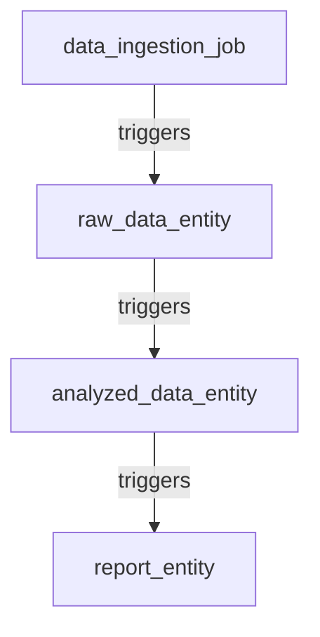
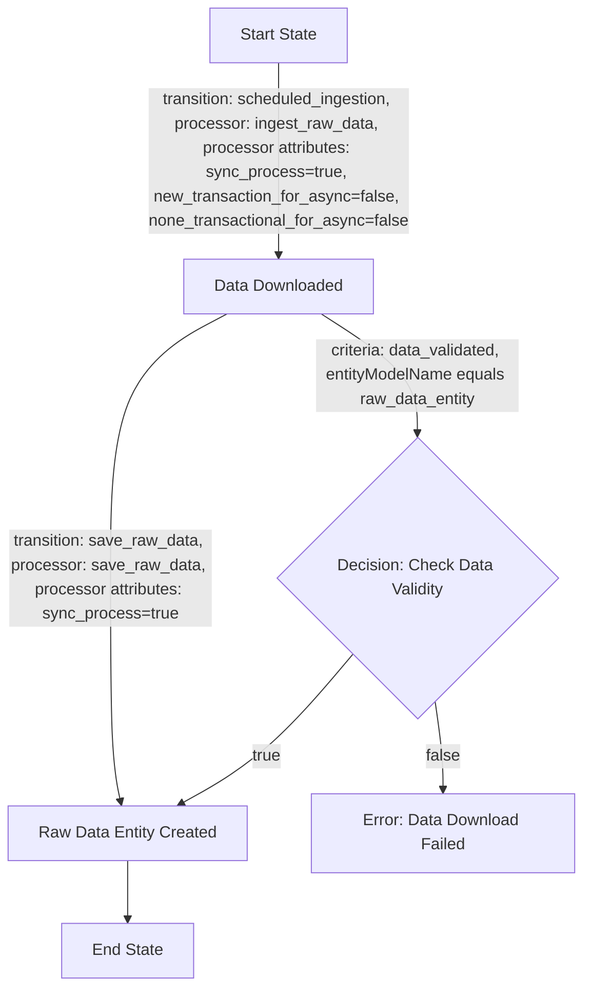

Sure! Here's a complete Product Requirements Document (PRD) for the application focusing on downloading, analyzing, and reporting on London Houses Data.

# Product Requirements Document (PRD) for London Houses Data Application

## Introduction

This document outlines the requirements for an application designed to download London Houses Data, analyze it using the pandas library, and generate reports. It details the entities, workflows, event-driven architecture, and data models involved in the system.

## Problem Statement

Users need an efficient way to download and analyze property data in London for making informed decisions. The application should automate the data retrieval process, enable detailed analysis, and provide actionable insights through reports.

## Key Features

1. **Data Ingestion**: Automatically download London Houses Data from external sources.
2. **Data Analysis**: Utilize the pandas library for data manipulation and analysis.
3. **Report Generation**: Create comprehensive reports based on analyzed data.
4. **Automated Scheduling**: Schedule data downloads and report generation.

## Cyoda Entity Database

### Entities Overview

1. **Data Ingestion Job (`data_ingestion_job`)**
   - **Type**: JOB
   - **Source**: SCHEDULED
   - **Description**: Orchestrates the download of London Houses Data.

2. **Raw Data Entity (`raw_data_entity`)**
   - **Type**: EXTERNAL_SOURCES_PULL_BASED_RAW_DATA
   - **Source**: ENTITY_EVENT
   - **Description**: Stores the raw data downloaded from external sources.

3. **Analyzed Data Entity (`analyzed_data_entity`)**
   - **Type**: SECONDARY_DATA
   - **Source**: ENTITY_EVENT
   - **Description**: Holds the processed data after analysis using pandas.

4. **Report Entity (`report_entity`)**
   - **Type**: SECONDARY_DATA
   - **Source**: ENTITY_EVENT
   - **Description**: Contains the generated report based on the analyzed data.

### Entities Diagram


```mermaid
graph TD;
    A[data_ingestion_job] -->|triggers| B[raw_data_entity];
    B -->|triggers| C[analyzed_data_entity];
    C -->|triggers| D[report_entity];
```

## Workflows

### Data Ingestion Job Workflow

- **Workflow Description**: This workflow manages the overall process of downloading London Houses Data, creating a Raw Data Entity upon successful ingestion.
- **Launch**: The workflow is launched based on a scheduled trigger.

#### Flowchart for Data Ingestion Job Workflow


```mermaid
flowchart TD
   A[Start State] -->|transition: scheduled_ingestion, processor: ingest_raw_data, processor attributes: sync_process=true, new_transaction_for_async=false, none_transactional_for_async=false| B[Data Downloaded]
   B -->|transition: save_raw_data, processor: save_raw_data, processor attributes: sync_process=true| C[Raw Data Entity Created]
   C --> D[End State]
   
   %% Decision point for criteria
   B -->|criteria: data_validated, entityModelName equals raw_data_entity| D1{Decision: Check Data Validity}
   D1 -->|true| C
   D1 -->|false| E[Error: Data Download Failed]

   class A,B,C,D,D1 automated;
```

## Event-Driven Architecture

The application utilizes an event-driven architecture, where each entity reacts to events:

1. **Data Update Event**: When the Raw Data Entity is created or updated, it triggers further processes (like analysis).
2. **Analysis Completion Event**: Upon completing the data analysis, an event triggers the report generation.
3. **Report Ready Event**: After generating the report, an event is sent to notify relevant users.

## JSON Data Models

### Data Ingestion Job

```json
{
  "job_id": "job_001",
  "status": "scheduled",
  "description": "Scheduled job to download London Houses Data",
  "next_run": "2023-10-02T12:00:00Z"
}
```

### Raw Data Entity

```json
{
  "id": 1,
  "source": "external_api",
  "data": [
    {
      "address": "123 Main St, London",
      "price": 500000,
      "bedrooms": 3,
      "bathrooms": 2
    },
    {
      "address": "456 High St, London",
      "price": 750000,
      "bedrooms": 4,
      "bathrooms": 3
    }
  ],
  "last_updated": "2023-10-01T12:00:00Z"
}
```

### Analyzed Data Entity

```json
{
  "id": 1,
  "average_price": 625000,
  "total_properties": 2,
  "analysis_date": "2023-10-01T14:00:00Z"
}
```

### Report Entity

```json
{
  "report_id": "report_2023_10_01",
  "generated_at": "2023-10-01T14:30:00Z",
  "report_title": "London Houses Analysis Report",
  "summary": "This report summarizes the analysis of London houses data.",
  "total_entries": 2,
  "average_price": 625000
}
```

## Conclusion

This PRD provides a comprehensive overview of the London Houses Data application, detailing the entities, workflows, and architecture necessary to implement the required features. The outlined components ensure the application will efficiently handle downloading, analyzing, and reporting on property data in London.

If you have any further questions or need additional information, feel free to ask!