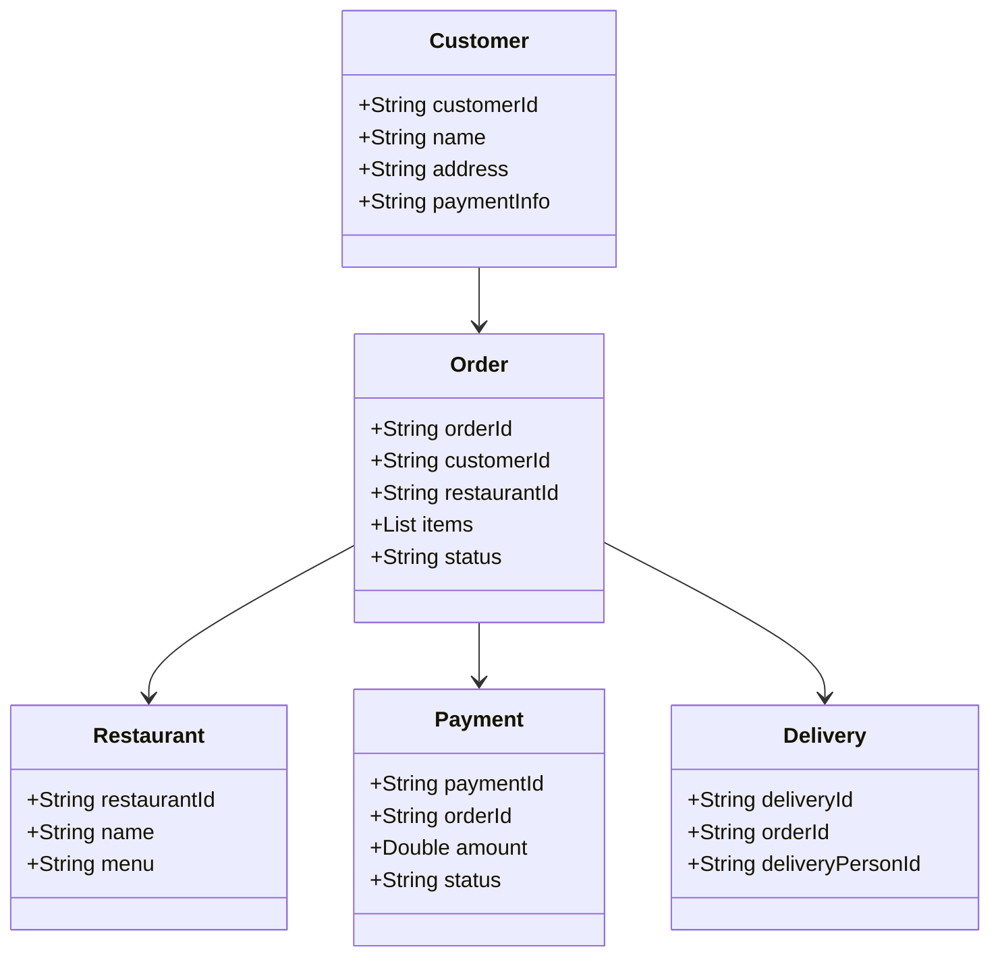
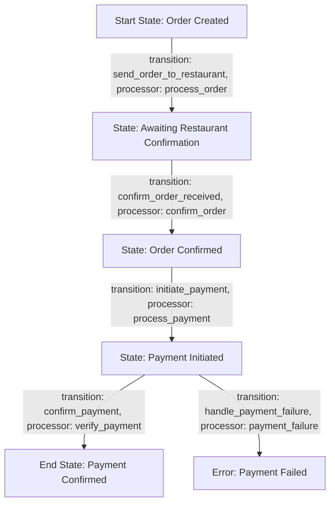
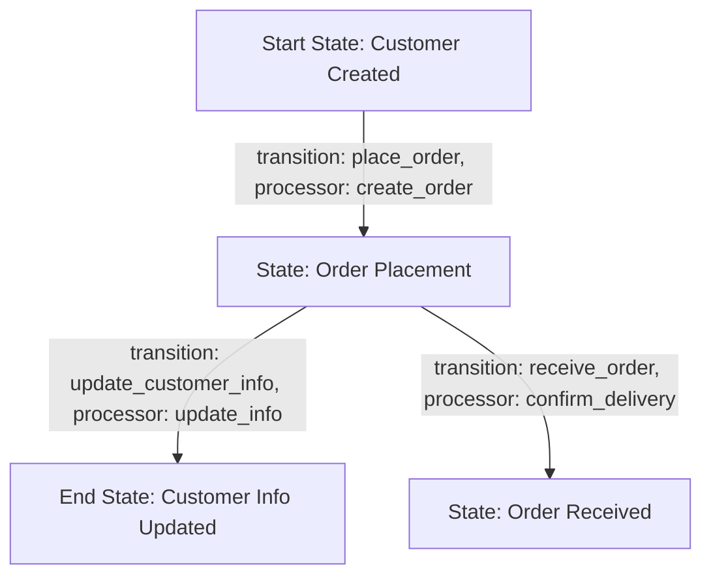

Sure! Here’s a complete Product Requirements Document (PRD) for the Online Food Ordering System, combining all the elements we've discussed.

---

# Product Requirements Document (PRD) for Online Food Ordering System

## Introduction

The goal of this document is to outline the requirements and specifications for the Online Food Ordering System, which enables customers to select restaurants, place orders, make payments, and receive their food through delivery.

## User Requirements

### User Stories

1. **As a customer**, I want to select a restaurant so that I can view its menu and choose my meal.
2. **As a customer**, I want to place an order so that I can enjoy my food from the restaurant.
3. **As a customer**, I want to make a payment after placing my order to ensure my meal is confirmed.
4. **As a customer**, I want to receive confirmation of my payment to know that my order is being processed.
5. **As a customer**, I want my order to be delivered to me so that I can enjoy my meal without leaving home.

## Entities

### Entities Diagram (Mermaid)


```mermaid
classDiagram
    class Customer {
        +String customerId
        +String name
        +String address
        +String paymentInfo
    }

    class Order {
        +String orderId
        +String customerId
        +String restaurantId
        +List<String> items
        +String status
    }

    class Restaurant {
        +String restaurantId
        +String name
        +String menu
    }

    class Payment {
        +String paymentId
        +String orderId
        +Double amount
        +String status
    }

    class Delivery {
        +String deliveryId
        +String orderId
        +String deliveryPersonId
    }

    Customer --> Order
    Order --> Restaurant
    Order --> Payment
    Order --> Delivery
```

### JSON Examples of Data Models

1. **Customer**
   ```json
   {
       "customerId": "C12345",
       "name": "John Doe",
       "address": "123 Main St, Anytown, USA",
       "paymentInfo": "Visa **** 1234"
   }
   ```
   - **Save Method**: Directly via API call.

2. **Order**
   ```json
   {
       "orderId": "O98765",
       "customerId": "C12345",
       "restaurantId": "R54321",
       "items": ["Burger", "Fries"],
       "status": "Pending"
   }
   ```
   - **Save Method**: Through the workflow of the Customer entity (ENTITY_EVENT).

3. **Restaurant**
   ```json
   {
       "restaurantId": "R54321",
       "name": "Tasty Bites",
       "menu": ["Burger", "Pizza", "Salad"]
   }
   ```
   - **Save Method**: Directly via API call.

4. **Payment**
   ```json
   {
       "paymentId": "P112233",
       "orderId": "O98765",
       "amount": 29.99,
       "status": "Confirmed"
   }
   ```
   - **Save Method**: Through the workflow of the Order entity (SECONDARY_DATA).

5. **Delivery**
   ```json
   {
       "deliveryId": "D44556",
       "orderId": "O98765",
       "deliveryPersonId": "DP7890"
   }
   ```
   - **Save Method**: Through the workflow of the Order entity (SECONDARY_DATA).

## Workflows

### Workflow Flowchart for Order Entity


```mermaid
flowchart TD
  A[Start State: Order Created] -->|transition: send_order_to_restaurant, processor: process_order| B[State: Awaiting Restaurant Confirmation]
  B -->|transition: confirm_order_received, processor: confirm_order| C[State: Order Confirmed]
  C -->|transition: initiate_payment, processor: process_payment| D[State: Payment Initiated]
  D -->|transition: confirm_payment, processor: verify_payment| E[End State: Payment Confirmed]
  D -->|transition: handle_payment_failure, processor: payment_failure| F[Error: Payment Failed]
class A,B,C,D,E,F automated;
```

### Workflow Flowchart for Customer Entity


```mermaid
flowchart TD
  A[Start State: Customer Created] -->|transition: place_order, processor: create_order| B[State: Order Placement]
  B -->|transition: update_customer_info, processor: update_info| C[End State: Customer Info Updated]
  B -->|transition: receive_order, processor: confirm_delivery| D[State: Order Received]
class A,B,C,D automated;
```

## Conclusion

This PRD outlines the essential requirements for the Online Food Ordering System, including user stories, entity models, and workflows. It provides a solid foundation for development, ensuring that the system meets the needs of its users effectively. 

Feel free to let me know if you have any other questions or if there's more information you’d like to add!