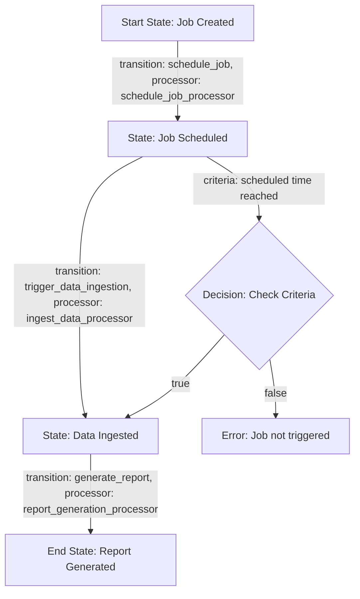

Sure! Here’s a complete Product Requirements Document (PRD) based on the requirements you've provided.

---

# Product Requirements Document (PRD)

## Overview
The goal of this application is to ingest data from specified data sources, aggregate that data, generate reports, and send them via email to an admin. The data ingestion should be scheduled to run daily, and the application will expose specific API endpoints for report generation and retrieval.

## Requirements

### Functional Requirements

1. **Data Ingestion**
   - The application must ingest data from specified data sources.
   - Data ingestion should be initiated via a scheduled job that runs once a day.

2. **Data Aggregation**
   - The application must process the ingested data to generate an aggregated report.

3. **Report Generation**
   - The application must generate a report from the aggregated data in JSON format.
   - After report generation, the application should send the report to the admin's email.

4. **API Endpoints**
   - **POST /report**: Triggers the report generation process.
     - Request Body: `{ "triggeredBy": "admin@example.com" }`
     - Response: `{ "status": "success", "reportId": "12345", "message": "Report generated successfully and sent to admin's email." }`
   
   - **GET /report/{id}**: Retrieves a report by its ID.
     - Response: `{ "reportId": "12345", "aggregatedData": [ ... ], "generatedAt": "2025-02-10T23:00:00Z" }`

### User Stories

1. **Report Generation**
   - **As an admin**, I want to trigger the report generation process via a POST request, so that I can generate a report on-demand.

2. **Manual Report Retrieval**
   - **As an admin**, I want to be able to retrieve a report by its ID via a GET request, so that I can view the specific report I need.

### Entities

1. **Job Entity**
   ```json
   {
     "job_id": "job_001",
     "status": "pending",
     "scheduled_time": "2023-10-25T00:00:00Z",
     "triggered_by": "admin@example.com"
   }
   ```
   - **Save Method**: Directly via API call or Scheduler.

2. **RawData Entity**
   ```json
   {
     "data_id": "data_001",
     "title": "Activity 1",
     "due_date": "2025-02-10T22:55:28.3667842+00:00",
     "completed": false
   }
   ```
   - **Save Method**: Through the workflow of a Job (ENTITY_EVENT).

3. **AggregatedReport Entity**
   ```json
   {
     "report_id": "report_001",
     "generated_at": "2025-02-10T23:00:00Z",
     "aggregated_data": [
       {
         "data_id": "data_001",
         "title": "Activity 1",
         "due_date": "2025-02-10T22:55:28.3667842+00:00",
         "completed": false
       },
       ...
     ],
     "admin_email": "admin@example.com"
   }
   ```
   - **Save Method**: Through the workflow of a Job (SECONDARY_DATA).

### Workflow Flowchart

#### Job Workflow


```mermaid
flowchart TD
  A[Start State: Job Created] -->|transition: schedule_job, processor: schedule_job_processor| B[State: Job Scheduled]
  B -->|transition: trigger_data_ingestion, processor: ingest_data_processor| C[State: Data Ingested]
  C -->|transition: generate_report, processor: report_generation_processor| D[End State: Report Generated]
  B -->|criteria: scheduled time reached| D1{Decision: Check Criteria}
  D1 -->|true| C
  D1 -->|false| E[Error: Job not triggered]
class A,B,C,D,D1 automated;
```

### Non-Functional Requirements

1. **Performance**: The application should handle multiple report generation requests concurrently without significant delays.

2. **Scalability**: The application should be able to scale to accommodate increased data load and user requests.

3. **Reliability**: The application should have error-handling mechanisms to manage failures during data ingestion or report generation.

4. **Security**: The application must ensure secure data transfers and protect sensitive information like the admin's email.

### Conclusion

This PRD outlines the requirements for the application aimed at data ingestion, aggregation, and reporting. The specified user stories, workflows, and entity definitions provide a clear roadmap for development. If there are any adjustments or additional details needed, feel free to ask!

--- 

Let me know if you need anything else! 😊