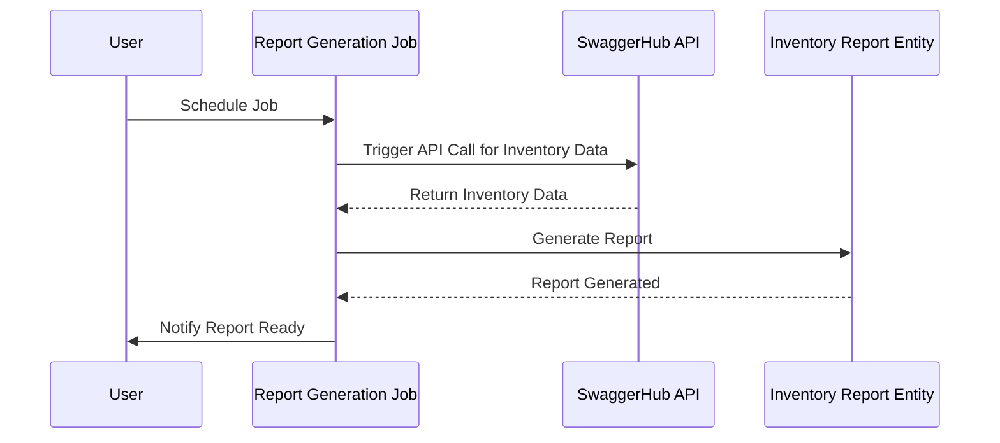

# Product Requirement Document (PRD) for Inventory Report Generation Application

## Overview

The purpose of this document is to provide a detailed explanation of the Cyoda design JSON for the Inventory Report Generation Application. This application is designed to generate reports on inventory data using the SwaggerHub API, allowing users to summarize key metrics such as total items, average price, and total value.

### Key Concepts of Cyoda

#### 1. What is Cyoda?

Cyoda is a state-driven workflow management system that utilizes an event-driven architecture to manage and process data. It orchestrates workflows based on the lifecycle of entities within the system, ensuring efficient data handling and transformation.

#### 2. Cyoda Entities

**Entities** in Cyoda represent distinct data objects. Each entity has a specific type and is associated with a lifecycle that can be triggered by various events. In the design, we have two primary entities:

- **Report Generation Job:** This is a `JOB` entity that is scheduled to generate reports periodically.
- **Inventory Report Entity:** This is a `SECONDARY_DATA` entity that stores the generated reports.

### Event-Driven Workflow Overview

Cyoda employs an event-driven model that triggers workflows based on specific events related to entities. When an entity is created, modified, or deleted, it can initiate a workflow that processes the affected data.

#### Workflow for Inventory Report Generation

1. **Scheduled Job:** The `report_generation_job` entity is scheduled to run periodically (e.g., daily). It will trigger the process to generate an inventory report.

2. **Report Generation Process:** Once the scheduled job is triggered, it performs the necessary operations to collect data from the SwaggerHub API, compute the required metrics, and then save the results as an `inventory_report_entity`.

3. **Event Emission:** After the report is generated, the system emits events that can trigger further processing or notifications based on the new state of the `inventory_report_entity`.

### Cyoda Design JSON Explained

Below is the Cyoda design JSON for the application:

```json
{
  "$schema": "http://json-schema.org/draft-07/schema#",
  "title": "Cyoda design",
  "type": "object",
  "entities": [
    {
      "entity_name": "report_generation_job",
      "entity_type": "JOB",
      "entity_source": "SCHEDULED",
      "depends_on_entity": "None",
      "entity_workflow": {
        "name": "report_generation_workflow",
        "class_name": "com.cyoda.tdb.model.treenode.TreeNodeEntity",
        "transitions": [
          {
            "name": "scheduled_inventory_report",
            "description": "Triggered by a schedule to generate inventory reports.",
            "start_state": "None",
            "start_state_description": "Initial state before the report generation.",
            "end_state": "report_generated",
            "end_state_description": "Report has been successfully generated.",
            "process": {
              "name": "generate_inventory_report_process",
              "description": "Process to generate inventory report from the SwaggerHub API.",
              "adds_new_entites": "inventory_report_entity"
            }
          }
        ]
      }
    },
    {
      "entity_name": "inventory_report_entity",
      "entity_type": "SECONDARY_DATA",
      "entity_source": "ENTITY_EVENT",
      "depends_on_entity": "report_generation_job",
      "entity_workflow": {
        "name": "inventory_report_workflow",
        "class_name": "com.cyoda.tdb.model.treenode.TreeNodeEntity",
        "transitions": []
      }
    }
  ]
}
```

#### Explanation of Entities

1. **Report Generation Job:**
   - **Type:** JOB
   - **Source:** SCHEDULED
   - **Workflow:** Contains the logic to manage the job, including transitions that define the job's states (e.g., scheduled, in progress, completed).
   - **Transitions:** `scheduled_inventory_report` triggers the report generation process.

2. **Inventory Report Entity:**
   - **Type:** SECONDARY_DATA
   - **Source:** ENTITY_EVENT
   - **Depends On:** report_generation_job
   - **Workflow:** This entity holds the generated reports and will evolve as the job processes the inventory data.

### Workflow Sequence

Below is a sequence diagram illustrating the flow of events for generating the inventory report:


```mermaid
sequenceDiagram
    participant U as User
    participant J as Report Generation Job
    participant API as SwaggerHub API
    participant R as Inventory Report Entity

    U->>J: Schedule Job
    J->>API: Trigger API Call for Inventory Data
    API-->>J: Return Inventory Data
    J->>R: Generate Report
    R-->>J: Report Generated
    J->>U: Notify Report Ready
```

### Conclusion

This design effectively captures the requirements for generating inventory reports by utilizing Cyoda's event-driven architecture. The structured approach to entity management and workflow orchestration ensures that users receive timely and accurate reports, while also allowing for future enhancements like additional data processing or reporting features.

The design is scalable, maintainable, and aligns with the requirement to provide a user-friendly, efficient reporting solution based on real-time inventory data.