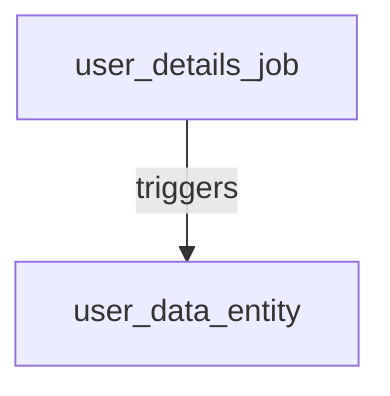
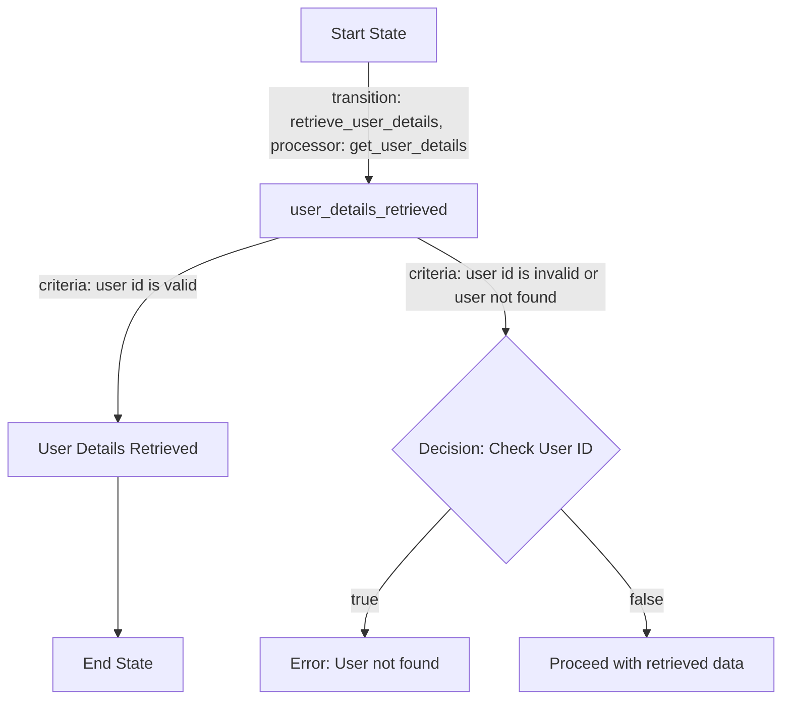
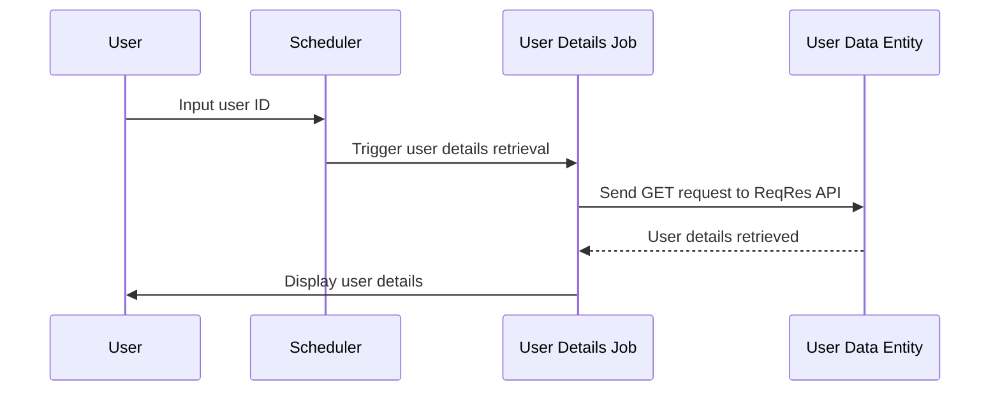

# Product Requirements Document (PRD) for Cyoda Design

## Introduction

This document outlines the Cyoda-based application designed to retrieve user details from the ReqRes API based on a given user ID. The application is structured using the Cyoda framework, which employs an event-driven architecture to manage workflows and entities. This PRD will explain the Cyoda design JSON, its alignment with the requirements, and include various diagrams to illustrate the workflows and relationships among entities.

## What is Cyoda?

Cyoda is a serverless, event-driven framework that organizes workflows around entities representing tasks and data. Each entity has a defined state, and transitions between these states are triggered by events, creating a flexible and scalable architecture.

## Cyoda Design JSON Overview

The Cyoda design JSON consists of two main entities:

1. **User Details Job (`user_details_job`)**: 
   - **Entity Type**: JOB
   - **Source**: API_REQUEST
   - **Description**: This job is responsible for managing the retrieval of user details from the ReqRes API based on the provided user ID.

2. **User Data Entity (`user_data_entity`)**:
   - **Entity Type**: EXTERNAL_SOURCES_PULL_BASED_RAW_DATA
   - **Source**: ENTITY_EVENT
   - **Description**: This entity stores the user information retrieved from the API.

### Entity Diagram

```mermaid
graph TD;
    A[user_details_job] -->|triggers| B[user_data_entity];
```

## Workflow Overview

The workflow for the `user_details_job` consists of a single transition that retrieves user details from the API:

- **Retrieve User Details**: This transition involves sending a GET request to the ReqRes API and storing the retrieved user information in the `user_data_entity`.

### Flowchart for User Details Job Workflow

```mermaid
flowchart TD
    A[Start State] -->|transition: retrieve_user_details, processor: get_user_details| B[user_details_retrieved]
    B -->|criteria: user id is valid| C[User Details Retrieved]
    C --> D[End State]

    %% Decision point for criteria
    B -->|criteria: user id is invalid or user not found| D1{Decision: Check User ID}
    D1 -->|true| E[Error: User not found]
    D1 -->|false| F[Proceed with retrieved data]

    class A,B,C,D,D1 automated;
```

## Sequence Diagram

```mermaid
sequenceDiagram
    participant User
    participant Scheduler
    participant User Details Job
    participant User Data Entity

    User->>Scheduler: Input user ID
    Scheduler->>User Details Job: Trigger user details retrieval
    User Details Job->>User Data Entity: Send GET request to ReqRes API
    User Data Entity-->>User Details Job: User details retrieved
    User Details Job->>User: Display user details
```

## Event-Driven Approach

The event-driven architecture ensures that actions are automatically triggered based on the state changes of entities:

1. **User Details Retrieval**: The job is initiated by an event (input user ID) that triggers the API request.
2. **Data Storage**: Once the user details are retrieved, the data is stored in the `user_data_entity`, enabling further processing or retrieval.

## Conclusion

The Cyoda design effectively aligns with the requirements for creating an application that retrieves user details from the ReqRes API. By incorporating an event-driven model, the application can efficiently manage the workflow from user ID input to API response handling. The outlined entities, workflows, and transitions comprehensively cover the needs of the application, ensuring a smooth process for users.

This PRD serves as a foundation for implementation and development, providing clear guidance on the Cyoda architecture while also offering clarity to those new to the Cyoda framework.