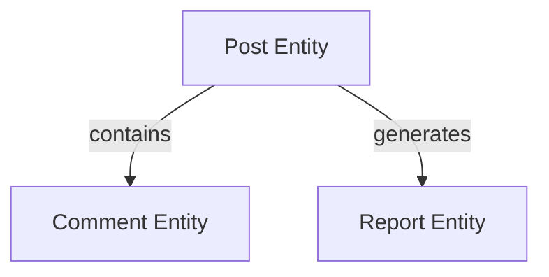
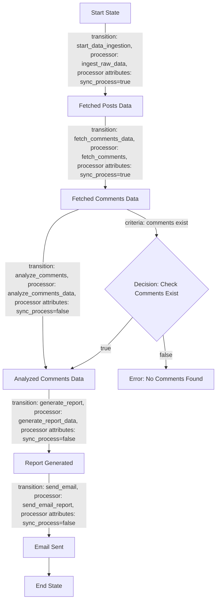

Sure! Here's a complete Product Requirements Document (PRD) based on everything we've discussed so far.

---

# Product Requirements Document (PRD) for Data Ingestion and Reporting Application

## Introduction

This document outlines the requirements for a data ingestion application that fetches posts and comments from external APIs, analyzes the data, and generates a report summarizing the number of comments for each post. The report is sent via email to the user immediately after data processing.

## What is Cyoda?

Cyoda is a serverless, event-driven framework that allows for efficient management of workflows through entities representing jobs and data. Each entity has a defined state, and transitions between states are governed by events, enabling a responsive architecture.

## User Requirements

### User Stories
1. **As a user**, I want to ingest data from the posts API to analyze the comments for each post.
2. **As a user**, I want to ingest data from the comments API to track how many comments are on each post.
3. **As a user**, I want to receive an email report immediately after the data ingestion to see the latest comment statistics.

### Email Reporting
- **Timing**: The report will be sent immediately after data ingestion.
- **Recipient Details**: The recipient's email address needs to be specified.
- **Subject Line**: The subject line of the email report should be clear and informative.

## Entity Outline

1. **Post Entity**
   - **Type**: `EXTERNAL_SOURCES_PULL_BASED_RAW_DATA`
   - **Source**: `API_REQUEST`

2. **Comment Entity**
   - **Type**: `EXTERNAL_SOURCES_PULL_BASED_RAW_DATA`
   - **Source**: `API_REQUEST`

3. **Report Entity**
   - **Type**: `SECONDARY_DATA`
   - **Source**: `ENTITY_EVENT`

### Entities Diagram


```mermaid
graph TD;
    A[Post Entity] -->|contains| B[Comment Entity];
    A -->|generates| C[Report Entity];
```

## Workflows

### Orchestration Workflow
This workflow manages the entire process from data ingestion to report generation.

#### Workflow Flowchart


```mermaid
flowchart TD
   A[Start State] -->|transition: start_data_ingestion, processor: ingest_raw_data, processor attributes: sync_process=true| B[Fetched Posts Data]
   B -->|transition: fetch_comments_data, processor: fetch_comments, processor attributes: sync_process=true| C[Fetched Comments Data]
   C -->|transition: analyze_comments, processor: analyze_comments_data, processor attributes: sync_process=false| D[Analyzed Comments Data]
   D -->|transition: generate_report, processor: generate_report_data, processor attributes: sync_process=false| E[Report Generated]
   E -->|transition: send_email, processor: send_email_report, processor attributes: sync_process=false| F[Email Sent]
   F --> G[End State]

   C -->|criteria: comments exist| D1{Decision: Check Comments Exist}
   D1 -->|true| D
   D1 -->|false| E1[Error: No Comments Found]

   class A,B,C,D,E,F,D1 automated;
```

### Workflow Launch Information
The orchestration workflow is triggered when a scheduled job starts or can be triggered manually if needed.

## Event-Driven Architecture
Entities send events whenever they are created or updated. For example:
- When a new post entity is saved after fetching data from the API, an event triggers the fetching of related comments.
- When a report entity is generated, it can emit events to notify other components of the system.

## Example JSON Data Models for Each Entity

1. **Post Entity**
   ```json
   {
     "userId": 1,
     "id": 1,
     "title": "sunt aut facere repellat provident occaecati excepturi optio reprehenderit",
     "body": "quia et suscipit\nsuscipit recusandae consequuntur expedita et cum\nreprehenderit molestiae ut ut quas totam\nnostrum rerum est autem sunt rem eveniet architecto"
   }
   ```

2. **Comment Entity**
   ```json
   {
     "postId": 1,
     "id": 1,
     "name": "id labore ex et quam laborum",
     "email": "Eliseo@gardner.biz",
     "body": "laudantium enim quasi est quidem magnam voluptate ipsam eos\ntempora quo necessitatibus\ndolor quam autem quasi\nreiciendis et nam sapiente accusantium"
   }
   ```

3. **Report Entity**
   ```json
   {
     "postId": 1,
     "commentCount": 3,
     "reportGeneratedAt": "2023-10-12T12:00:00Z"
   }
   ```

## Conclusion
This PRD outlines the requirements and architecture for the data ingestion and reporting application using the Cyoda framework. The specified workflows, entities, and reporting features ensure a smooth and automated process for retrieving, analyzing, and reporting comment statistics for each post.

---

Let me know if there’s anything else you’d like to add or change! 😊