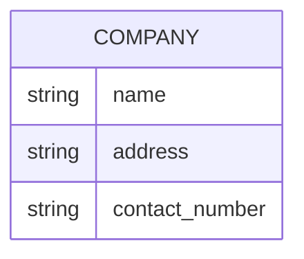
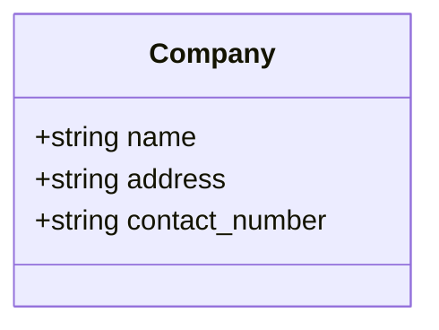
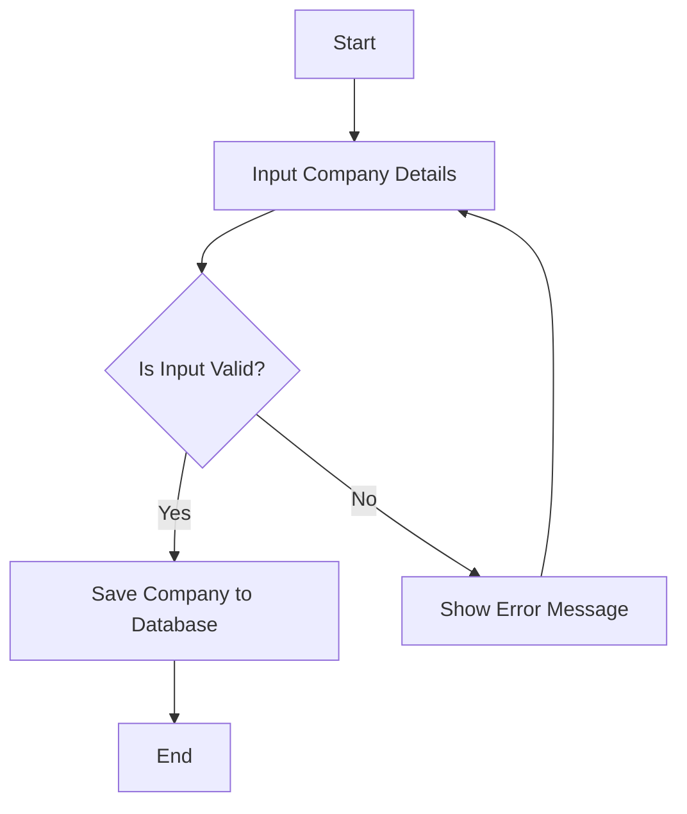

Based on the provided JSON design document, I will create a Mermaid entity-relationship (ER) diagram and a class diagram for the "company" entity, as well as a flowchart for a hypothetical workflow related to the "company" entity.

### Mermaid ER Diagram

### Mermaid Class Diagram

### Flowchart for Company Workflow

Assuming a simple workflow for managing a company (e.g., adding a new company), here is a flowchart:

### Summary

- The ER diagram represents the structure of the "company" entity with its attributes.
- The class diagram illustrates the "Company" class with its properties.
- The flowchart outlines a basic workflow for adding a new company, including validation and error handling.

If you have any specific workflows or additional entities to include, please let me know!