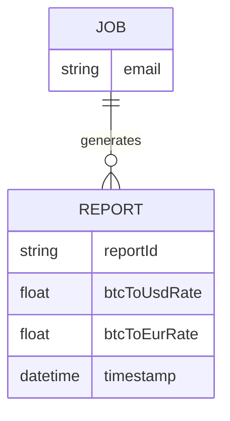
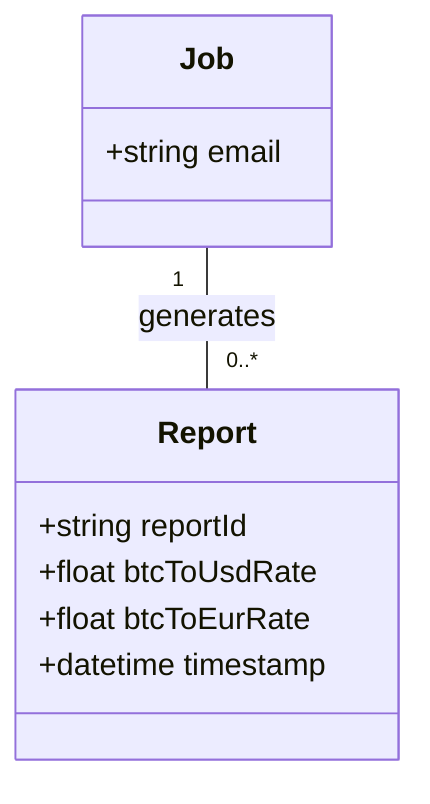
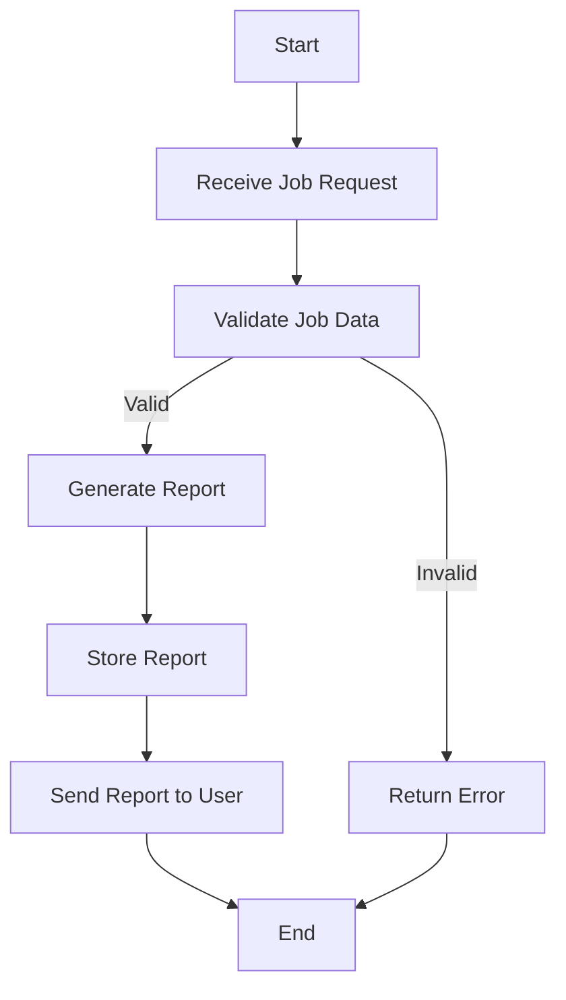

Based on the provided JSON design document, I will create the Mermaid entity-relationship (ER) diagrams, class diagrams for each entity, and flow charts for each workflow. 

### Mermaid ER Diagram

### Mermaid Class Diagram

### Flow Chart for Workflows

Since the provided JSON does not specify any workflows, I will create a generic flow chart that illustrates a possible workflow for generating a report from a job.

### Summary

- The **ER Diagram** shows the relationship between the `Job` and `Report` entities.
- The **Class Diagram** defines the structure of the `Job` and `Report` classes.
- The **Flow Chart** outlines a generic workflow for processing a job request and generating a report. 

If you have specific workflows or additional entities to include, please provide that information for further refinement.