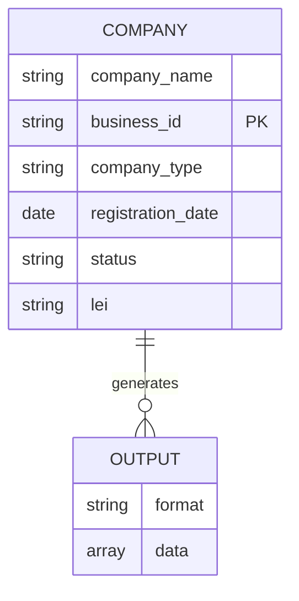
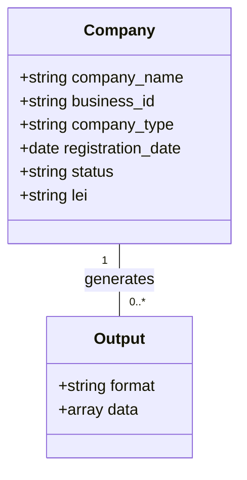
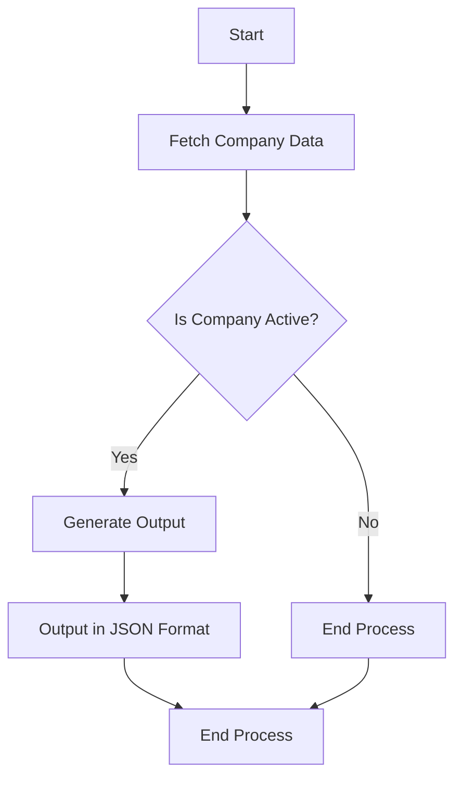

Based on the provided JSON design document, here are the Mermaid diagrams for the entities and workflows.

### Entity-Relationship (ER) Diagram

### Class Diagram

### Flow Chart for Workflow

Assuming a simple workflow for generating output based on company data, here’s a flowchart:

### Explanation

1. **ER Diagram**: This diagram shows the relationship between the `Company` and `Output` entities. The `Company` entity has a one-to-many relationship with the `Output` entity, indicating that one company can generate multiple outputs.

2. **Class Diagram**: This diagram represents the structure of the `Company` and `Output` classes, including their attributes and the relationship between them.

3. **Flow Chart**: This flowchart outlines a simple workflow for generating output based on the company data, including decision points and actions.

Feel free to ask if you need further modifications or additional details!