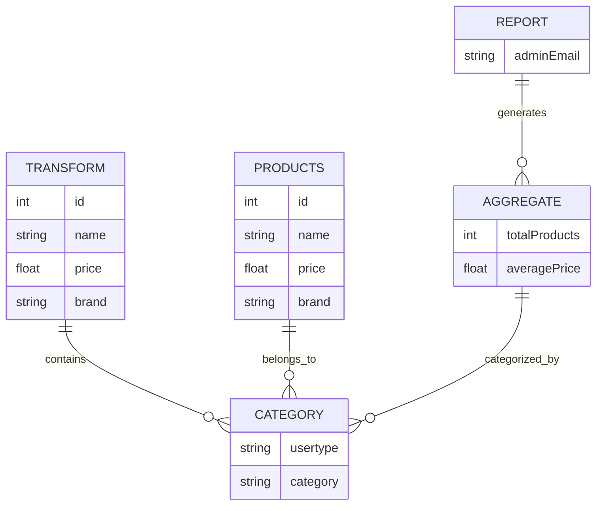
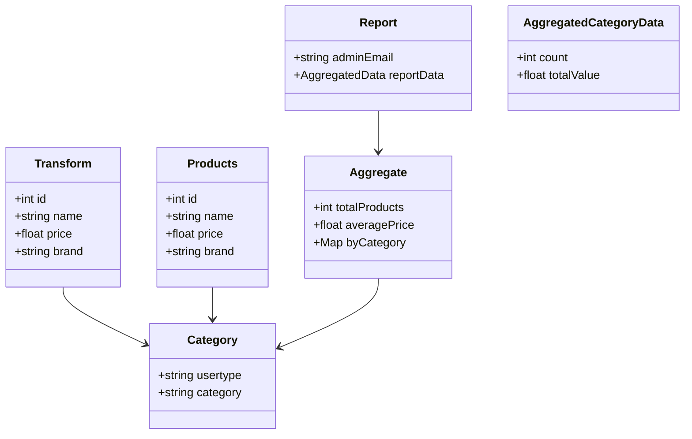
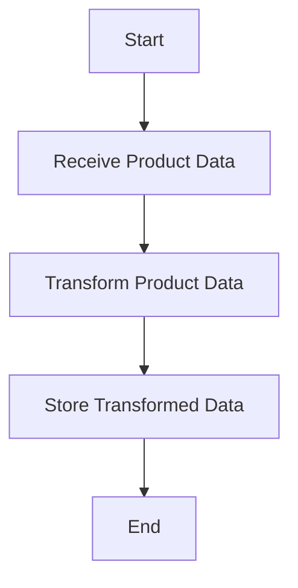
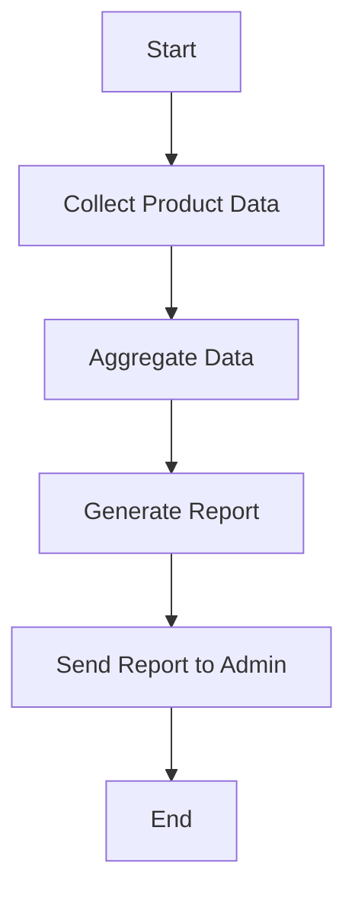
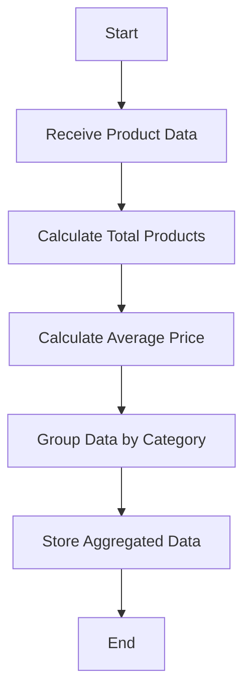

Based on the provided JSON design document, here are the requested Mermaid diagrams for entity-relationship (ER) diagrams, class diagrams, and flowcharts for each workflow.

### Entity-Relationship (ER) Diagram

### Class Diagram

### Flowchart for Workflows

#### Workflow for Transforming Products

#### Workflow for Generating Reports

#### Workflow for Aggregating Data

These diagrams represent the entities, their relationships, and the workflows based on the provided JSON design document.