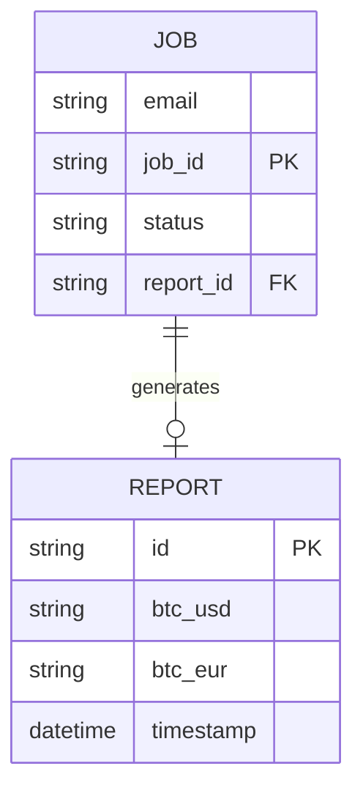
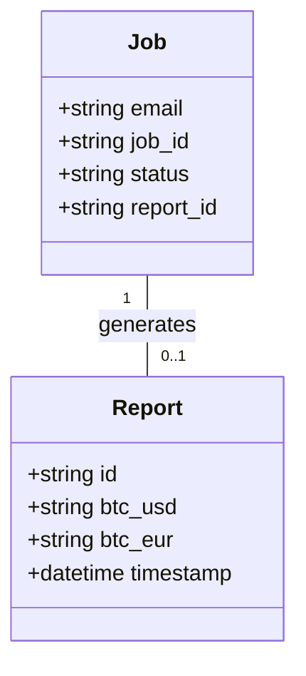
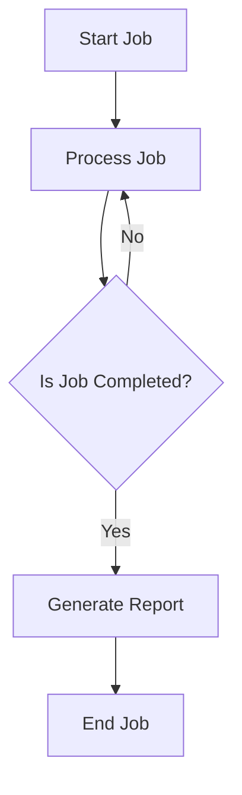

Based on the provided JSON design document, here are the Mermaid diagrams for the entities and workflows.

### Entity-Relationship Diagram (ERD)

### Class Diagram

### Flow Chart for Workflow

Assuming a simple workflow where a job generates a report, here is a flowchart representation:

These diagrams represent the entities and their relationships as well as the workflow based on the provided JSON design document.