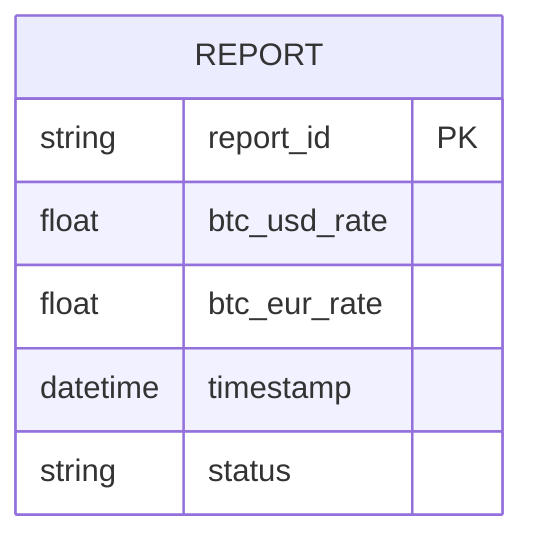
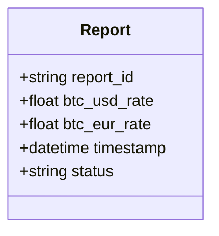
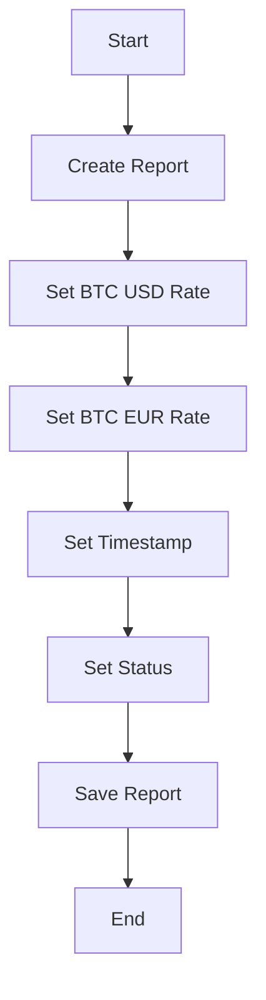

Based on the provided JSON design document, here are the Mermaid diagrams for the entity-relationship (ER) diagram, class diagram, and a flowchart for the workflow associated with the "report" entity.

### Mermaid ER Diagram

### Mermaid Class Diagram

### Mermaid Flowchart for Workflow
Assuming a basic workflow for creating and processing a report, here is a flowchart representation:

These diagrams represent the structure and workflow based on the provided JSON design document. If you have any specific workflows or additional entities to include, please provide that information for further elaboration.