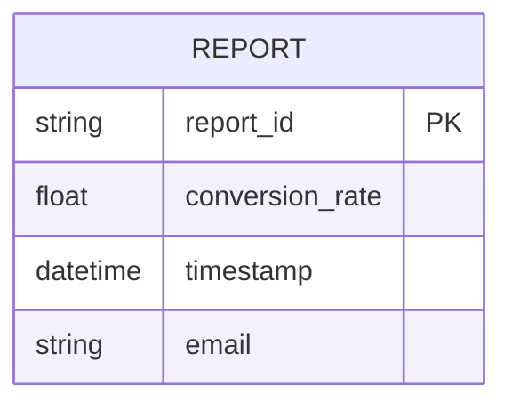
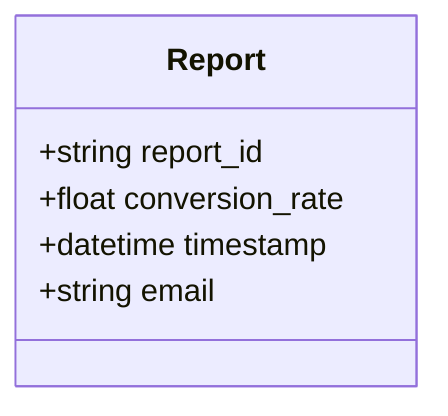
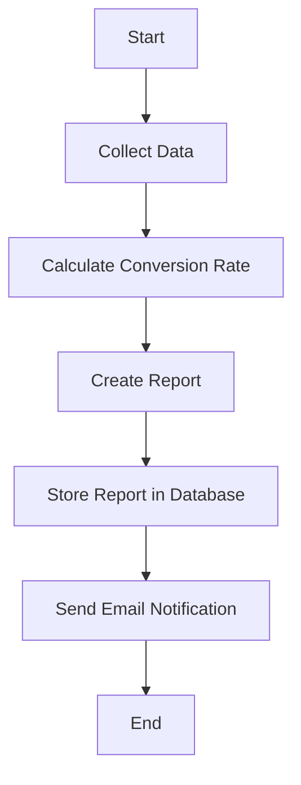

Based on the provided JSON design document, I will create a Mermaid ER diagram, class diagram, and flow chart for the specified entity. 

### Mermaid ER Diagram

### Mermaid Class Diagram

### Flow Chart for Workflow

Since the JSON does not specify a particular workflow, I will create a generic flow chart that represents the process of generating a report based on the entity data.

These diagrams represent the entity structure, class representation, and a basic workflow for handling reports based on the provided JSON design document. If you have specific workflows or additional entities to include, please provide that information for further refinement.