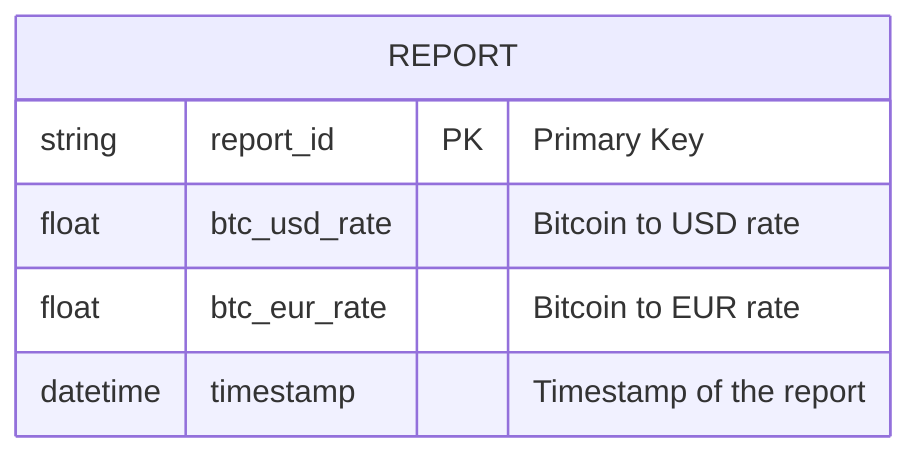
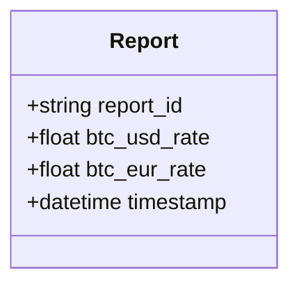
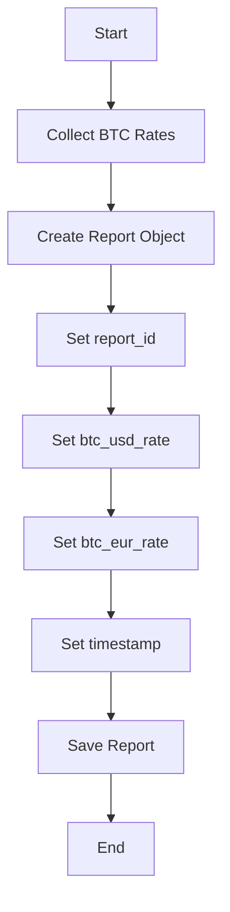

Based on the provided JSON design document, here are the requested Mermaid diagrams for the entity-relationship (ER) diagram, class diagram, and a flowchart for the workflow.

### Mermaid ER Diagram

### Mermaid Class Diagram

### Mermaid Flowchart

Since the JSON does not provide specific workflows, I will create a generic flowchart for generating a report based on the entity provided.

These diagrams represent the structure and workflow based on the provided JSON design document. If you have specific workflows or additional entities, please provide that information for more tailored diagrams.