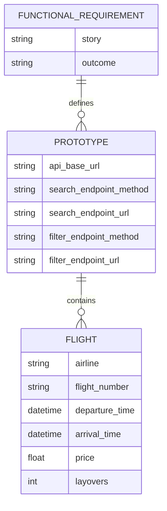
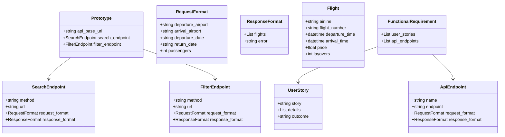
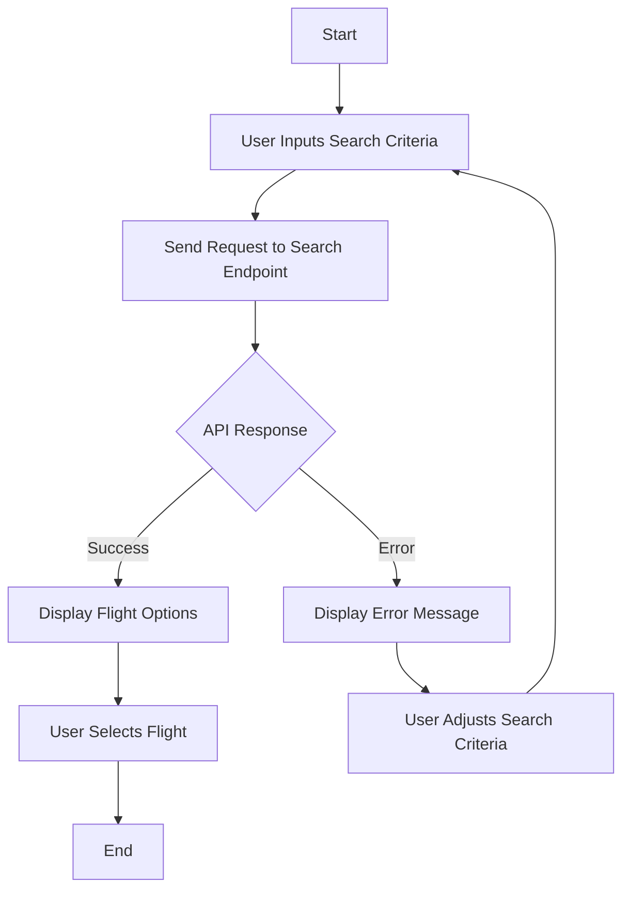
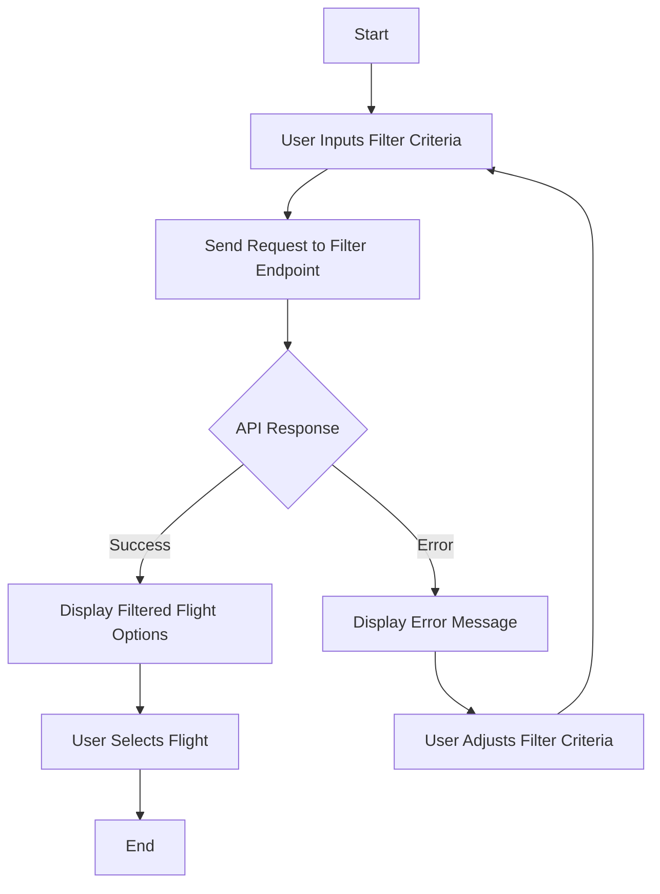

Based on the provided JSON design document, here are the Mermaid diagrams for the entity-relationship (ER) model, class diagrams, and flowcharts for the workflows.

### Mermaid Entity-Relationship Diagram (ERD)

### Mermaid Class Diagram

### Flowchart for Search Flights Workflow

### Flowchart for Filter Flights Workflow

These diagrams represent the entities, their relationships, and the workflows described in the JSON design document.