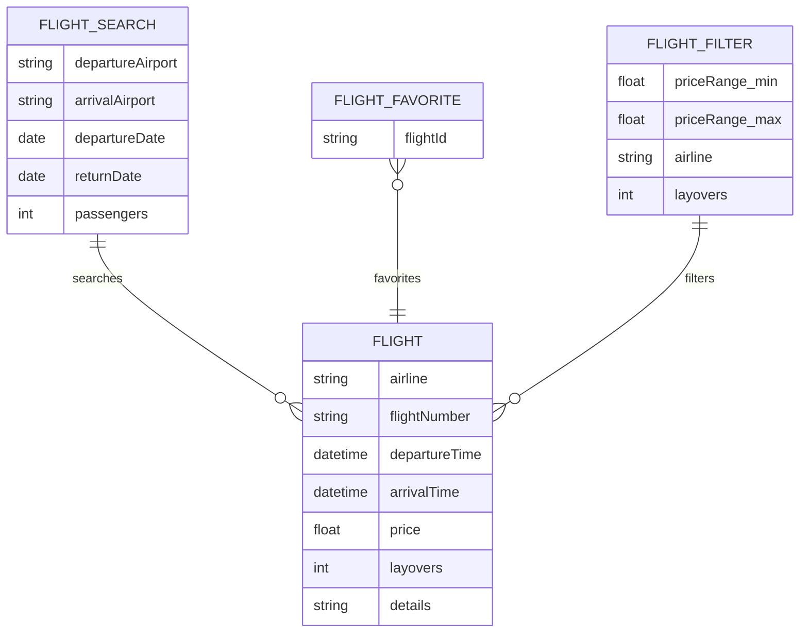
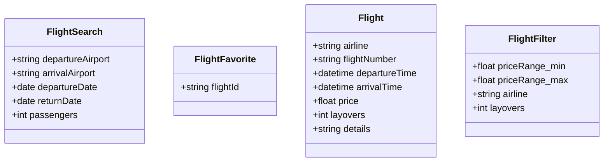
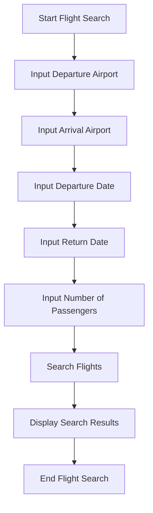
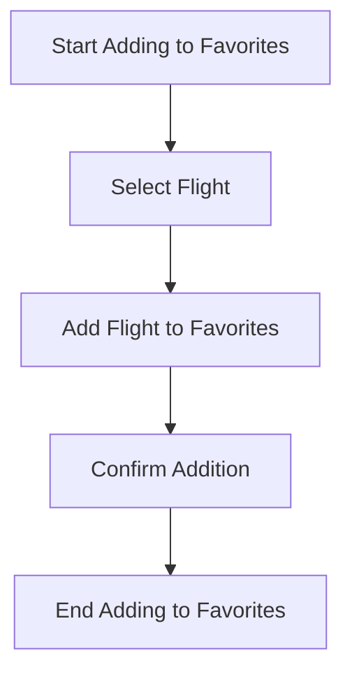
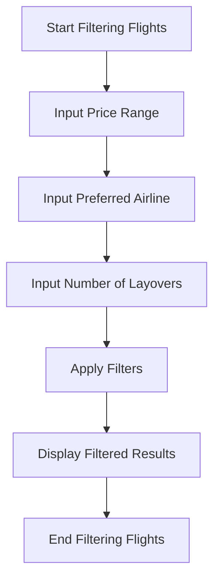

Based on the provided JSON design document, here are the Mermaid entity-relationship (ER) diagrams, class diagrams for each entity, and flow charts for each workflow.

### Mermaid ER Diagram

### Mermaid Class Diagrams

### Flow Charts for Each Workflow

#### Flight Search Workflow

#### Flight Favorite Workflow

#### Flight Filter Workflow

These diagrams and flowcharts represent the entities and workflows as specified in the provided JSON design document.