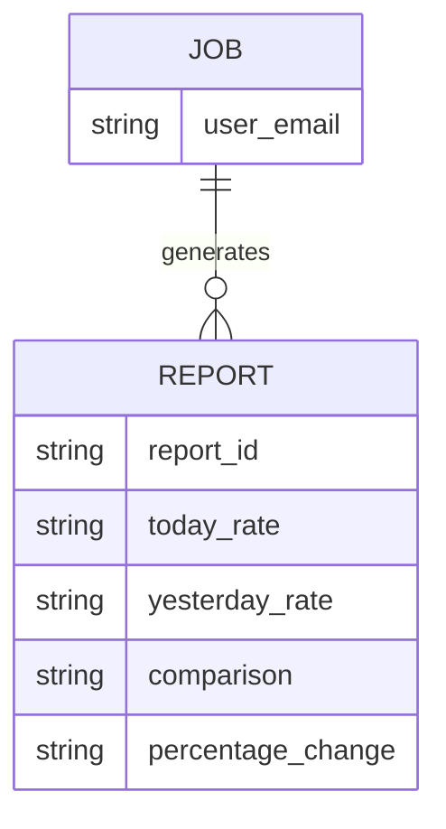
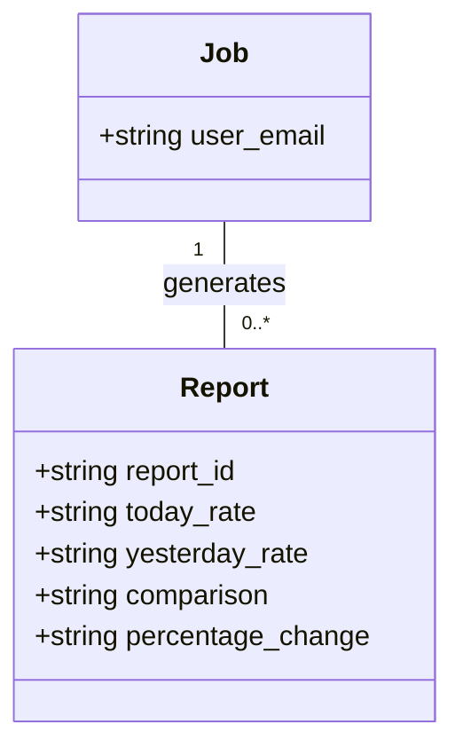
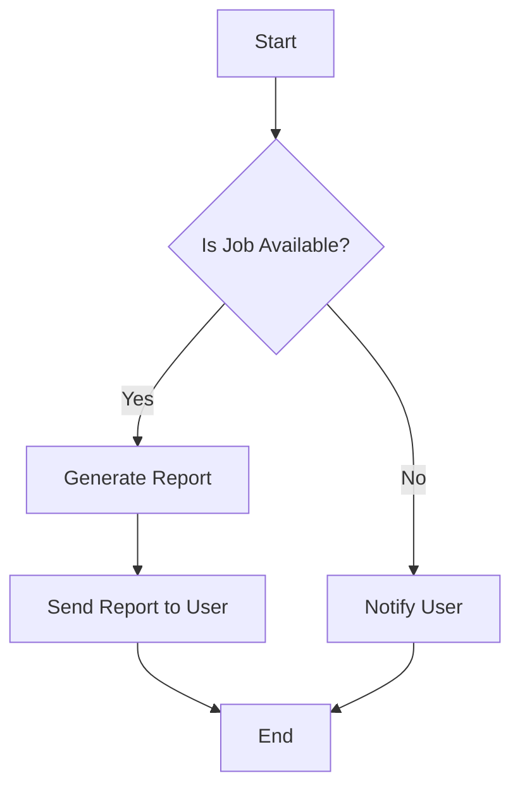

Based on the provided JSON design document, here are the Mermaid diagrams for the entities and workflows.

### Entity-Relationship (ER) Diagram

### Class Diagram

### Flow Chart for Workflow

Assuming a simple workflow for generating a report based on a job, here is a flowchart representation:

These diagrams represent the entities and their relationships as well as a basic workflow for generating reports based on jobs.