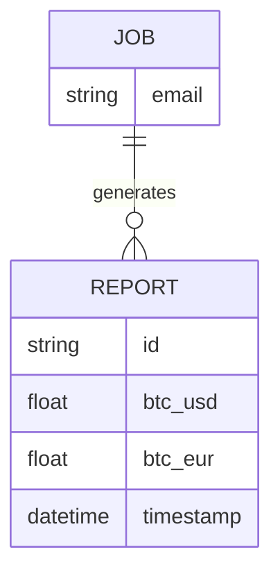
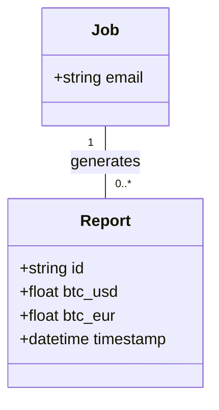
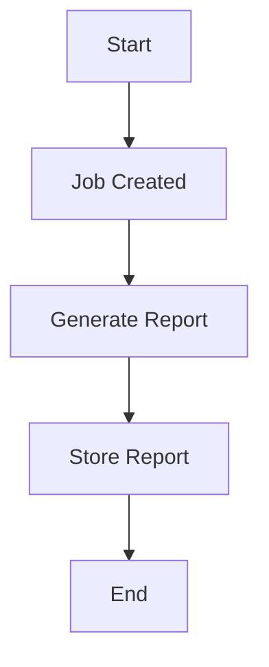

Based on the provided JSON design document, here are the Mermaid diagrams for the entities and workflows.

### Entity-Relationship Diagram (ERD)

### Class Diagram

### Flow Chart for Workflow

Assuming a simple workflow where a job generates a report, the flowchart can be represented as follows:

These diagrams represent the entities and their relationships as well as a basic workflow based on the provided JSON design document. If you have any specific workflows or additional details to include, please let me know!