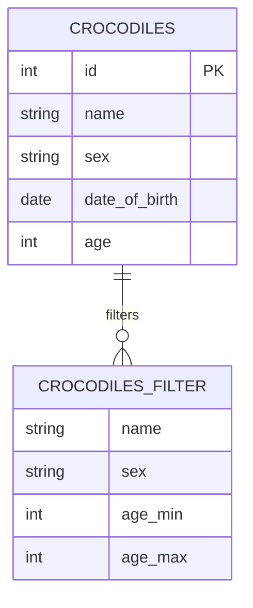
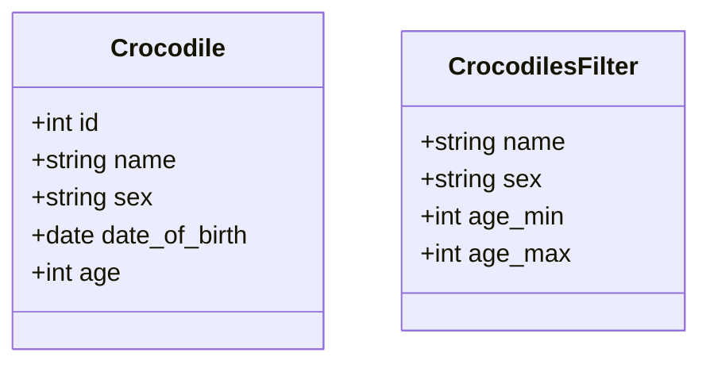
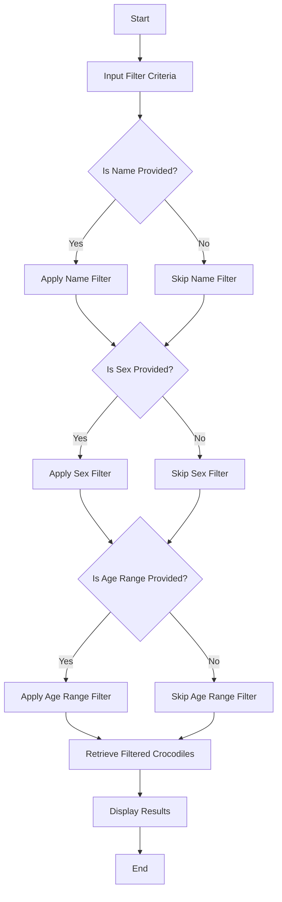

Based on the provided JSON design document, here are the Mermaid entity-relationship (ER) diagrams, class diagrams for each entity, and flow charts for each workflow.

### ER Diagram

### Class Diagram

### Flow Chart

Since the JSON does not specify a particular workflow, I will create a generic flow chart that could represent a workflow for filtering crocodiles based on the provided filter criteria.

These diagrams and flowcharts represent the entities and their relationships as well as a potential workflow for filtering crocodiles based on the criteria provided in the JSON document.