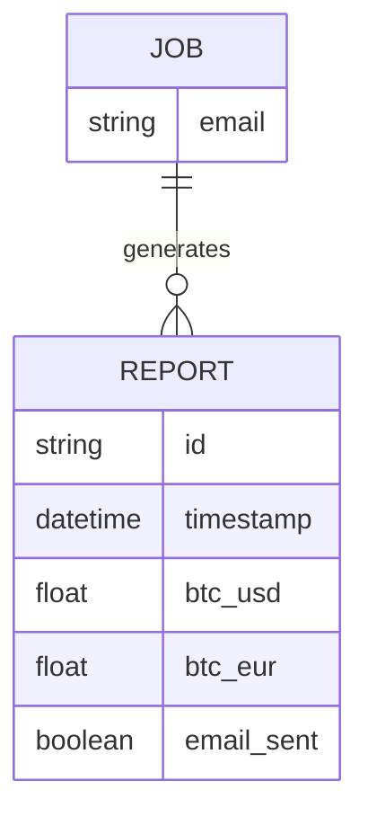
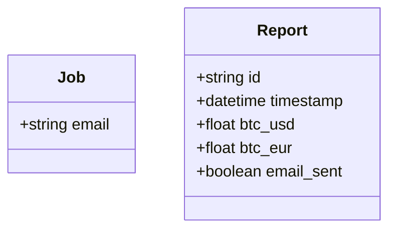
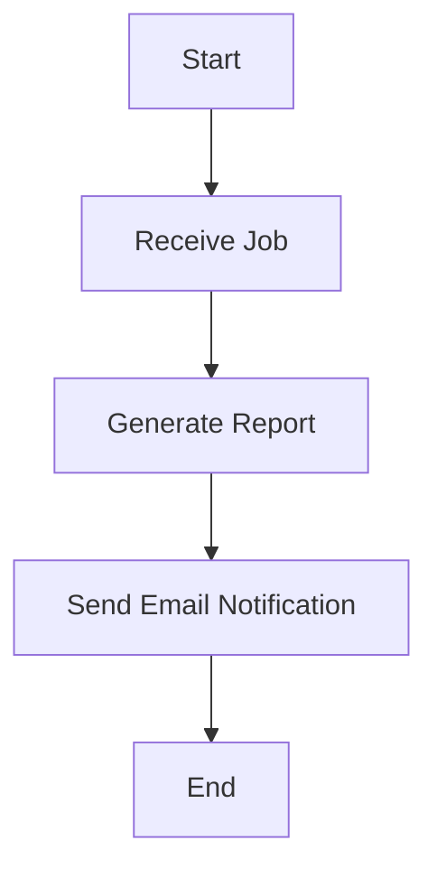

Based on the provided JSON design document, I will create the Mermaid entity-relationship (ER) diagrams, class diagrams for each entity, and flowcharts for each workflow. 

### Mermaid ER Diagram

### Mermaid Class Diagrams

### Flowchart for Workflows

Assuming a simple workflow where a job generates a report, here is a flowchart:

### Summary

- **ER Diagram**: Shows the relationship between the `Job` and `Report` entities.
- **Class Diagrams**: Defines the structure of the `Job` and `Report` classes.
- **Flowchart**: Illustrates a basic workflow where a job generates a report and sends an email notification.

Feel free to ask if you need any further modifications or additional details!