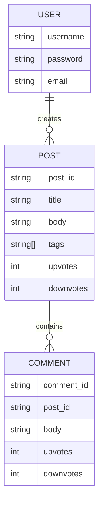
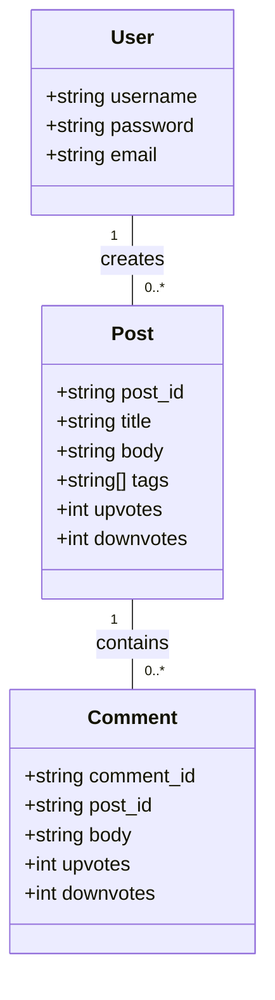
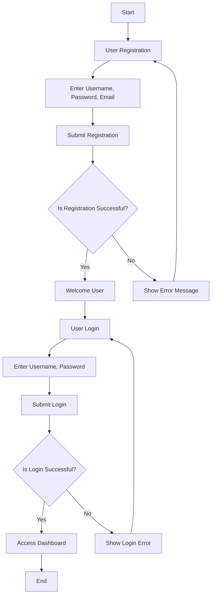
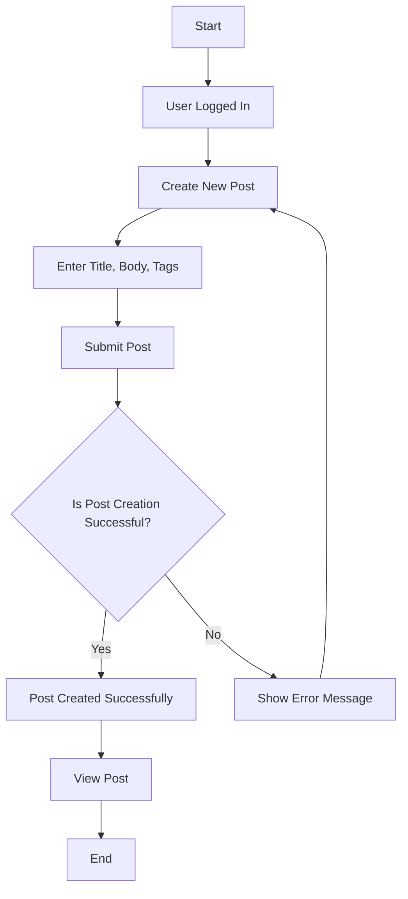
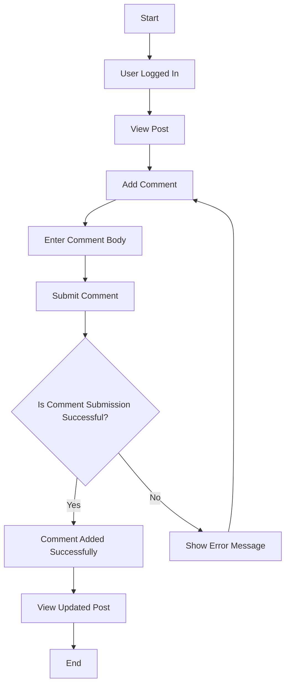

Based on the provided JSON design document, here are the Mermaid diagrams for the entities and workflows.

### Entity-Relationship Diagram (ERD)

### Class Diagram

### Flowchart for User Workflow

### Flowchart for Post Creation Workflow

### Flowchart for Commenting on a Post Workflow

These diagrams represent the entities, their relationships, and workflows based on the provided JSON design document.