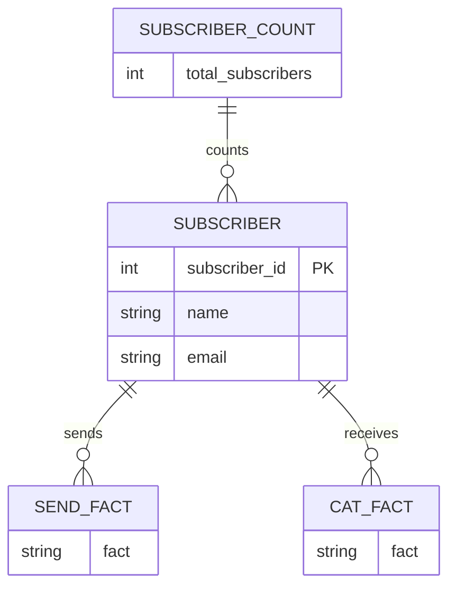
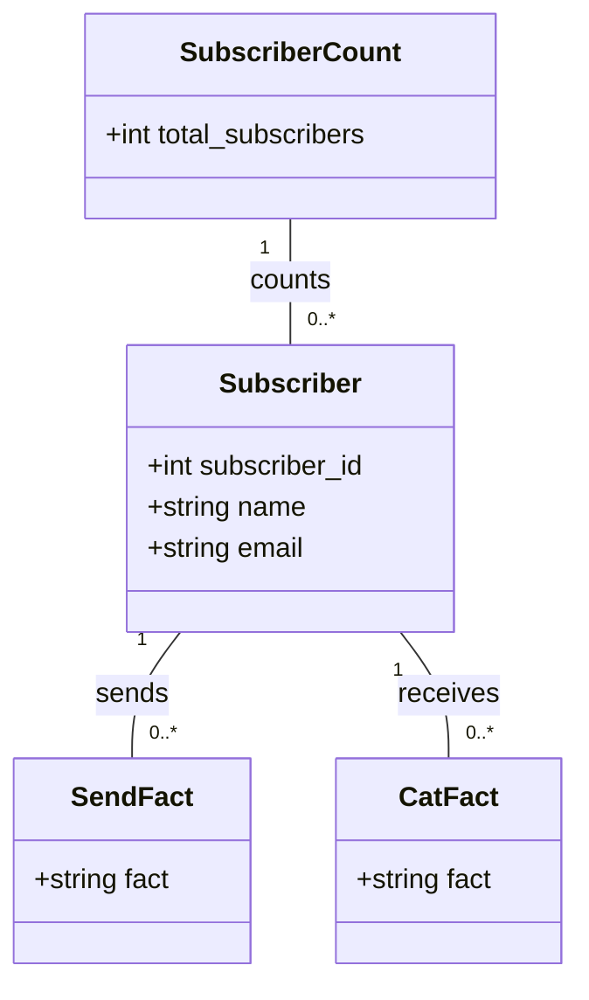
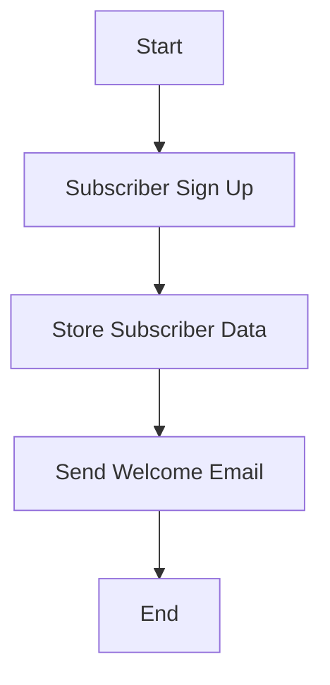
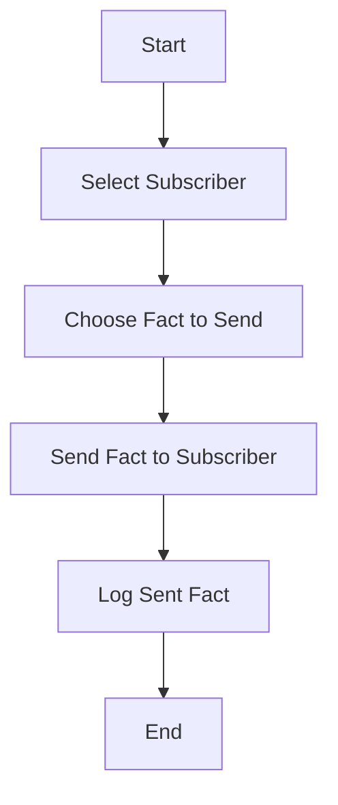
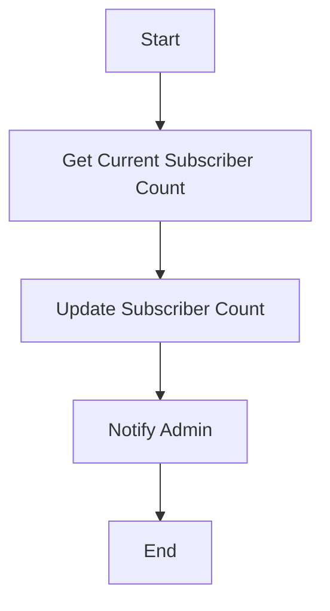

Based on the provided JSON design document, here are the Mermaid diagrams for the entities and workflows.

### Entity-Relationship (ER) Diagram

### Class Diagram

### Flow Chart for Each Workflow

1. **Subscriber Workflow**

2. **Fact Sending Workflow**

3. **Subscriber Count Update Workflow**

These diagrams represent the entities and their relationships, as well as the workflows based on the provided JSON design document.