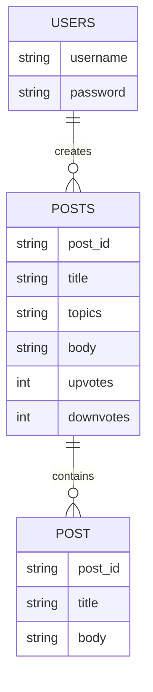
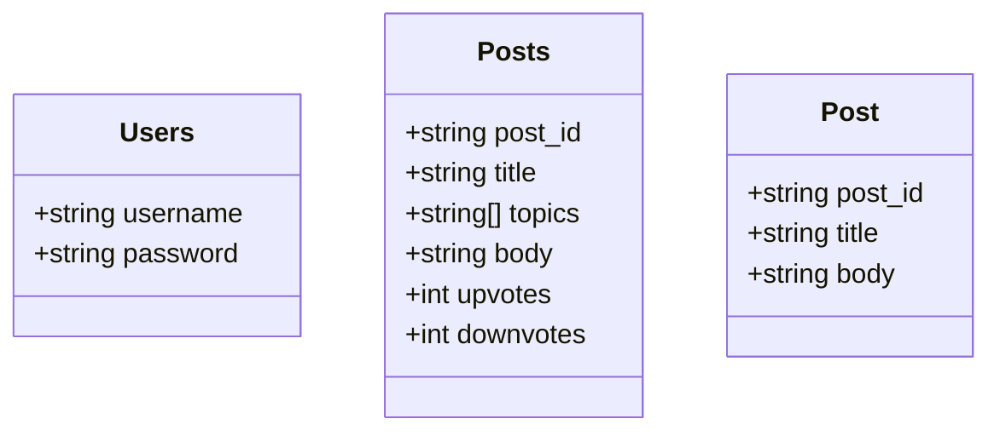
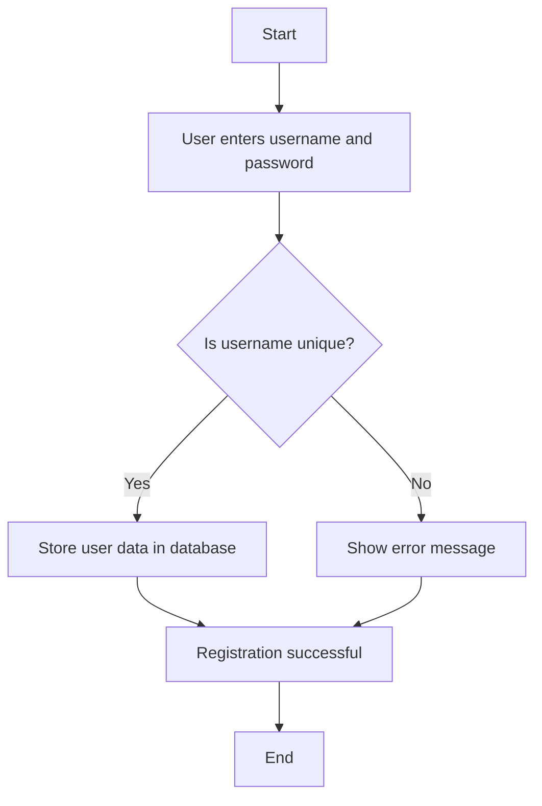
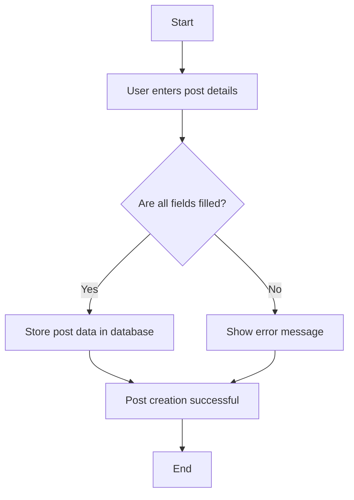

Based on the provided JSON design document, here are the Mermaid diagrams for the entities and workflows.

### Entity-Relationship (ER) Diagram

### Class Diagram

### Flowchart for User Registration Workflow

### Flowchart for Creating a Post Workflow

These diagrams represent the entities and their relationships, as well as the workflows for user registration and post creation based on the provided JSON design document.