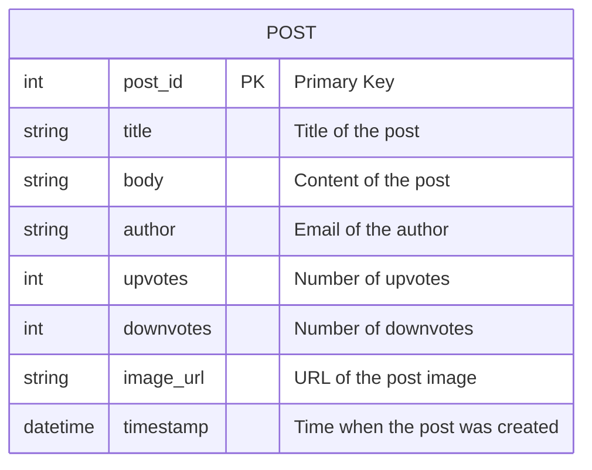
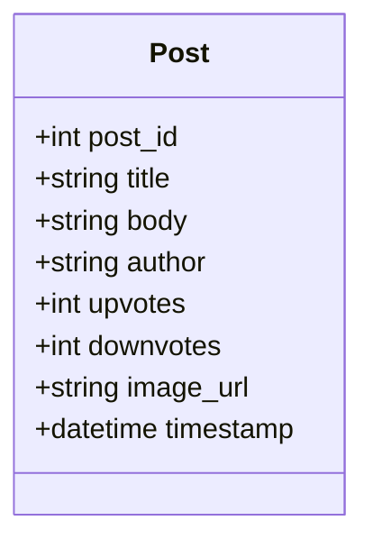
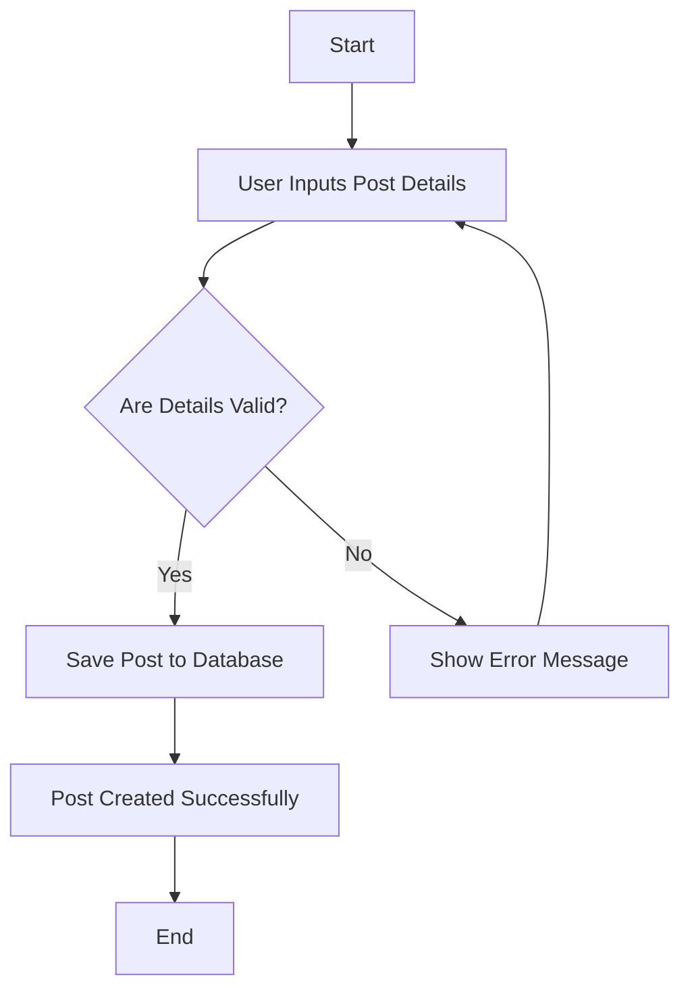

Based on the provided JSON design document, here are the requested Mermaid diagrams:

### Entity-Relationship (ER) Diagram

### Class Diagram

### Flow Chart for Workflow

Since the JSON does not provide specific workflows, I will create a generic flow chart for creating a post. You can modify it according to your specific workflow needs.

These diagrams represent the entity structure and a basic workflow for creating a post based on the provided JSON document. If you have specific workflows or additional entities, please provide that information for more tailored diagrams.