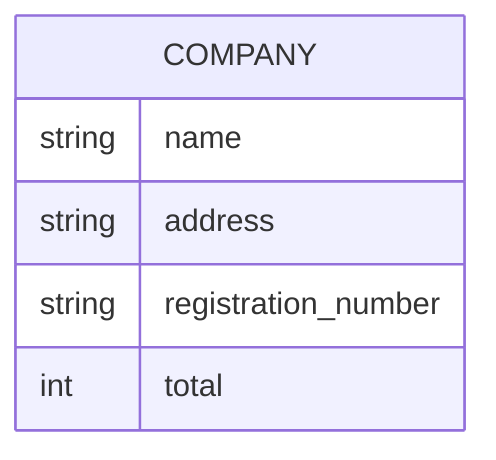
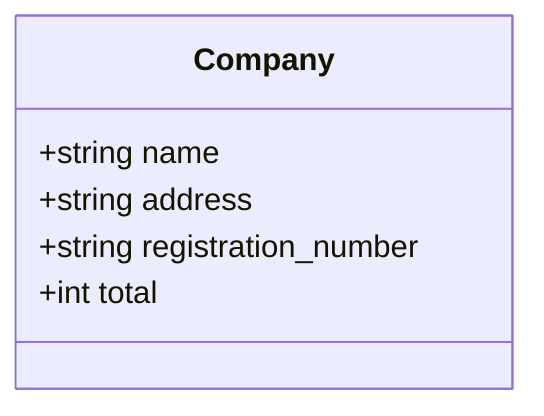
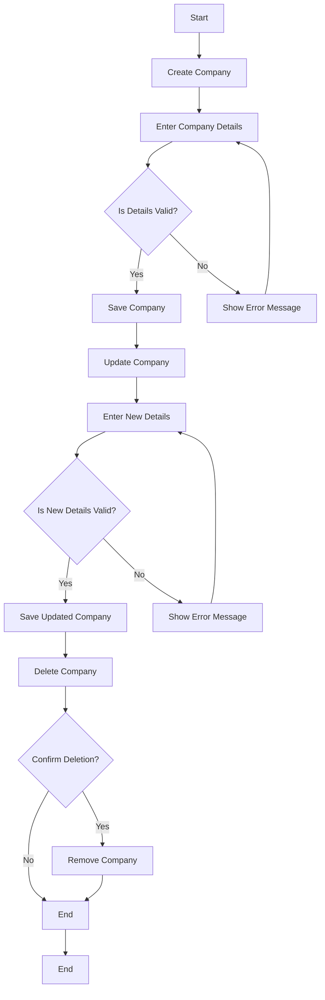

Based on the provided JSON design document, I will create a Mermaid ER diagram, class diagram, and a flowchart for the given entity. The entity described is "company."

### Mermaid ER Diagram

### Mermaid Class Diagram

### Flowchart for Company Workflow

Assuming a simple workflow for managing a company, such as creating, updating, and deleting a company, here is a flowchart:

This representation captures the entity "company" and outlines a basic workflow for managing company data. If you have specific workflows or additional entities to include, please provide that information for further refinement.