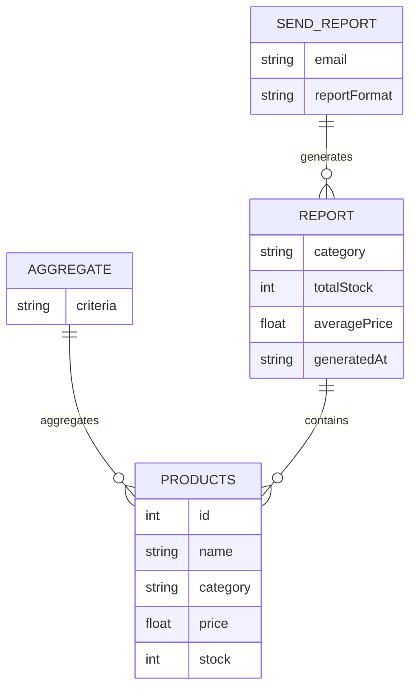
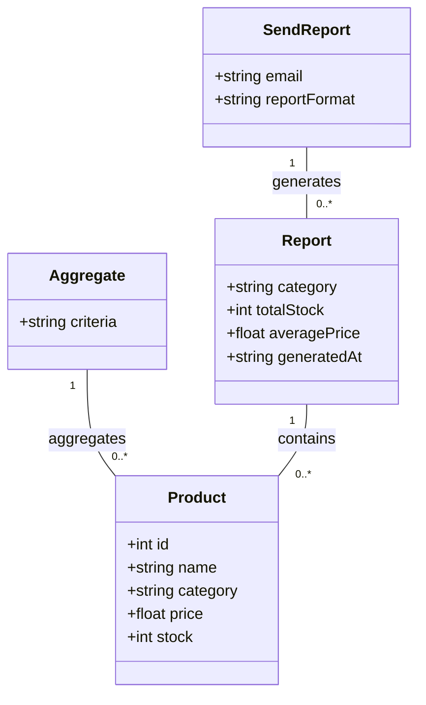
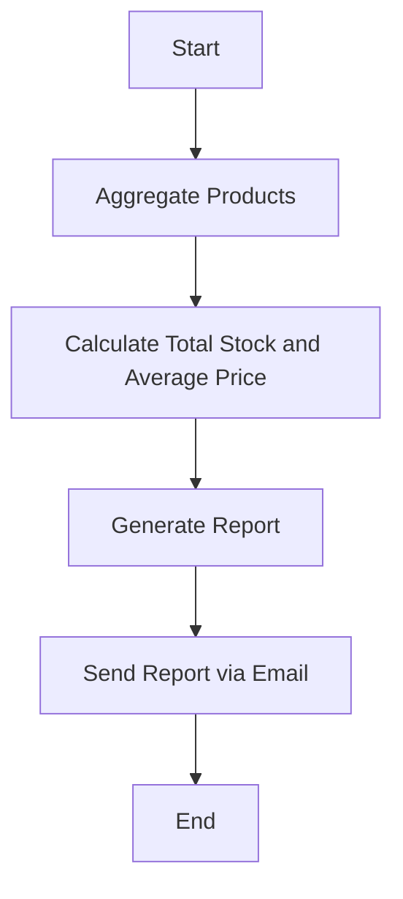
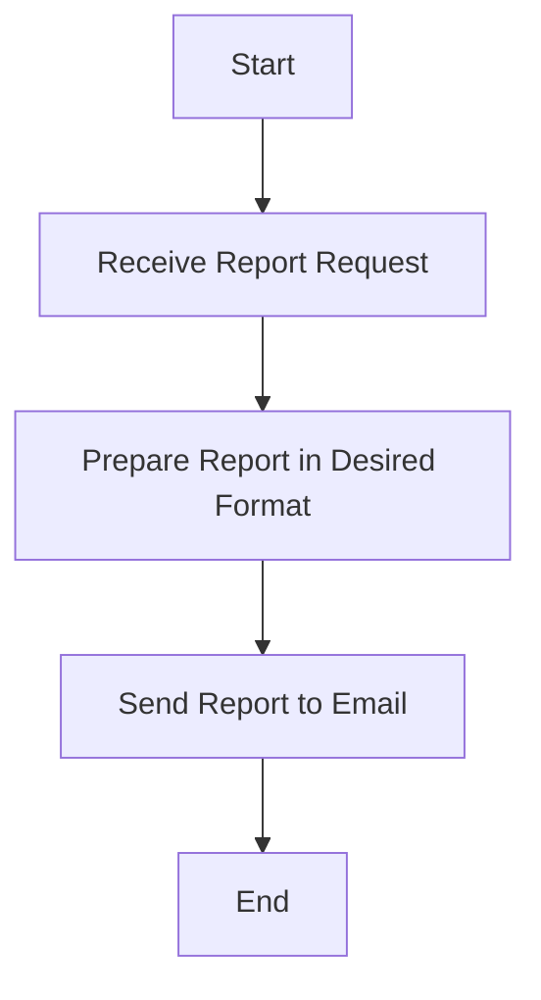

Based on the provided JSON design document, here are the Mermaid diagrams for the entities and workflows.

### Entity-Relationship (ER) Diagram

### Class Diagram

### Flow Chart for Each Workflow

#### Workflow for Generating a Report

### Workflow for Sending a Report

These diagrams represent the entities, their relationships, and workflows as specified in the JSON design document.