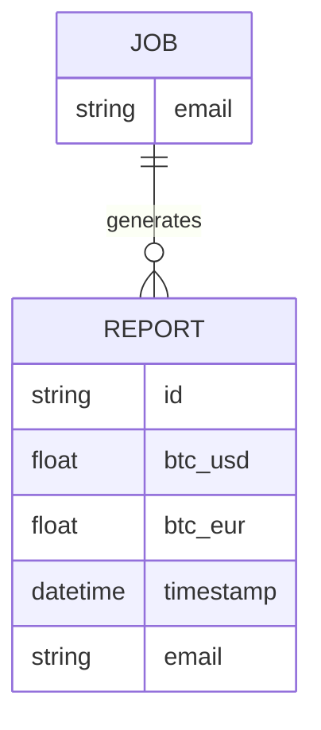
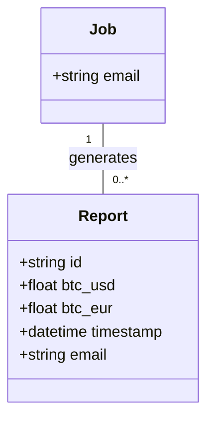
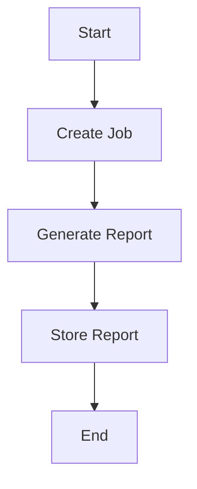

Based on the provided JSON design document, here are the Mermaid diagrams for the entities and their relationships, as well as flowcharts for workflows.

### Entity-Relationship Diagram (ERD)

### Class Diagram

### Flowchart for Workflow

Assuming a simple workflow where a job generates a report, here is a flowchart:

These diagrams represent the entities and their relationships as well as a basic workflow based on the provided JSON data. If you have specific workflows in mind or additional details, please provide them for more tailored diagrams.