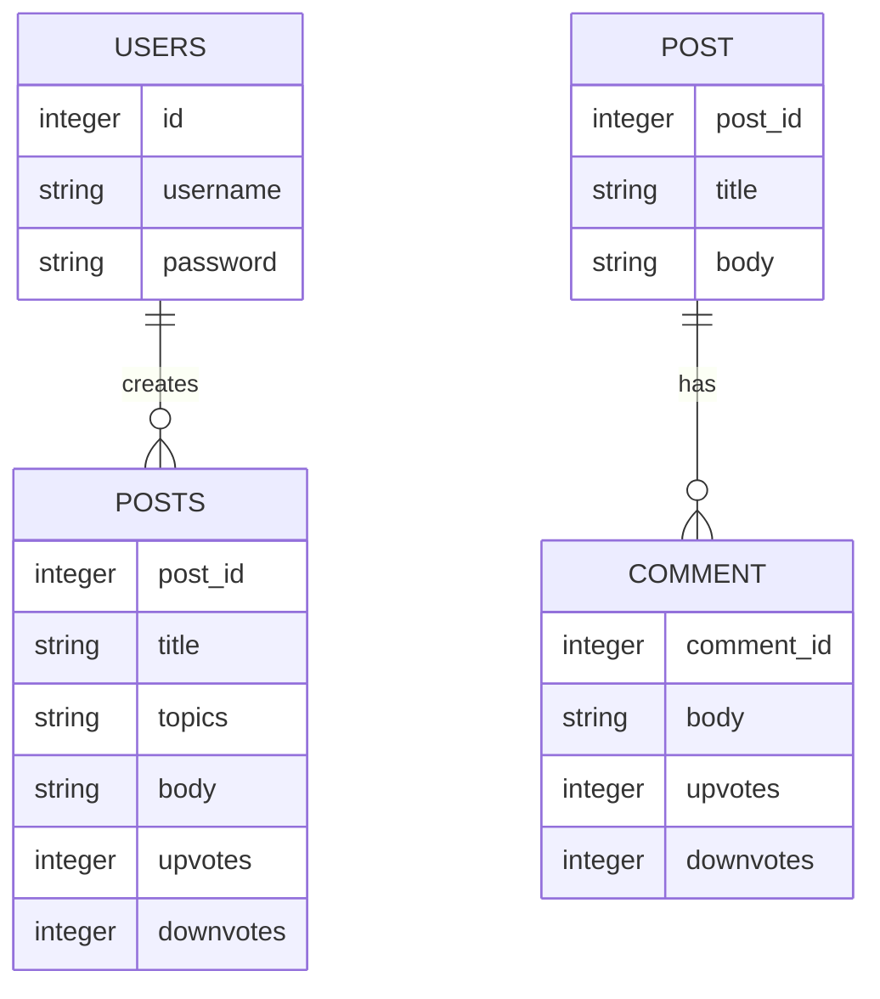
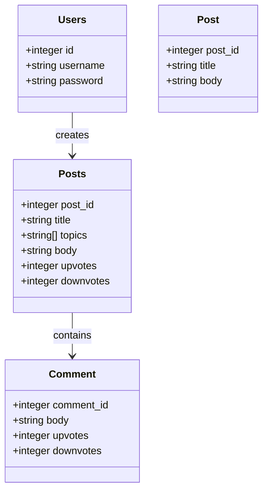
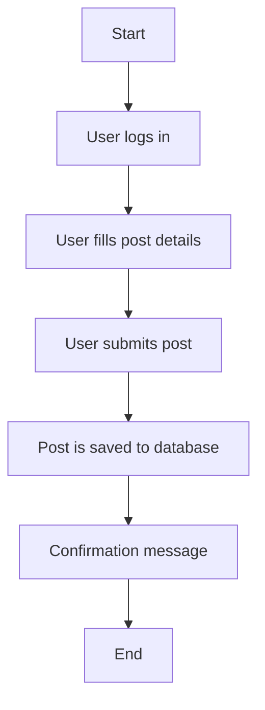
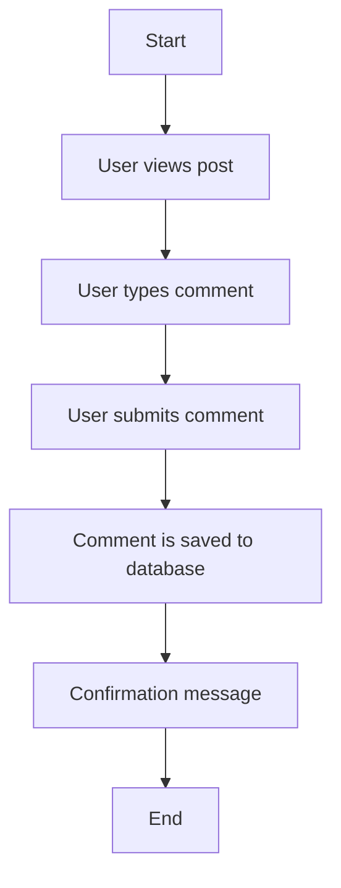

Based on the provided JSON design document, here are the Mermaid diagrams for the entities and workflows.

### Entity-Relationship Diagram (ERD)

### Class Diagrams

### Flow Chart for Each Workflow

Assuming a basic workflow for creating a post and adding comments, here is a flowchart:

#### Workflow: Create Post

#### Workflow: Add Comment to Post

These diagrams represent the entities, their relationships, and workflows as specified in the JSON design document.