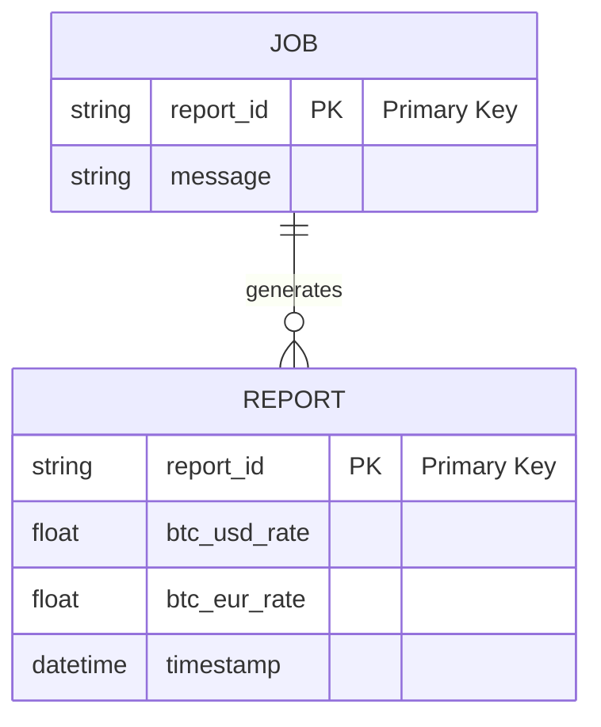
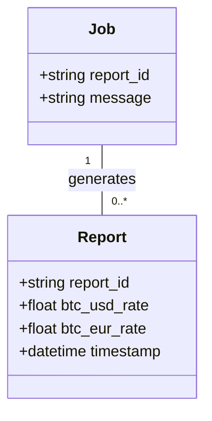
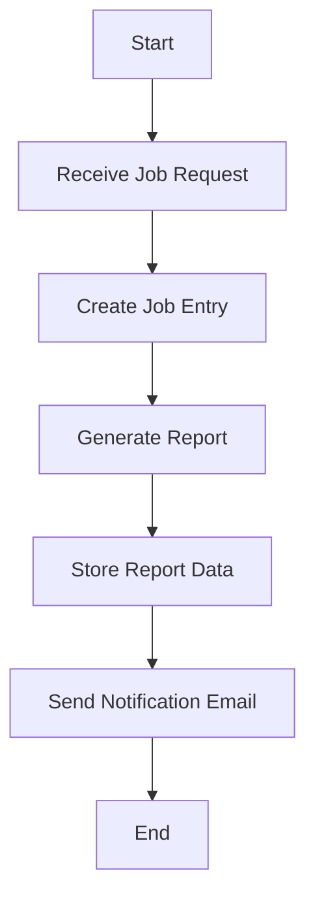

Based on the provided JSON design document, here are the Mermaid diagrams for the entities and workflows.

### Entity-Relationship (ER) Diagram

### Class Diagram

### Flow Chart for Workflow

Assuming a simple workflow for generating a report based on a job, here is a flowchart:

These diagrams represent the entities and their relationships as well as a basic workflow for handling job requests and generating reports based on the provided JSON design document.