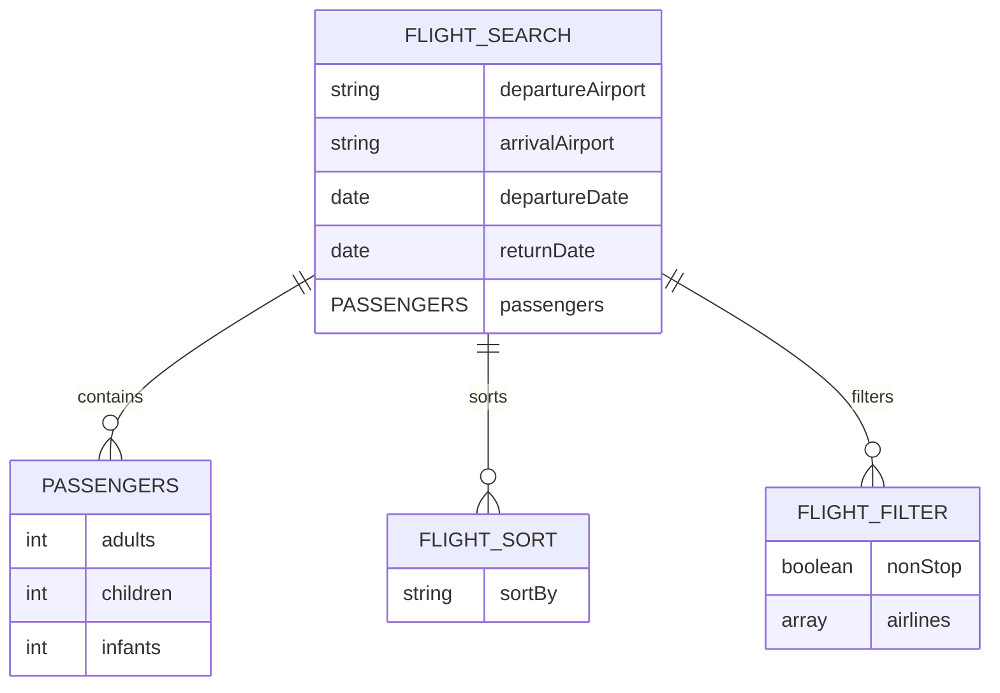
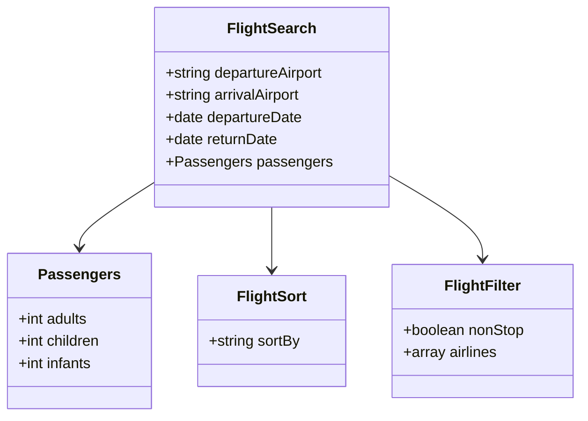
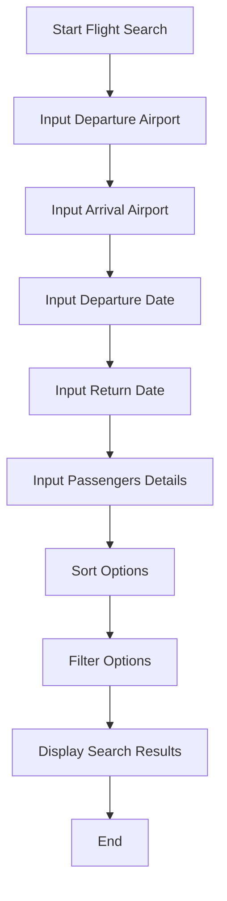
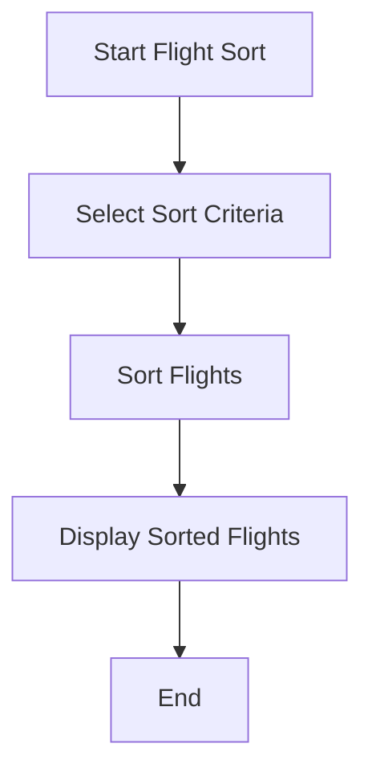
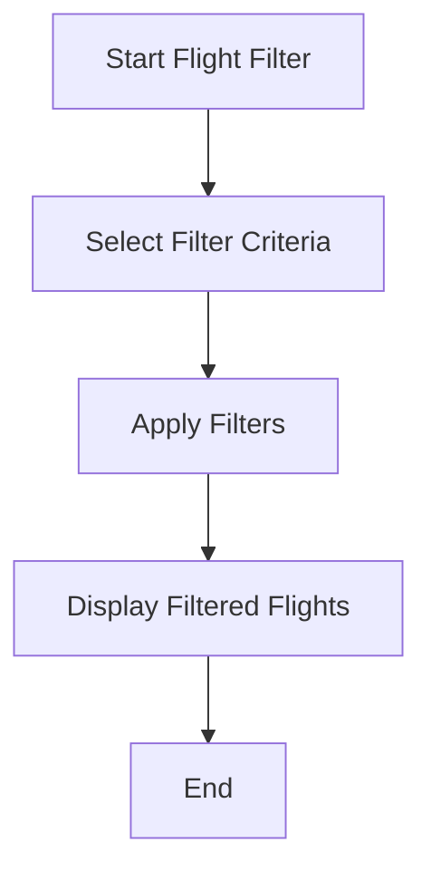

Based on the provided JSON design document, here are the Mermaid diagrams for the entities and workflows.

### Entity-Relationship (ER) Diagram

### Class Diagram

### Flowchart for Flight Search Workflow

### Flowchart for Flight Sort Workflow

### Flowchart for Flight Filter Workflow

These diagrams represent the entities and workflows as specified in the provided JSON design document.