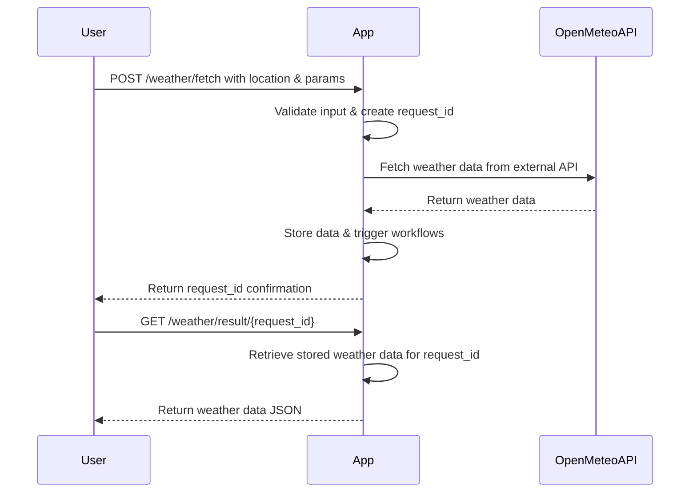

```markdown
# Functional Requirements for Weather Data Fetching App

## API Endpoints

### 1. POST `/weather/fetch`
- **Purpose:** Trigger fetching weather data from the external Open-Meteo API based on user input.
- **Request Body (JSON):**
  ```json
  {
    "latitude": 52.52,
    "longitude": 13.405,
    "parameters": ["temperature_2m", "humidity_2m", "windspeed_10m"],
    "start_date": "2024-06-01",
    "end_date": "2024-06-02"
  }
  ```
- **Response (JSON):**
  ```json
  {
    "status": "success",
    "message": "Weather data fetch initiated",
    "request_id": "uuid-string"
  }
  ```
- **Business Logic:**
  - Validate inputs.
  - Build request to Open-Meteo API.
  - Fetch data (sync or async).
  - Store fetched data linked to `request_id` entity and trigger workflow.

---

### 2. GET `/weather/result/{request_id}`
- **Purpose:** Retrieve stored weather data results from a previous fetch.
- **Path Parameter:**
  - `request_id`: UUID of the fetch request.
- **Response (JSON):**
  ```json
  {
    "request_id": "uuid-string",
    "latitude": 52.52,
    "longitude": 13.405,
    "parameters": {
      "temperature_2m": [20.1, 21.3, 19.8],
      "humidity_2m": [45, 50, 48],
      "windspeed_10m": [5.2, 4.8, 6.1]
    },
    "start_date": "2024-06-01",
    "end_date": "2024-06-02",
    "fetched_at": "2024-06-01T10:00:00Z"
  }
  ```

---

## User-App Interaction Sequence



---

## Summary

- All external API calls and calculations happen in **POST** `/weather/fetch`.
- Weather data results retrieval happens in **GET** `/weather/result/{request_id}`.
- Each fetch request creates an entity with a workflow triggered by the POST event.
- Stored data can be retrieved later with GET requests by `request_id`.
```