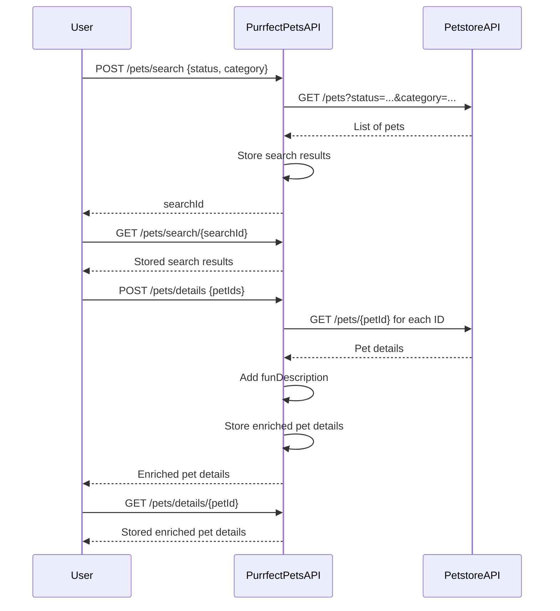

```markdown
# Purrfect Pets API - Functional Requirements

## Overview
The "Purrfect Pets" API app integrates with the Petstore API data. It follows RESTful principles where:
- **POST** endpoints invoke business logic, including external Petstore API calls, data retrieval, or calculations.
- **GET** endpoints only retrieve stored or processed results from our application.

---

## API Endpoints

### 1. POST /pets/search
- **Purpose:** Search pets by criteria (e.g., status, category) via Petstore API and store results for retrieval.
- **Request Body (JSON):**
  ```json
  {
    "status": "available|pending|sold",
    "category": "string (optional)"
  }
  ```
- **Response Body (JSON):**
  ```json
  {
    "searchId": "string"  // Unique ID for this search session
  }
  ```

---

### 2. GET /pets/search/{searchId}
- **Purpose:** Retrieve stored search results from a previous search.
- **Response Body (JSON):**
  ```json
  {
    "searchId": "string",
    "results": [
      {
        "id": "integer",
        "name": "string",
        "category": "string",
        "status": "string",
        "description": "string (optional)"
      }
    ]
  }
  ```

---

### 3. POST /pets/details
- **Purpose:** Fetch detailed info about one or more pets by IDs from Petstore API, enrich with app-specific data (e.g., fun description).
- **Request Body (JSON):**
  ```json
  {
    "petIds": [integer, integer, ...]
  }
  ```
- **Response Body (JSON):**
  ```json
  {
    "pets": [
      {
        "id": "integer",
        "name": "string",
        "category": "string",
        "status": "string",
        "funDescription": "string"
      }
    ]
  }
  ```

---

### 4. GET /pets/details/{petId}
- **Purpose:** Retrieve stored enriched details of a pet.
- **Response Body (JSON):**
  ```json
  {
    "id": "integer",
    "name": "string",
    "category": "string",
    "status": "string",
    "funDescription": "string"
  }
  ```

---

## User-App Interaction Sequence


```