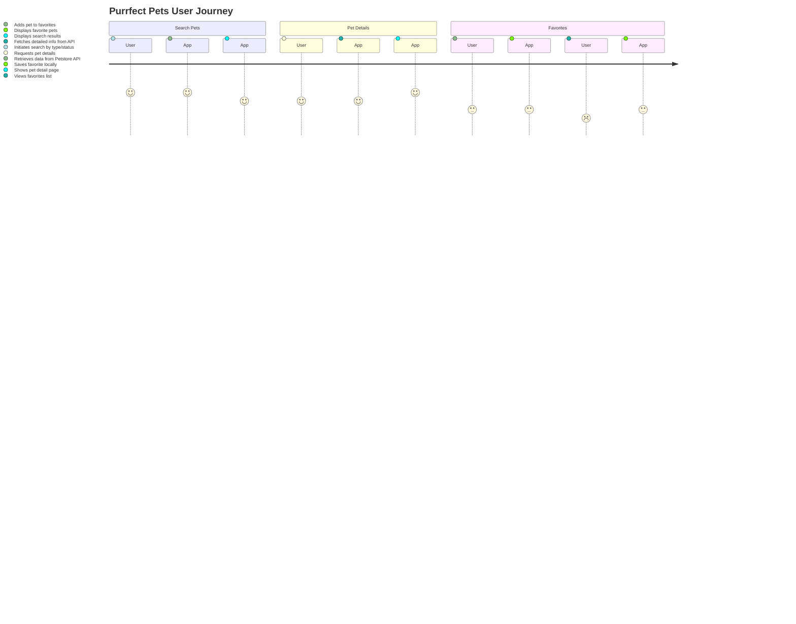

```markdown
# Purrfect Pets API - Functional Requirements

## API Endpoints

### 1. POST /pets/search
**Description:** Search for pets using criteria (e.g., type, status). This endpoint fetches data from the external Petstore API and applies any business logic if needed.  
**Request:**  
```json
{
  "type": "string (optional)",       // e.g. "cat", "dog"
  "status": "string (optional)"      // e.g. "available", "sold", "pending"
}
```  
**Response:**  
```json
{
  "pets": [
    {
      "id": "integer",
      "name": "string",
      "type": "string",
      "status": "string",
      "photoUrls": ["string"],
      "tags": [{"id": "integer", "name": "string"}]
    },
    ...
  ]
}
```

---

### 2. GET /pets
**Description:** Retrieve the last search result stored in the application (no external calls).  
**Response:**  
```json
{
  "pets": [
    {
      "id": "integer",
      "name": "string",
      "type": "string",
      "status": "string",
      "photoUrls": ["string"],
      "tags": [{"id": "integer", "name": "string"}]
    },
    ...
  ]
}
```

---

### 3. POST /pets/details
**Description:** Retrieve detailed information about a pet by ID, calling external Petstore API to get fresh data if needed.  
**Request:**  
```json
{
  "id": "integer"
}
```  
**Response:**  
```json
{
  "id": "integer",
  "name": "string",
  "type": "string",
  "status": "string",
  "photoUrls": ["string"],
  "tags": [{"id": "integer", "name": "string"}],
  "description": "string (optional)"
}
```

---

### 4. GET /pets/favorites
**Description:** Retrieve a list of favorite pets saved within the app (assuming local storage).  
**Response:**  
```json
{
  "favorites": [
    {
      "id": "integer",
      "name": "string",
      "type": "string",
      "status": "string"
    },
    ...
  ]
}
```

---

### 5. POST /pets/favorites
**Description:** Add a pet to favorites by ID (business logic performed in POST).  
**Request:**  
```json
{
  "id": "integer"
}
```  
**Response:**  
```json
{
  "message": "Pet added to favorites",
  "pet": {
    "id": "integer",
    "name": "string",
    "type": "string",
    "status": "string"
  }
}
```

---

# User-App Interaction Sequence Diagram

```mermaid
sequenceDiagram
    participant User
    participant App
    participant ExternalAPI as Petstore API

    User->>App: POST /pets/search {type, status}
    App->>ExternalAPI: Fetch pets with filters
    ExternalAPI-->>App: Return filtered pets
    App-->>User: Return pet list

    User->>App: GET /pets
    App-->>User: Return last search results

    User->>App: POST /pets/details {id}
    App->>ExternalAPI: Fetch pet details by id
    ExternalAPI-->>App: Return pet details
    App-->>User: Return pet details

    User->>App: POST /pets/favorites {id}
    App: Add pet to favorites storage
    App-->>User: Confirm addition

    User->>App: GET /pets/favorites
    App-->>User: Return favorites list
```

---

# User Journey Diagram


```