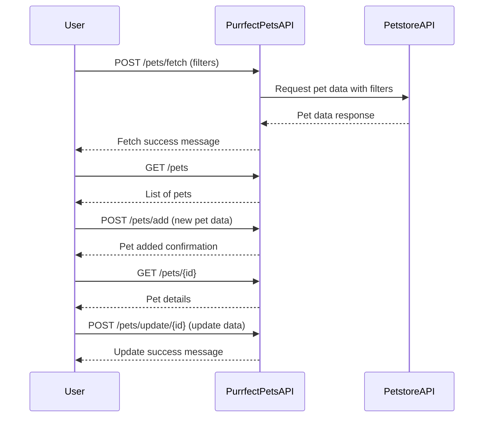

```markdown
# Purrfect Pets API - Functional Requirements

## Overview
The Purrfect Pets API provides RESTful endpoints to manage pet data enhanced by Petstore API data. All external data retrieval or business logic that involves fetching or processing data is done via POST endpoints. GET endpoints serve only to retrieve already processed or stored results.

---

## API Endpoints

### 1. POST /pets/fetch
- **Purpose:** Fetch pets data from the external Petstore API and optionally process/filter it.
- **Request Body:**
  ```json
  {
    "filter": {
      "status": "available" | "pending" | "sold",
      "category": "string (optional)"
    }
  }
  ```
- **Response:**
  ```json
  {
    "message": "Data fetched and processed successfully",
    "pets_count": 10
  }
  ```
- **Notes:** Stores or caches the processed pet data internally for later retrieval.

---

### 2. GET /pets
- **Purpose:** Retrieve the list of pets previously fetched and processed.
- **Response:**
  ```json
  [
    {
      "id": 123,
      "name": "Fluffy",
      "category": "cat",
      "status": "available",
      "tags": ["cute", "playful"]
    },
    ...
  ]
  ```

---

### 3. POST /pets/add
- **Purpose:** Add a new pet entry into the internal system.
- **Request Body:**
  ```json
  {
    "name": "string",
    "category": "string",
    "status": "available" | "pending" | "sold",
    "tags": ["string", ...]
  }
  ```
- **Response:**
  ```json
  {
    "message": "Pet added successfully",
    "pet_id": 124
  }
  ```

---

### 4. GET /pets/{id}
- **Purpose:** Retrieve detailed information about a single pet by ID.
- **Response:**
  ```json
  {
    "id": 123,
    "name": "Fluffy",
    "category": "cat",
    "status": "available",
    "tags": ["cute", "playful"]
  }
  ```

---

### 5. POST /pets/update/{id}
- **Purpose:** Update an existing pet’s data.
- **Request Body:**
  ```json
  {
    "name": "string (optional)",
    "category": "string (optional)",
    "status": "available" | "pending" | "sold (optional)",
    "tags": ["string", ...] (optional)
  }
  ```
- **Response:**
  ```json
  {
    "message": "Pet updated successfully"
  }
  ```

---

## User-App Interaction Sequence



---

## Notes
- All POST endpoints perform data processing or external API interaction.
- GET endpoints only return the current internal state or stored data.
- Requests and responses use JSON format.
```
