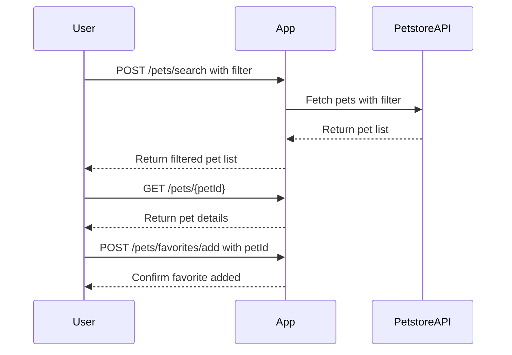
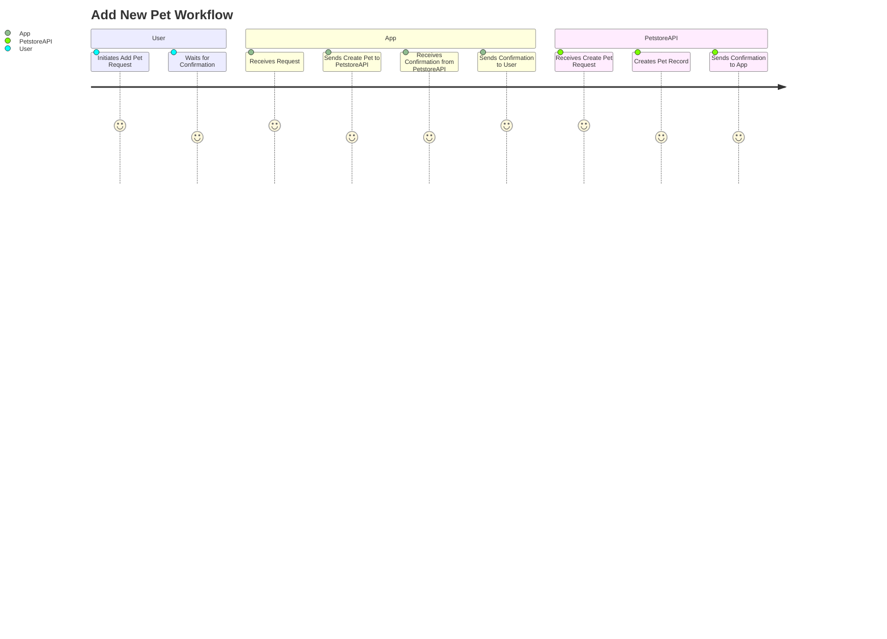

```markdown
# Functional Requirements for "Purrfect Pets" API App

## API Endpoints

### 1. POST /pets/search  
**Description:** Search pets using criteria (e.g., type, status) by invoking the external Petstore API and returning filtered results.  
**Request:**  
```json
{
  "type": "string",       // optional, e.g. "cat", "dog"
  "status": "string"      // optional, e.g. "available", "sold"
}
```
**Response:**  
```json
{
  "pets": [
    {
      "id": "integer",
      "name": "string",
      "type": "string",
      "status": "string",
      "description": "string"    // fun description added by app
    }
  ]
}
```

---

### 2. POST /pets/add  
**Description:** Add a new pet record. This will invoke the external Petstore API to create a pet entry.  
**Request:**  
```json
{
  "name": "string",
  "type": "string",
  "status": "string"
}
```
**Response:**  
```json
{
  "success": true,
  "petId": "integer"
}
```

---

### 3. GET /pets/{petId}  
**Description:** Retrieve pet details by petId (from local app cache or external source).  
**Response:**  
```json
{
  "id": "integer",
  "name": "string",
  "type": "string",
  "status": "string",
  "description": "string"
}
```

---

### 4. POST /pets/update/{petId}  
**Description:** Update pet details by invoking external Petstore API.  
**Request:**  
```json
{
  "name": "string",     // optional
  "type": "string",     // optional
  "status": "string"    // optional
}
```
**Response:**  
```json
{
  "success": true
}
```

---

### 5. GET /pets/favorites  
**Description:** Retrieve user's favorite pets stored locally.  
**Response:**  
```json
{
  "favorites": [
    {
      "id": "integer",
      "name": "string",
      "type": "string",
      "status": "string",
      "description": "string"
    }
  ]
}
```

---

### 6. POST /pets/favorites/add  
**Description:** Add a pet to user's favorites (local operation).  
**Request:**  
```json
{
  "petId": "integer"
}
```
**Response:**  
```json
{
  "success": true
}
```

---

## Mermaid Sequence Diagram: User Interaction with "Purrfect Pets" API



---

## Mermaid Journey Diagram: Adding a New Pet


```