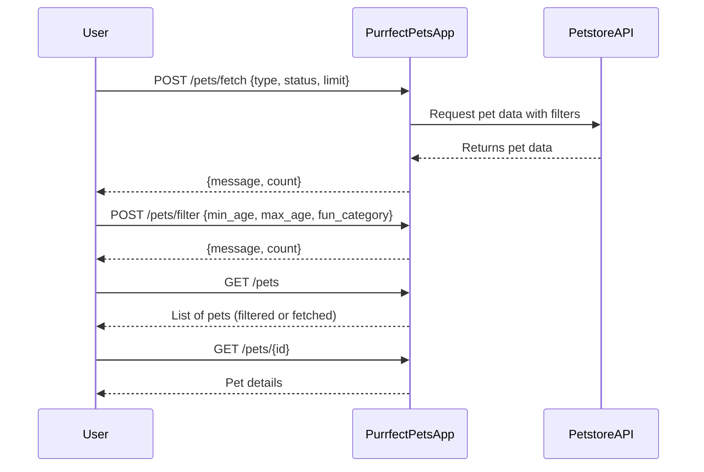

```markdown
# Purrfect Pets API - Functional Requirements

## Overview
The app provides pet-related data by interacting with the external Petstore API.  
- **POST endpoints** handle any external data fetching, business logic, or calculations.  
- **GET endpoints** serve cached or processed results stored in the app.

---

## API Endpoints

### 1. POST /pets/fetch
**Purpose:** Fetch pet data from Petstore API based on filters and store results locally for retrieval.  
**Request:**  
```json
{
  "type": "string (optional, e.g. dog, cat)",
  "status": "string (optional, e.g. available, sold)",
  "limit": "integer (optional, max number of pets)"
}
```  
**Response:**  
```json
{
  "message": "Pets fetched and stored successfully",
  "count": "integer - number of pets stored"
}
```

---

### 2. POST /pets/filter
**Purpose:** Apply additional business logic or calculations on stored pets (e.g., filter by age, fun categorization) and update results for retrieval.  
**Request:**  
```json
{
  "min_age": "integer (optional)",
  "max_age": "integer (optional)",
  "fun_category": "string (optional, e.g. playful, sleepy)"
}
```  
**Response:**  
```json
{
  "message": "Pets filtered successfully",
  "count": "integer - number of pets matching filters"
}
```

---

### 3. GET /pets
**Purpose:** Retrieve the current list of pets based on latest fetched or filtered data.  
**Response:**  
```json
[
  {
    "id": "integer",
    "name": "string",
    "type": "string",
    "age": "integer",
    "status": "string",
    "fun_category": "string (optional)"
  },
  ...
]
```

---

### 4. GET /pets/{id}
**Purpose:** Retrieve details of a single pet by its id.  
**Response:**  
```json
{
  "id": "integer",
  "name": "string",
  "type": "string",
  "age": "integer",
  "status": "string",
  "fun_category": "string (optional)"
}
```

---

## User-App Interaction Sequence



---

## Notes
- POST endpoints trigger external calls or heavy logic.
- GET endpoints are idempotent and fast, returning app-stored data.
- Fun categories provide playful tags for pets to enhance user experience.
```
