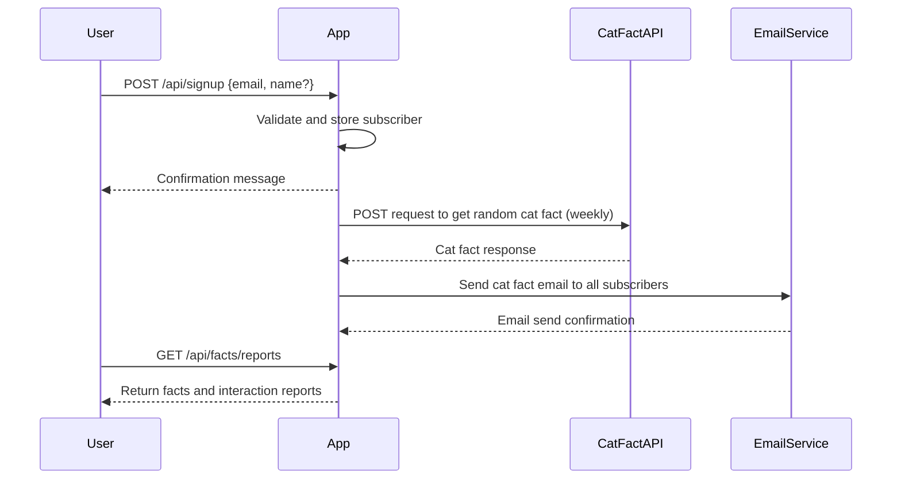
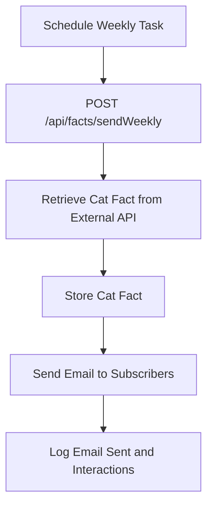

```markdown
# Functional Requirements and API Design for Weekly Cat Fact Subscription

## API Endpoints

### 1. User Signup  
**POST /api/signup**  
- **Purpose:** Register a new subscriber.  
- **Request Body:**  
```json
{
  "email": "user@example.com",
  "name": "optional name"
}
```  
- **Response:**  
```json
{
  "message": "Subscription successful",
  "subscriberId": "uuid"
}
```  

### 2. Retrieve Subscribers Count and List  
**GET /api/subscribers**  
- **Purpose:** Retrieve subscriber list or count for reporting.  
- **Query Parameters (optional):**  
`?countOnly=true` (returns only total count)  
- **Response:**  
```json
{
  "totalSubscribers": 123,
  "subscribers": [
    {
      "id": "uuid",
      "email": "user@example.com",
      "name": "Name"
    }
  ]
}
```

### 3. Trigger Weekly Cat Fact Retrieval and Email Send  
**POST /api/facts/sendWeekly**  
- **Purpose:** Retrieve new cat fact from external API and send email to all subscribers.  
- **Request Body:**  
```json
{}
```  
- **Response:**  
```json
{
  "message": "Cat fact sent to subscribers",
  "factId": "uuid",
  "fact": "Cats have five toes on their front paws."
}
```  

### 4. Retrieve Sent Cat Facts and Interaction Reports  
**GET /api/facts/reports**  
- **Purpose:** Retrieve historical sent facts and interaction counts (emails sent, opens, clicks).  
- **Response:**  
```json
{
  "facts": [
    {
      "factId": "uuid",
      "fact": "Cats have five toes on their front paws.",
      "sentDate": "2024-04-20T10:00:00Z",
      "emailsSent": 120,
      "emailsOpened": 100,
      "linksClicked": 30
    }
  ]
}
```

---

## User-App Interaction Sequence Diagram



---

## Weekly Cat Fact Send-Out Flow


```